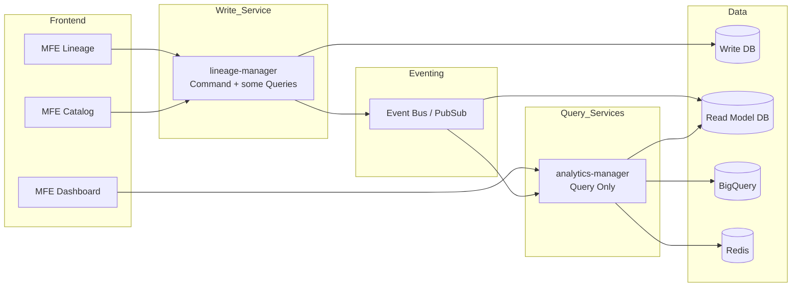
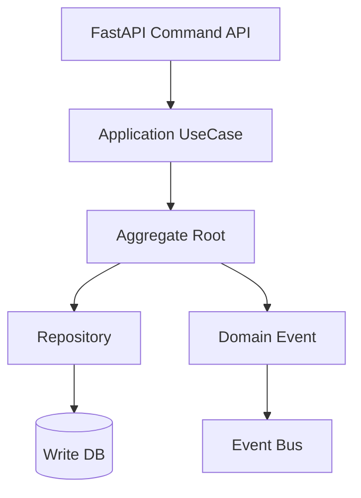
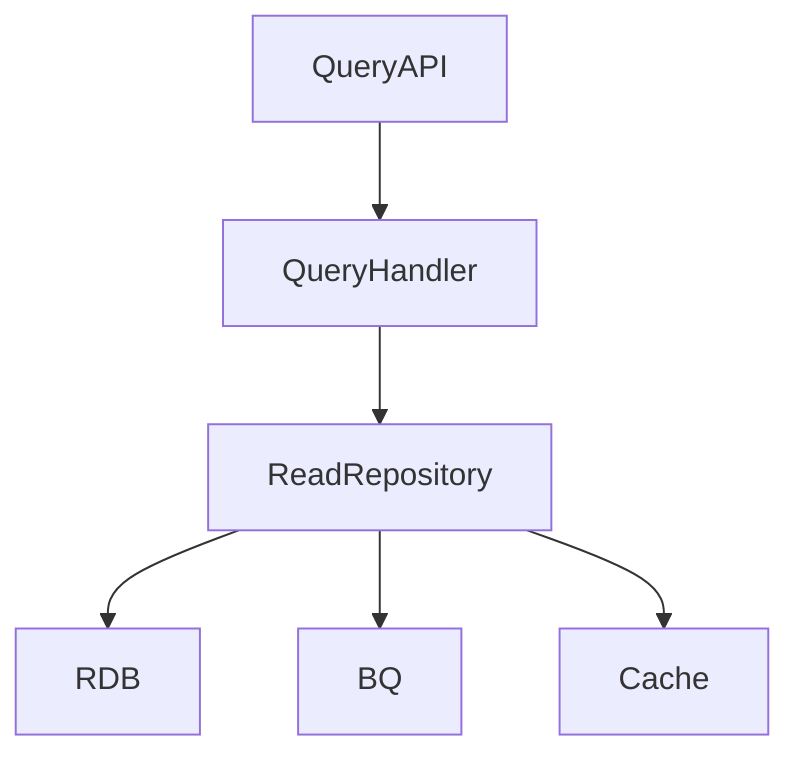
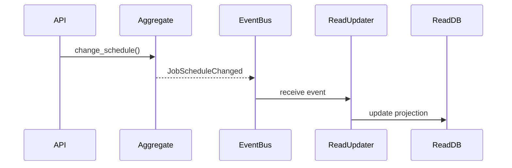
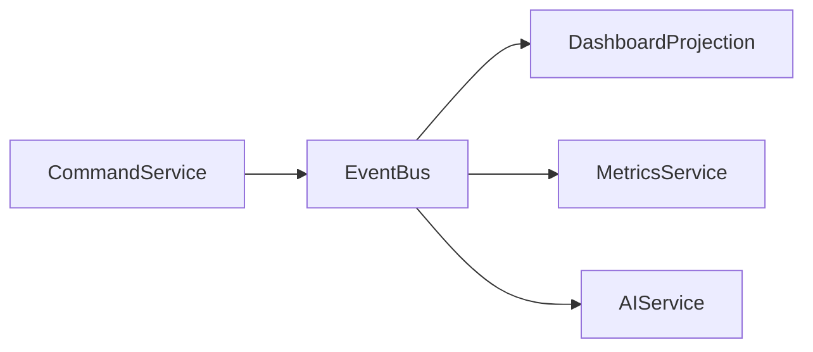

# Backend Architecture: DDD + CQRS Design Spec

This document defines the architectural principles and service boundaries for the OPS Console backend ecosystem.

---

## 1. Overall System Architecture


---

## 2. CQRS Concept (Applied to AdminConsole)

### Write Side (Command Model)
📍 **Service**: `lineage-manager`

*   **Responsibilities**:
    *   Job configuration changes
    *   Dependency updates
    *   Ownership changes
    *   Status updates
    *   Aggregate management
    *   Domain Event publishing
*   **Characteristics**:
    *   Strict transactional consistency
    *   Centralized business rules
    *   Normalized data model

### Read Side (Query Model)
📍 **Services**: `analytics-manager`, and parts of `lineage-manager` Query Handlers

*   **Responsibilities**:
    *   Graph traversal/queries (lineage-manager)
    *   Dashboard statistics (analytics-manager)
    *   Project summaries
    *   Aggregated data serving
    *   Usage tracking & Visit statistics (analytics-manager)
    *   KPI calculations (analytics-manager)
*   **Characteristics**:
    *   Optimized for low-latency responses
    *   Denormalized data models (Projections)
    *   Cache-centric design

---

## 3. lineage-manager Internal Structure (Command-Centric)


### Write Side Directory Structure
```text
src/lineage_manager/
 ├── api/commands/           # Command Endpoints
 ├── application/commands/    # Command Handlers (UseCases)
 ├── domain/                  # Core Business Logic
 │   ├── aggregates/          # Aggregate Roots
 │   ├── entities/            # Domain Entities
 │   ├── events/              # Domain Events
 │   └── value_objects/       # Immutable Value Objects
 └── infrastructure/persistence/ # DB Repositories
```

---

## 4. Read Side Structure


The Read Model uses dedicated tables or views optimized for performance.

| Read Table | Description |
| :--- | :--- |
| **job_summary** | For dashboard overviews |
| **project_summary** | For project-based aggregations |
| **lineage_graph_view** | For optimized graph visualization |
| **metrics_view** | BigQuery-based statistical views |

---

## 5. Event Flow


---

## 6. Job Configuration Change (Example Command Flow)
1.  **Load Aggregate**: Retrieve the latest Job Aggregate from the Write DB.
2.  **Validate Business Rules**: Check if the change is allowed based on the current state.
3.  **Perform Change**: Execute business logic within the Aggregate.
4.  **Record Event**: Generate a Domain Event capturing the change.
5.  **Persist**: Store the updated state and events within a single transaction.
6.  **Publish Event**: Distribute the event to external systems (Read Side).

---

## 7. Data Model Separation Example
*   **Write Model (Normalized)**: `jobs`, `tables`, `job_dependencies`, `users`
*   **Read Model (Denormalized)**: `job_detail_projection`, `project_dashboard_projection`, `job_execution_daily_projection`

---

## 8. AdminConsole Service Roles Summary
| Service | Role | CQRS Role | Features |
| :--- | :--- | :--- | :--- |
| **lineage-manager** | Metadata management & Commands | Write Side | Core Catalog, Lineage Graph |
| **analytics-manager** | Analytics & Usage Tracking | Read Side | KPIs, Visit Stats, Dashboards |
| **ai-advisor** | Insights & Guidance | Intelligence | AI Analysis |

### 8.1 Analytics Manager Architecture Rationale

The decision to separate `analytics-manager` as a dedicated service is driven by four key architectural principles:

#### 1. Separation of Concerns
*   **Lineage Manager**: Focuses on the core domain of the Data Catalog—managing Lineage Graphs, Jobs, Projects, and Data Resources. It handles the structural integrity of metadata.
*   **Analytics Manager**: Focuses on the analytical domain—platform usage tracking, visit statistics, and KPI calculations. This cleanly separates operational metadata from behavioral analytics.

#### 2. Scalability
*   Analytical queries often involve resource-intensive aggregations and time-series data processing.
*   By decoupling the analytics workload, we can scale the `analytics-manager` independently based on analytical demand without impacting the performance of core lineage operations.

#### 3. Data Ownership
*   **Operational Metadata vs. Behavioral Data**: Visit tracking and usage analytics are conceptually distinct from lineage metadata.
*   **Dedicated Storage**: The `analytics-manager` can own its specialized data stores (e.g., Time-Series DB, Redis, or specific tables) optimized for analytics, preventing pollution of the core lineage schema.

#### 4. Future Extensibility
*   A dedicated service provides a flexible foundation for adding advanced analytical features:
    *   User activity trends and behavioral analysis.
    *   Resource usage patterns and capacity planning insights.
    *   System performance metrics.
    *   Customizable dashboards for different stakeholders.

---

## 9. Implementation Strategy (Roadmap)
*   **Phase 1 (Current)**: Logical CQRS separation. Command and Query UseCases are separated. **Introduction of Celery Worker skeletons in both services.**
*   **Phase 2**: Introduction of Projection tables. Asynchronous Read Model updates via Domain Events.
*   **Phase 3**: Physical separation of the Read DB. Complete service decoupling using a messaging bus (Pub/Sub).

---

## 10. DDD + CQRS Integration Rules
1.  **Rule 1**: No state changes allowed outside of an Aggregate (always use Commands).
2.  **Rule 2**: Query Handlers must not use Aggregate Roots (query Read Models/DTOs directly).
3.  **Rule 3**: Read Models can be freely denormalized for query performance.
4.  **Rule 4**: Domain Events capture historical facts and must be Immutable.

---

## 11. Long-term Evolution

This architecture is optimized for **scalability, fault isolation, analytical extensibility, and future AI integration**.

---

## 13. Deployment Strategy (Container & Scaling)

To maintain a robust and scalable MSA environment, we follow the **"One Image, Multiple Processes"** and **"Independent Deployment"** patterns.

### 13.1 Deployment Unit
- **Single Source of Truth**: Each service (`lineage-manager`, `analytics-manager`) produces a single Docker image.
- **Process Separation**: The same image is deployed as multiple independent services (Containers/Pods) by changing the startup command.
    - **API Node**: Runs the FastAPI application (e.g., `uvicorn`).
    - **Worker Node**: Runs the Celery worker (e.g., `celery worker`).

### 13.2 Independent Scaling & Isolation
- **Independent Resource Allocation**:
    - High-load workers (e.g., `lineage-worker`) can be scaled up (HPA) and assigned more CPU/Memory.
    - Low-load workers (e.g., `analytics-worker`) can run on minimal resources.
- **Failure-Isolation**: A crash or memory leak in one worker does not impact others or the API's responsiveness.

### 13.3 Logical Grouping
- **Namespace**: All OPS Console backend services are deployed within the same namespace (e.g., `ops-console`).
- **Resource Discovery**: Shared infrastructure like **Redis (Broker/Cache)** and **MySQL (Write DB)** are accessible within the namespace.
