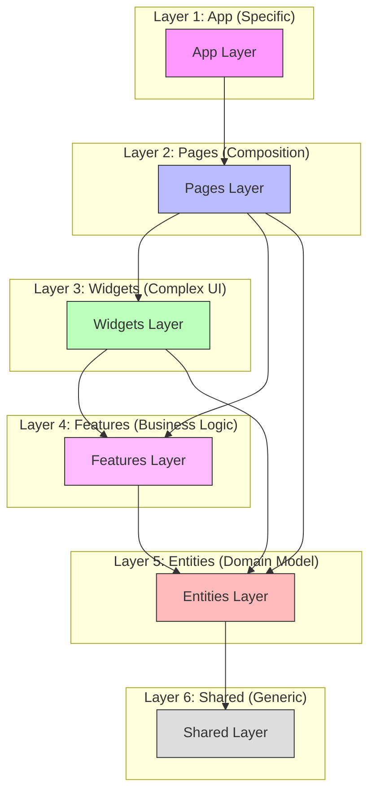

# Frontend Container Architecture Guide

**Version:** 1.0  
**Updated:** 2026-01-31  
**Architecture:** Feature-Sliced Design (FSD)

This document outlines the architecture of the `admin-console-container` application, which serves as the host shell for the micro-frontend (MFE) ecosystem. It has been refactored to strictly follow **Feature-Sliced Design (FSD)** principles to ensure scalability and maintainability.

## 1. High-Level Structure

The codebase is organized into layers, ordered from most specific (top) to most generic (bottom). A layer can only import from layers **below** it.



```
src/
├── app/          # Global app setup (Entry, Providers, Router)
├── pages/        # Composition of Widgets for specific Routes
├── widgets/      # Composition of Features/Entities (Page sections)
├── features/     # User interactions (Business logic + UI)
├── entities/     # Domain data models (Business entities)
├── shared/       # Reusable primitives (UI Kit, API, Libs)
```

---

## 2. Layer Details

### 🟢 Shared Layer (`src/shared/`)
*Foundation of the application. Contains code with NO domain logic.*
- **UI Kit**: `shared/ui/` (e.g., `Drawer`, `SummaryGrid`, `VisitHistoryCard`)
- **API**: `shared/api/config.ts` (Environment configuration)
- **Libs**: `shared/lib/` (`utils` for classNames, `hooks` for generic logic)
- **Types**: `shared/types/` (Global utility types)

### 🟡 Entities Layer (`src/entities/`)
*Domain entities providing data structures and simple display logic.*
- **User**: `entities/user/types.ts` (User profile, Auth client interface)
- **Analytics**: `entities/analytics/types.ts` (Metrics data models)
- **Search**: `entities/search/types.ts` (Global search result models)

### 🟠 Features Layer (`src/features/`)
*User interactions that deliver distinct value.*
- **Auth**: `features/auth/UserMenu.tsx` (Login/Logout, Profile display)
- **Breadcrumbs**: `features/breadcrumbs/Breadcrumbs.tsx` (Navigation trail)
- **MFE Loader**: `features/mfe-loader/RemoteMount.tsx` (Dynamic MFE mounting logic)

### 🔴 Widgets Layer (`src/widgets/`)
*Self-contained UI blocks combining features and entities.*
- **App Layout**: `widgets/app-layout/` (Combines `Navbar`, `Sidebar` with features like `Breadcrumbs` and `UserMenu`)
- **Global Search**: `widgets/search/GlobalSearch.tsx` (Search bar logic + UI)

### 🔵 Pages Layer (`src/pages/`)
*Full views corresponding to routes. Composed mainly of Widgets and MFE slots.*
- **Dashboard**: `pages/dashboard/DashboardPage.tsx` (System overview)
- **Users**: `pages/users/UsersPage.tsx` (User management list)
- **UserDetail**: `pages/users/UserDetailPage.tsx` (User profile details)
- **Audit**: `pages/audit/AuditPage.tsx` (System audit logs)

### 🟣 App Layer (`src/app/`)
*Application bootstrapping and global configuration.*
- **Entry**: `app/entry/` (`main.tsx`, `bootstrap.tsx`) - **Webpack Entry Point**
- **Providers**: `app/providers/AuthProvider.tsx` (Global Authentication Context)
- **Router**: `app/router/Router.tsx` (Route definitions mapping URLs to Pages)
- **Root**: `app/ShellApp.tsx` (Main application shell)

---

## 3. Core Concepts & Rules

### Dependency Rule
- **Correct**: `Page` -> imports -> `Widget` -> imports -> `Feature`
- **Incorrect**: `Feature` -> imports -> `Widget` (Circular/Upward dependency forbidden)
- **Incorrect**: `Shared` -> imports -> `Entity` (Shared layer must be domain-agnostic)

### "Export Function" Standard
All components use the `export function Name() {}` syntax instead of `const Name: React.FC = () => {}`. This improves readability, debugging (named functions in stack traces), and consistency.

```typescript
// ✅ Good
export function DashboardPage() { ... }

// ❌ Avoid
export const DashboardPage: React.FC = () => { ... }
```

### Micro-Frontend (MFE) Integration
The container acts as a "Shell" that loads "Remote" MFEs (Lineage, Catalog).
- **Loader**: `features/mfe-loader` handles the dynamic import of Webpack Module Federationremotes.
- **Routing**: Valid MFE routes are defined in `app/router/Router.tsx` but rendered via `RemoteMount` components within specific pages or wrappers.

---

## 4. Key Files Map

| Feature | Key File/Path | Description |
| :--- | :--- | :--- |
| **Authentication** | `src/app/providers/AuthProvider.tsx` | Manages user session via BFF calls. |
| **Navigation** | `src/widgets/app-layout/Sidebar.tsx` | Main side navigation menu. |
| **Search** | `src/widgets/search/GlobalSearch.tsx` | Global search box in Navbar. |
| **Analytics Hooks** | `src/shared/lib/hooks/` | Custom hooks for fetching dashboard metrics. |
| **Config** | `src/shared/api/config.ts` | Centralized env vars and API base URLs. |

---

## 5. Functional Scope & MFE Integration

The Container assumes the role of an **Application Shell**, orchestrating navigation and layout while delegating domain-specific complexity to Micro-Frontends (MFE).

### 🧩 Micro-Frontends (Remotes)

| MFE Name | Routes Triggered | Webpack Remote | Description |
| :--- | :--- | :--- | :--- |
| **Lineage MFE** | `/lineage/*` | `lineage` | Interactive data lineage graph. Mounted via `LineageRouteWrapper`. |
| **Catalog MFE** | `/jobs/*`<br>`/tables/*`<br>`/projects/*` | `tableDetailViewer` | Detail views and lists for catalog entities. Mounted via `CatalogRouteWrapper`. |

### 🛠️ Shell-Native Features (Locally Implemented)

These features are implemented directly in the container for performance or global access:

1.  **Dashboard (`/`)**: System overview with metrics cards (using shared hooks).
2.  **User Management (`/users`)**: Full CRUD for platform users and role management.
3.  **Audit Logs (`/audit`)**: System-wide event logs and command history.
4.  **Global Search**: Always-visible search bar in the Navbar that queries the backend search API.
5.  **Authentication**: OIDC-based login/logout handling via `AuthProvider`.

### 🔌 Configuration Integration

The shell injects configuration into MFEs via props and window objects. Key environment variables (in `src/shared/api/config.ts`) include:

-   `LINEAGE_MFE_URL`: URL to the Lineage MFE `remoteEntry.js`.
-   `CATALOG_MFE_URL`: URL to the Catalog MFE `remoteEntry.js`.
-   `ENABLE_MFE_LINEAGE` / `ENABLE_MFE_CATALOG`: Feature flags to toggle MFE loading.
