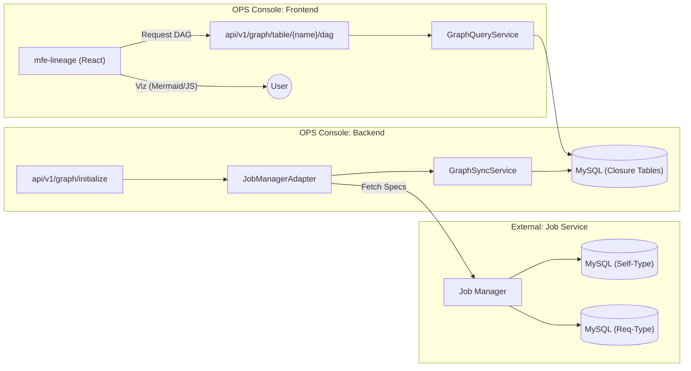

Created: 2026-01-30
Updated: 2026-01-30
Author: David
Version: 1.1
Status: Shipped
Title: OPS Console: Codebase Map & Functional Guide

Summary:
Provides a high-level map of the OPS Console project, linking functional requirements to specific backend and frontend components. Includes execution modes and a deep dive into the Lineage Manager orchestration logic.

## 1. Project Identity & Tech Stack
- **Purpose**: Admin console for scheduling service management.
- **Frontend**: 3 Micro-frontends (MFE) using **TypeScript + React**.
- **Backend**: 2 Backend services using **Python + FastAPI**.
- **Infrastructure**: MySQL, Redis, Nginx (for routing).

## 2. Frontend Structure (FSD Architecture)
*Refactored to Feature-Sliced Design (Jan 2026). See [Architecture Guide](admin-console-architecture.md) for details.*

### 📂 Container Layer Map (`apps/frontend/container/src/`)
- **App Layer** (`app/`): Entry point (`bootstrap.tsx`), Global Providers (`AuthProvider`), Router.
- **Pages Layer** (`pages/`):
  - **Dashboard**: `pages/dashboard/DashboardPage.tsx` - System overview & metrics.
  - **Users**: `pages/users/UsersPage.tsx` - User management list & details.
  - **Audit**: `pages/audit/AuditPage.tsx` - System audit logs & commands.
- **Widgets Layer** (`widgets/`):
  - **Layout**: `widgets/app-layout/` (Navbar, Sidebar).
  - **Search**: `widgets/search/GlobalSearch.tsx` - Global entity search.
- **Features Layer** (`features/`): `RemoteMount` (MFE Loader), `UserMenu` (Auth UI), `Breadcrumbs`.
- **Shared Layer** (`shared/`): Reusable UI (`ui/`), Hooks (`lib/hooks/`), Config (`api/config.ts`).

## 3. Execution Modes

### 🟢 Local Development (Ubuntu)
Run these commands to start individual components for rapid development:
- **Root Control**: `make up` (Starts all via Docker) or `make venv-all` (Prepares Python envs).
- **Backend (FastAPI)**:
  - Lineage Manager: `make -C apps/backend/lineage_manager run`
  - Dummy Job Manager: `make -C apps/backend/dummy-job-manager run`
- **Frontend (TS/React)**:
  - Shell Container: `make -C apps/frontend/container dev`
  - Lineage MFE: `make -C apps/frontend/mfe-lineage dev`
  - Catalog MFE: `make -C apps/frontend/mfe-catalog dev`

### 🟡 Integration Verification (Docker Compose)
Used to verify Nginx reverse proxy and multi-MFE mounting:
- `make -C apps/backend up`
- `make -C apps/frontend up`

### 🟡 Development Deployment (k8s)
- Target: Dev Clusters.
- Workflow: `docker-build` -> `docker-push` -> `helm-upgrade`.
- Commands: `make -C <app-dir> deploy ENV=dev`

### 🔴 Production Deployment (K8s)
- Target: Prd Clusters.
- Workflow: `confirm` -> `docker-build` -> `docker-push` -> `helm-upgrade`.
- Commands: `make -C <app-dir> deploy ENV=prd`

---

## 5. Architect Standards

To maintain **OPS Console** as a top-tier enterprise tool, all code must adhere to:

### A. Clean Architecture & SOLID
- **Dependency Rule**: Dependencies point inwards. Outer layers (Nginx, API routes) depend on Inner layers (Services, Domain Models), never vice-versa.
- **Single Responsibility**: One component/service = One reason to change.
- **Interface Segregation**: Don't force dependencies on methods they don't use.

### B. Backend Excellence (FastAPI)
- **Framework Independence**: Business logic stays in Services; Controllers/Endpoints only handle request/response.
- **Robust Validation**: Use Pydantic V2 for all DTOs. Strict type hinting is non-negotiable.
- **Async First**: Use `async def` for I/O tasks. Handle CPU-bound tasks in thread pools if necessary.
- **Dependency Injection**: Use `dependency-injector` for mockable, testable services.

### C. Frontend Excellence (React/TS)
- **Component Atomicity**: Small, reusable, and focused components.
- **Performance**: Use `React.memo`, `useCallback`, and `useMemo` strategically to prevent expensive re-renders in the Cytoscape graph.
- **Error Boundaries**: Wrap major UI modules to prevent the entire shell from crashing.
- **State Flow**: Use Props/Context for state; Custom Events for cross-MFE communication (Event-Driven Architecture).

## 6. Lineage Manager: Deep Dive

The **Lineage Manager** (backend) is the brain of the OPS Console, responsible for orchestrating the dependency graph.

### A. Data Flow Architecture
The graph is built based on the relationship: `[Source Table] -> (Job) -> [Target Table]`.

### B. Core Functional Components

1. **Initialization (`/api/v1/graph/initialize`)**:
   - Resets all existing graph data in MySQL (clears nodes, edges, and transitive closures).
   - Fetches the entire job catalog from `dummy-job-manager`.
   - Reconstructs the dependency graph from scratch to ensure consistency.

2. **Synchronization (`/api/v1/sync`)**:
   - Supports incremental updates from the Job Manager or direct payload injection.
   - Updates the **Closure Table** to allow lightning-fast recursive DAG queries (upstream/downstream).

3. **Mermaid Rendering**:
   - Located in: `static/js/mermaid/dsl-generator.js`.
   - Converts the internal graph model into Mermaid DSL string for client-side rendering.

4. **Query Engine**:
   - Handles complex graph traversals (Neighbors API, DAG API).
   - Supports depth-limited searches and filtering by node type (Job vs Table).

### C. The "Dummy" Role
The `dummy-job-manager` is a local simulator that provides deterministic responses for testing the lineage logic without needing a full production scheduling cluster. In production, this adapter is swapped for the real Self-Scheduilng Job-Manager.
