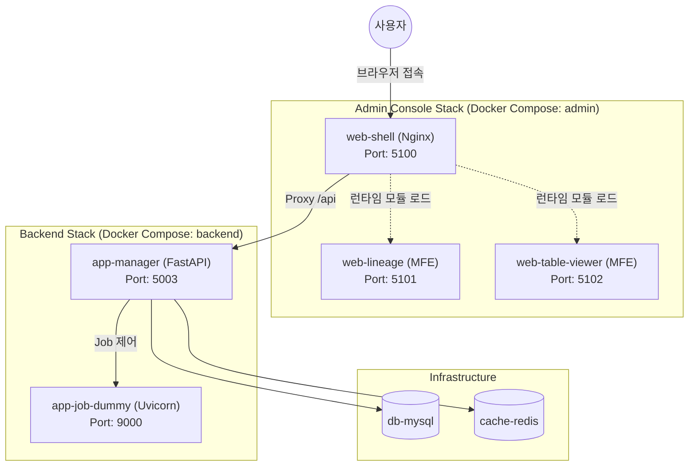

# 서비스 아키텍처 개요 (Service Architecture Overview)

이 문서는 Lineage Platform의 컴포넌트 레벨 서비스 구조와 프론트엔드/백엔드 간의 통합 아키텍처를 설명합니다.

---

## 1. 전체 시스템 아키텍처 (High-Level Diagram)

플랫폼은 **Micro-Frontend(MFE)** 기반의 어드민 콘솔 스택과 **FastAPI** 기반의 백엔드 스택으로 구성되어 있습니다.

---

## 2. 프론트엔드 구조 (Admin Console)

프론트엔드는 **Module Federation** 기술을 사용하여 여러 독립적인 마이크로 앱을 하나의 쉘(Shell)에서 통합합니다.

- **web-shell**:
  - 메인 애플리케이션 프레임워크 (GNB, 메뉴, 라우팅).
  - 런타임에 `web-lineage`와 `web-table-viewer`의 `remoteEntry.js`를 로드하여 통합.
  - **Nginx Reverse Proxy**: 프론트엔드 코드에서 발생하는 `/api` 요청을 백엔드 서비스(`app-manager`)로 전달.
- **web-lineage (MFE)**:
  - 데이터 계보(Lineage) 그래프 시각화 담당.
  - Cytoscape.js를 사용하여 복잡한 노드 관계를 렌더링.
- **web-table-viewer (MFE)**:
  - 특정 테이블의 메타데이터, 스키마, 히스토리 등 상세 정보 표시.

---

## 3. 백엔드 구조 (Backend Tier)

백엔드는 도메인 주도 설계(DDD)와 의존성 주입(DI) 패턴을 따르는 모듈형 구조입니다.

- **app-manager (Lineage Manager)**:
  - **API Layer**: FastAPI를 사용하여 RESTful API 제공. `/lineage-manager`를 root path로 사용.
  - **Service Layer**: 비즈니스 로직 처리.
  - **Repository Layer**: SQLAlchemy를 사용한 데이터 영속성 관리.
  - **Container (DI)**: `Dependency Injector` 라이브러리를 통해 서비스와 리포지토리를 관리.
- **app-job-dummy**:
  - 테스트 데이타 생성을 위한 더미 작업 관리 서비스.
  - `app-manager`의 요청을 받아 가상의 데이터 추출 작업을 수행.

---

## 4. 인프라스트럭처 (Infrastructure)

- **db-mysql**: 메타데이터 및 계보 정보(Closure Table 방식)를 저장하는 메인 데이터베이스.
- **cache-redis**: 복잡한 그래프 쿼리 결과 및 세션 정보를 저장하기 위한 고속 캐시.

---

## 5. 데이터 흐름 (Data Flow)

1.  **초기 접속**: 사용자가 `web-shell`에 접속하면 Nginx가 `index.html`과 정적 자산을 제공합니다.
2.  **MFE 통합**: 브라우저는 설정된 URL에서 각 MFE의 `remoteEntry.js`를 로드하여 화면을 구성합니다.
3.  **API 요청**: 사용자가 검색을 수행하면, `web-shell` 내의 Nginx 프록시가 요청을 받아 백엔드(`app-manager`)로 전달합니다.
4.  **CORS 처리**: 백엔드는 허용된 원본(Origin) 리스트를 확인하여 CORS 헤더를 응답에 포함합니다.
5.  **쿼리 수행**: 백엔드는 Redis 캐시를 먼저 확인하고, 없으면 MySQL에서 계보 데이터를 조회하여 프론트엔드에 응답합니다.
