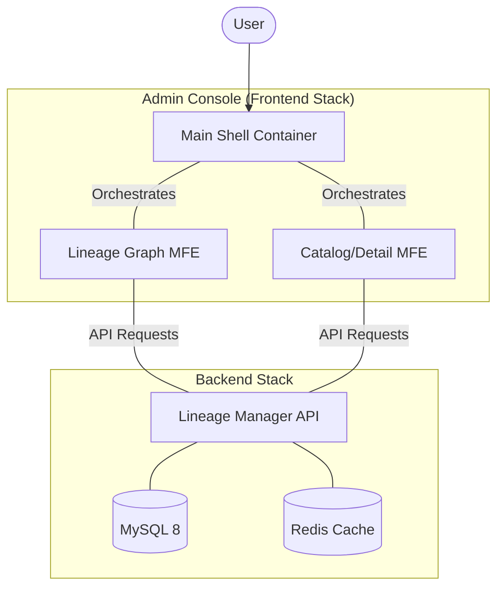

Created: 2026-01-30
Updated: 2026-01-30
Author: David
Version: 1.1
Status: Shipped
Title: OPS Console: System Architecture Overview

Summary:
Explains the high-level architecture of the OPS Console platform, detailing the interactions between the centralized backend (Lineage Manager) and the distributed micro-frontend ecosystem.

---

## 🏗️ System Overview

**OPS Console** is a modular platform for managing and visualizing complex data lineages. It is built as a **Micro-Frontend (MFE)** ecosystem orchestrated by a Main Shell, supported by a specialized FastAPI backend.

## 📦 Core Components

### 1. The Main Shell (Container)
- **Role**: Single Point of Entry and Orchestrator.
- **Responsibilities**:
  - Authentication & Session Management (OIDC).
  - Global Search and Navigation.
  - Dynamically mounting/unmounting MFEs.
  - Cross-MFE communication (Event Bridge).

### 2. Micro-Frontends (MFEs)
- **Lineage MFE**: Specialized in rendering high-performance dependency graphs using Cytoscape.js.
- **Catalog MFE**: Handles lists, detail views, and metadata management for jobs and tables.
- **Isolation**: Each MFE is independently deployable and uses a strictly defined contract via the **[MFE Contract](../../00.guides/mfe-contract.md)**.

### 3. Lineage Manager (Backend)
- **Role**: The centralized "Source of Truth" for graph data.
- **Core Technology**: FastAPI + SQLAlchemy + MySQL.
- **Detail**: See **[Backend Architecture Design](backend/design.md)**.

## 🔄 Interaction Patterns

### Cross-MFE Communication
MFEs do not communicate directly. They use a standard **Event Bridge** pattern managed by the Shell.
- Example: Selecting a node in the Lineage MFE triggers a `mfe:selection` event, which the Shell propagates to the Catalog MFE to show details.

### Authentication
- The Shell holds the OIDC state.
- When an MFE is mounted, the Shell injects an `auth` client.
- MFEs use this client to make authenticated requests to the backend.

## 🚀 Deployment Strategy
The system is designed for **Containerized Deployment** via Kubernetes or Docker Compose.
- **Backend**: Scalable FastAPI pods.
- **Frontend**: MFEs are served as static assets and integrated at runtime via Module Federation.
- **Detail**: See **[Local Docker Running Guide](../../00.guides/local-docker-guide.md)**.
