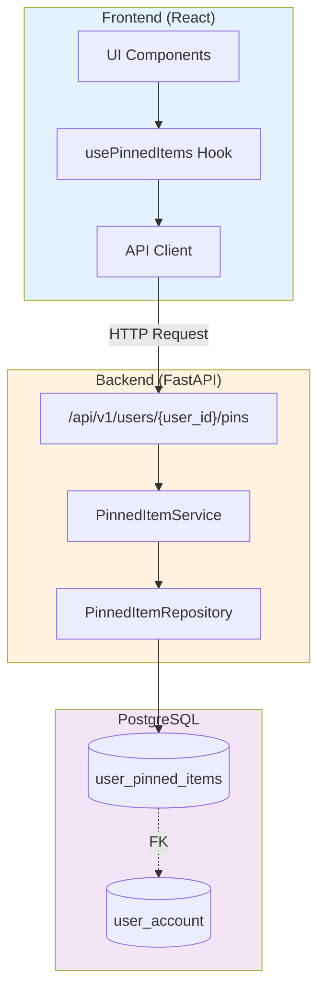
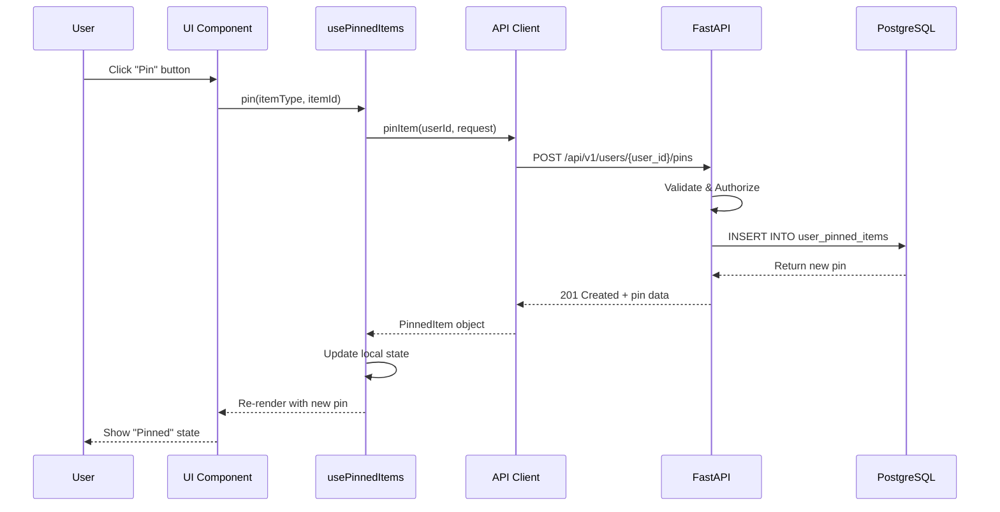
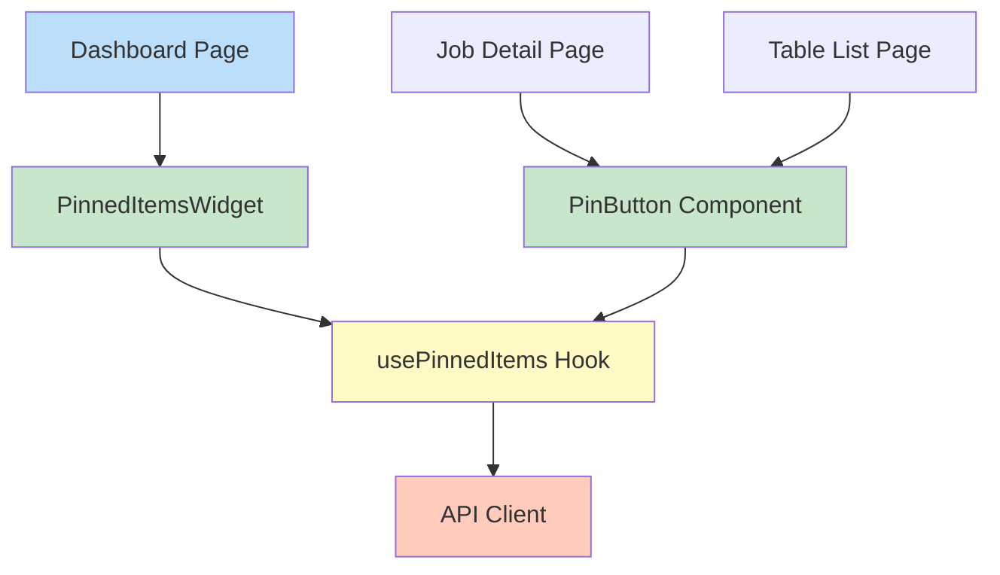
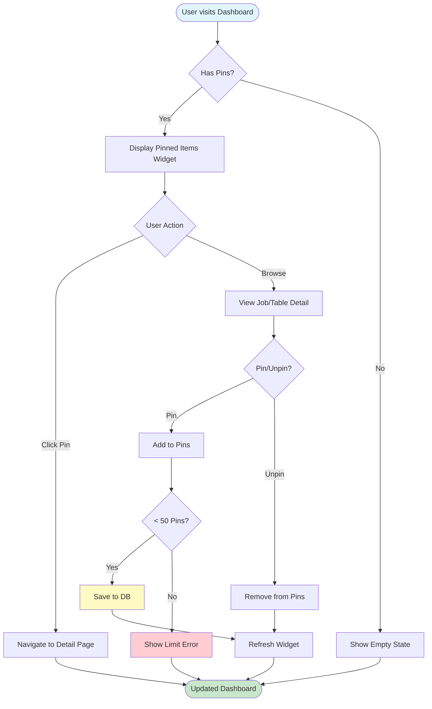
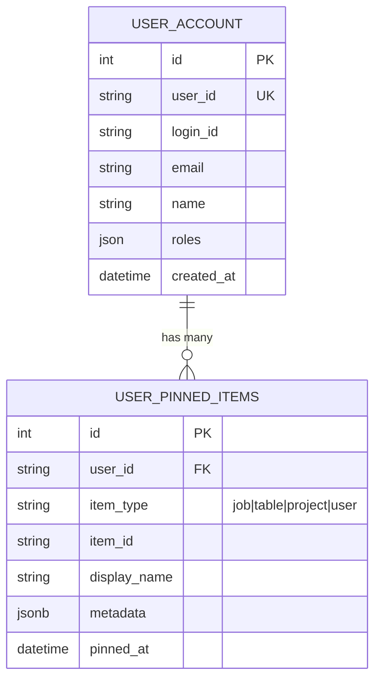

# Pinned Items Feature - 상세 구현 명세서

## 📋 목차
1. [기능 개요 및 사용 시나리오](#1-기능-개요-및-사용-시나리오)
2. [아키텍처 개요](#2-아키텍처-개요)
3. [데이터베이스 설계](#3-데이터베이스-설계)
4. [백엔드 구현](#4-백엔드-구현)
5. [API 명세](#5-api-명세)
6. [프론트엔드 구현](#6-프론트엔드-구현)
7. [UI/UX 디자인](#7-uiux-디자인)
8. [보안 및 성능](#8-보안-및-성능)
9. [테스트 전략](#9-테스트-전략)
10. [배포 계획](#10-배포-계획)

---

## 1. 기능 개요 및 사용 시나리오

### 1.1 기능 설명

**Pinned Items**는 사용자가 자주 사용하는 Jobs, Tables, Projects, Users를 "즐겨찾기"처럼 고정하여 빠르게 접근할 수 있는 기능입니다. 

**핵심 가치:**
- ⚡ **빠른 접근**: 자주 사용하는 리소스를 대시보드 상단에서 즉시 확인
- 🎯 **개인화**: 사용자별로 독립적인 Pin 목록 관리
- 📊 **생산성 향상**: 검색 없이 중요한 Job/Table로 원클릭 이동
- 👥 **협업 강화**: 팀원 프로필을 Pin하여 빠른 연락

### 1.2 대표 사용 시나리오

#### 시나리오 1: 데이터 엔지니어의 일상 모니터링
```
김철수 엔지니어는 매일 아침 다음 작업을 수행합니다:

1. 대시보드 접속 → "Pinned Items" 위젯 확인
2. Pin된 "Daily Sales ETL" Job 클릭 → 실행 상태 확인
3. Pin된 "sales.orders" Table 클릭 → 최신 데이터 검증
4. 문제 발견 시 Pin된 "Data Team Lead" 프로필 클릭 → 즉시 연락

✅ 결과: 검색 시간 90% 단축 (평균 5분 → 30초)
```

#### 시나리오 2: 프로젝트 매니저의 프로젝트 추적
```
박영희 PM은 3개 프로젝트를 동시에 관리합니다:

1. "Sales Analytics" 프로젝트 Pin
2. "Marketing Campaign" 프로젝트 Pin
3. "Customer Insights" 프로젝트 Pin

매일 대시보드에서 Pin된 프로젝트들의 상태를 한눈에 확인하고,
각 프로젝트의 핵심 Job/Table도 함께 Pin하여 전체 현황 파악

✅ 결과: 프로젝트 전환 시간 80% 단축
```

#### 시나리오 3: 신입 개발자의 온보딩
```
이민수 신입 개발자는 첫 주에 다음을 수행합니다:

1. 멘토가 공유한 핵심 Table 5개 Pin
2. 자주 참고하는 "Data Quality Check" Job Pin
3. 질문할 선배 개발자 3명 Pin

✅ 결과: 온보딩 기간 중 리소스 찾기 시간 70% 단축
```

### 1.3 제약 사항
- 사용자당 최대 **50개** Pin (타입별 제한 없음)
- Pin 순서는 **최신순** (pinned_at DESC)
- 삭제된 엔티티의 Pin은 자동 정리되지 않음 (UI에서 "Not Found" 표시)

---

## 2. 아키텍처 개요

### 2.1 전체 시스템 아키텍처



### 2.2 데이터 흐름도



### 2.3 컴포넌트 계층 구조



### 2.4 사용자 인터랙션 플로우



---

## 3. 데이터베이스 설계

### 3.1 Entity-Relationship Diagram



### 3.2 추천 스키마: 단일 Polymorphic 테이블

```sql
CREATE TABLE user_pinned_items (
    id SERIAL PRIMARY KEY,
    user_id VARCHAR(100) NOT NULL,
    item_type VARCHAR(20) NOT NULL CHECK (item_type IN ('job', 'table', 'project', 'user')),
    item_id VARCHAR(255) NOT NULL,
    display_name VARCHAR(500),
    metadata JSONB,
    pinned_at TIMESTAMP DEFAULT NOW(),
    
    CONSTRAINT unique_user_pin UNIQUE (user_id, item_type, item_id),
    CONSTRAINT fk_user FOREIGN KEY (user_id) 
        REFERENCES user_account(user_id) 
        ON DELETE CASCADE
);

CREATE INDEX idx_user_pins ON user_pinned_items(user_id, pinned_at DESC);
CREATE INDEX idx_item_lookup ON user_pinned_items(item_type, item_id);
```

### 2.2 스키마 선택 근거

**왜 단일 테이블인가?**
- ✅ 간단한 쿼리: `SELECT * FROM user_pinned_items WHERE user_id = ?`
- ✅ 확장성: 새로운 타입 추가 시 스키마 변경 불필요
- ✅ 성능: 단일 인덱스로 모든 조회 최적화
- ❌ FK 제약: item_id에 직접 FK를 걸 수 없음 (application-level validation)

---

## 3. 백엔드 구현

### 3.1 SQLAlchemy Model

```python
# lineage_manager/models/user_pinned_item.py
from sqlalchemy import Column, Integer, String, DateTime, Index, CheckConstraint, func
from sqlalchemy.dialects.postgresql import JSONB
from .base import Base

class ItemType:
    JOB = "job"
    TABLE = "table"
    PROJECT = "project"
    USER = "user"
    
    @classmethod
    def all(cls):
        return [cls.JOB, cls.TABLE, cls.PROJECT, cls.USER]

class UserPinnedItem(Base):
    __tablename__ = "user_pinned_items"
    
    id = Column(Integer, primary_key=True, autoincrement=True)
    user_id = Column(String(100), nullable=False, index=True)
    item_type = Column(String(20), nullable=False)
    item_id = Column(String(255), nullable=False)
    display_name = Column(String(500), nullable=True)
    metadata = Column(JSONB, nullable=True)
    pinned_at = Column(DateTime, default=func.now(), nullable=False)
    
    __table_args__ = (
        CheckConstraint(
            f"item_type IN {tuple(ItemType.all())}", 
            name="check_item_type"
        ),
        Index('idx_user_pins', 'user_id', 'pinned_at'),
        Index('idx_unique_pin', 'user_id', 'item_type', 'item_id', unique=True),
    )
    
    def to_dict(self):
        return {
            "id": self.id,
            "item_type": self.item_type,
            "item_id": self.item_id,
            "display_name": self.display_name,
            "metadata": self.metadata,
            "pinned_at": self.pinned_at.isoformat() if self.pinned_at else None
        }
```

### 3.2 Repository Layer

```python
# lineage_manager/repositories/pinned_item_repository.py
from typing import List, Optional
from sqlalchemy.orm import Session
from sqlalchemy.exc import IntegrityError
from ..models.user_pinned_item import UserPinnedItem, ItemType

class PinnedItemRepository:
    def __init__(self, db: Session):
        self.db = db
    
    def pin_item(
        self, 
        user_id: str, 
        item_type: str, 
        item_id: str, 
        display_name: Optional[str] = None,
        metadata: Optional[dict] = None
    ) -> UserPinnedItem:
        """Pin an item. Idempotent - returns existing if already pinned."""
        try:
            pin = UserPinnedItem(
                user_id=user_id,
                item_type=item_type,
                item_id=item_id,
                display_name=display_name,
                metadata=metadata
            )
            self.db.add(pin)
            self.db.commit()
            self.db.refresh(pin)
            return pin
        except IntegrityError:
            self.db.rollback()
            return self.db.query(UserPinnedItem).filter_by(
                user_id=user_id,
                item_type=item_type,
                item_id=item_id
            ).first()
    
    def unpin_item(self, user_id: str, item_type: str, item_id: str) -> bool:
        result = self.db.query(UserPinnedItem).filter_by(
            user_id=user_id,
            item_type=item_type,
            item_id=item_id
        ).delete()
        self.db.commit()
        return result > 0
    
    def get_user_pins(
        self, 
        user_id: str, 
        item_type: Optional[str] = None,
        limit: int = 50
    ) -> List[UserPinnedItem]:
        query = self.db.query(UserPinnedItem).filter_by(user_id=user_id)
        if item_type:
            query = query.filter_by(item_type=item_type)
        return query.order_by(UserPinnedItem.pinned_at.desc()).limit(limit).all()
    
    def is_pinned(self, user_id: str, item_type: str, item_id: str) -> bool:
        return self.db.query(UserPinnedItem).filter_by(
            user_id=user_id,
            item_type=item_type,
            item_id=item_id
        ).count() > 0
    
    def get_pin_count(self, user_id: str) -> int:
        return self.db.query(UserPinnedItem).filter_by(user_id=user_id).count()
```

### 3.3 Service Layer

```python
# lineage_manager/services/pinned_item_service.py
from typing import List, Optional
from ..repositories.pinned_item_repository import PinnedItemRepository
from ..models.user_pinned_item import ItemType, UserPinnedItem

class PinnedItemService:
    MAX_PINS_PER_USER = 50
    
    def __init__(self, repo: PinnedItemRepository):
        self.repo = repo
    
    def pin(
        self, 
        user_id: str, 
        item_type: str, 
        item_id: str, 
        display_name: Optional[str] = None,
        metadata: Optional[dict] = None
    ) -> UserPinnedItem:
        if item_type not in ItemType.all():
            raise ValueError(f"Invalid item_type: {item_type}")
        
        current_count = self.repo.get_pin_count(user_id)
        if current_count >= self.MAX_PINS_PER_USER:
            raise ValueError(f"Pin limit reached ({self.MAX_PINS_PER_USER})")
        
        return self.repo.pin_item(user_id, item_type, item_id, display_name, metadata)
    
    def unpin(self, user_id: str, item_type: str, item_id: str) -> bool:
        if item_type not in ItemType.all():
            raise ValueError(f"Invalid item_type: {item_type}")
        return self.repo.unpin_item(user_id, item_type, item_id)
    
    def get_pins(
        self, 
        user_id: str, 
        item_type: Optional[str] = None
    ) -> List[dict]:
        pins = self.repo.get_user_pins(user_id, item_type)
        return [pin.to_dict() for pin in pins]
```

---

## 4. API 명세

### 4.1 Pin an Item
**Endpoint:** `POST /api/v1/users/{user_id}/pins`

**Request:**
```json
{
  "item_type": "job",
  "item_id": "daily_sales_aggregation",
  "display_name": "Daily Sales Job",
  "metadata": {
    "project": "sales_analytics",
    "owner": "data_team"
  }
}
```

**Response (201 Created):**
```json
{
  "id": 123,
  "item_type": "job",
  "item_id": "daily_sales_aggregation",
  "display_name": "Daily Sales Job",
  "metadata": {
    "project": "sales_analytics",
    "owner": "data_team"
  },
  "pinned_at": "2026-01-31T07:30:00Z"
}
```

### 4.2 Unpin an Item
**Endpoint:** `DELETE /api/v1/users/{user_id}/pins/{item_type}/{item_id}`

**Response:** `204 No Content`

### 4.3 Get All Pinned Items
**Endpoint:** `GET /api/v1/users/{user_id}/pins?item_type=job`

**Response (200 OK):**
```json
{
  "pins": [
    {
      "id": 123,
      "item_type": "job",
      "item_id": "daily_sales_aggregation",
      "display_name": "Daily Sales Job",
      "pinned_at": "2026-01-31T07:30:00Z"
    }
  ],
  "total": 1
}
```

### 4.4 FastAPI Implementation

```python
# lineage_manager/api/v1/endpoints/pins.py
from fastapi import APIRouter, Depends, HTTPException, status
from typing import Optional
from pydantic import BaseModel
from ....services.pinned_item_service import PinnedItemService
from ....core.dependencies import get_pinned_item_service, get_current_user

router = APIRouter(prefix="/users/{user_id}/pins", tags=["pins"])

class PinRequest(BaseModel):
    item_type: str
    item_id: str
    display_name: Optional[str] = None
    metadata: Optional[dict] = None

@router.post("", status_code=status.HTTP_201_CREATED)
def pin_item(
    user_id: str,
    request: PinRequest,
    current_user = Depends(get_current_user),
    service: PinnedItemService = Depends(get_pinned_item_service)
):
    # Authorization check
    if user_id != current_user.user_id:
        raise HTTPException(status_code=403, detail="Forbidden")
    
    try:
        pin = service.pin(
            user_id, 
            request.item_type, 
            request.item_id,
            request.display_name,
            request.metadata
        )
        return pin.to_dict()
    except ValueError as e:
        raise HTTPException(status_code=400, detail=str(e))

@router.delete("/{item_type}/{item_id}", status_code=status.HTTP_204_NO_CONTENT)
def unpin_item(
    user_id: str,
    item_type: str,
    item_id: str,
    current_user = Depends(get_current_user),
    service: PinnedItemService = Depends(get_pinned_item_service)
):
    if user_id != current_user.user_id:
        raise HTTPException(status_code=403, detail="Forbidden")
    
    success = service.unpin(user_id, item_type, item_id)
    if not success:
        raise HTTPException(status_code=404, detail="Pin not found")

@router.get("")
def get_pins(
    user_id: str,
    item_type: Optional[str] = None,
    current_user = Depends(get_current_user),
    service: PinnedItemService = Depends(get_pinned_item_service)
):
    if user_id != current_user.user_id:
        raise HTTPException(status_code=403, detail="Forbidden")
    
    pins = service.get_pins(user_id, item_type)
    return {"pins": pins, "total": len(pins)}
```

---

## 5. 프론트엔드 구현

### 5.1 API Client

```typescript
// mfe-catalog/src/shared/api/api.ts
export interface PinRequest {
  item_type: string;
  item_id: string;
  display_name?: string;
  metadata?: Record<string, any>;
}

export interface PinnedItem {
  id: number;
  item_type: string;
  item_id: string;
  display_name?: string;
  metadata?: Record<string, any>;
  pinned_at: string;
}

export class ApiClient {
  // 기존 메서드들...
  
  async pinItem(userId: string, request: PinRequest): Promise<PinnedItem> {
    return this.request<PinnedItem>('POST', `/api/v1/users/${userId}/pins`, request);
  }
  
  async unpinItem(userId: string, itemType: string, itemId: string): Promise<void> {
    return this.request<void>('DELETE', `/api/v1/users/${userId}/pins/${itemType}/${itemId}`);
  }
  
  async getPinnedItems(userId: string, itemType?: string): Promise<PinnedItem[]> {
    const params = itemType ? `?item_type=${itemType}` : '';
    const response = await this.request<{pins: PinnedItem[]}>('GET', `/api/v1/users/${userId}/pins${params}`);
    return response.pins;
  }
}
```

### 5.2 React Hook

```typescript
// mfe-catalog/src/shared/hooks/usePinnedItems.ts
import { useState, useEffect, useCallback } from 'react';
import { useApiClient } from '../api/ApiContext';
import { PinnedItem } from '../api/api';

export function usePinnedItems(userId: string, itemType?: string) {
  const api = useApiClient();
  const [pins, setPins] = useState<PinnedItem[]>([]);
  const [loading, setLoading] = useState(true);
  const [error, setError] = useState<string | null>(null);
  
  const fetchPins = useCallback(async () => {
    try {
      setLoading(true);
      const data = await api.getPinnedItems(userId, itemType);
      setPins(data);
      setError(null);
    } catch (err: any) {
      setError(err.message);
    } finally {
      setLoading(false);
    }
  }, [api, userId, itemType]);
  
  const pin = useCallback(async (itemType: string, itemId: string, displayName?: string) => {
    try {
      const newPin = await api.pinItem(userId, { 
        item_type: itemType, 
        item_id: itemId, 
        display_name: displayName 
      });
      setPins(prev => [newPin, ...prev]);
      return newPin;
    } catch (err: any) {
      throw new Error(err.message);
    }
  }, [api, userId]);
  
  const unpin = useCallback(async (itemType: string, itemId: string) => {
    try {
      await api.unpinItem(userId, itemType, itemId);
      setPins(prev => prev.filter(p => !(p.item_type === itemType && p.item_id === itemId)));
    } catch (err: any) {
      throw new Error(err.message);
    }
  }, [api, userId]);
  
  const isPinned = useCallback((itemType: string, itemId: string) => {
    return pins.some(p => p.item_type === itemType && p.item_id === itemId);
  }, [pins]);
  
  useEffect(() => {
    fetchPins();
  }, [fetchPins]);
  
  return { pins, loading, error, pin, unpin, isPinned, refresh: fetchPins };
}
```

### 5.3 프론트엔드 호출 예시

#### 예시 1: Job Detail 페이지에서 Pin 버튼 추가
```typescript
// mfe-catalog/src/pages/job/JobDetailView.tsx
import { PinButton } from '../../shared/ui/PinButton';
import { useAuth } from '../../shared/api/AuthContext';

export function JobDetailView({ jobId }: { jobId: string }) {
  const { user } = useAuth();
  
  return (
    <div>
      <div className="flex items-center justify-between">
        <h1>Job: {jobId}</h1>
        <PinButton 
          userId={user.user_id}
          itemType="job"
          itemId={jobId}
          displayName={`Job: ${jobId}`}
        />
      </div>
      {/* 나머지 Job 상세 정보 */}
    </div>
  );
}
```

#### 예시 2: Table Landing에서 Pin 버튼 추가
```typescript
// mfe-catalog/src/features/datasets-table/DatasetsTableView.tsx
export function DatasetsTableView({ datasets }: Props) {
  const { user } = useAuth();
  const { pin, unpin, isPinned } = usePinnedItems(user.user_id);
  
  return (
    <Table>
      <TableBody>
        {datasets.map(dataset => (
          <TableRow key={dataset.name}>
            <TableCell>{dataset.name}</TableCell>
            <TableCell>
              <Button
                variant="ghost"
                size="sm"
                onClick={() => {
                  if (isPinned('table', dataset.name)) {
                    unpin('table', dataset.name);
                  } else {
                    pin('table', dataset.name, dataset.name);
                  }
                }}
              >
                <Star className={isPinned('table', dataset.name) ? 'fill-yellow-400' : ''} />
              </Button>
            </TableCell>
          </TableRow>
        ))}
      </TableBody>
    </Table>
  );
}
```

---

## 6. UI/UX 디자인

### 6.1 Pinned Items 표시 위치

#### 위치 1: Dashboard 상단 위젯 (Primary) ⭐
```
┌─────────────────────────────────────────────────────┐
│  Dashboard                                          │
├─────────────────────────────────────────────────────┤
│  📌 Pinned Items (5)                    [View All]  │
│  ┌──────────┬──────────┬──────────┬──────────┐     │
│  │ 🔧 Job   │ 📊 Table │ 📁 Proj  │ 👤 User  │     │
│  │ Daily    │ sales.   │ Sales    │ John     │     │
│  │ Sales    │ orders   │ Analytics│ Doe      │     │
│  └──────────┴──────────┴──────────┴──────────┘     │
├─────────────────────────────────────────────────────┤
│  Metrics Grid (5 cards)                             │
│  ...                                                 │
└─────────────────────────────────────────────────────┘
```

**구현:**
```tsx
// mfe-catalog/src/widgets/pinned-items/PinnedItemsWidget.tsx
import { usePinnedItems } from '../../shared/hooks/usePinnedItems';
import { Card, CardHeader, CardTitle, CardContent } from '../../shared/ui/card';
import { Star, Briefcase, Database, Folder, User } from 'lucide-react';

const ICON_MAP = {
  job: Briefcase,
  table: Database,
  project: Folder,
  user: User
};

export function PinnedItemsWidget({ userId }: { userId: string }) {
  const { pins, loading } = usePinnedItems(userId);
  
  if (loading) return <div>Loading...</div>;
  if (pins.length === 0) return null;
  
  return (
    <Card className="mb-6">
      <CardHeader className="pb-3">
        <div className="flex items-center justify-between">
          <CardTitle className="flex items-center gap-2 text-lg">
            <Star className="h-5 w-5 text-yellow-500 fill-yellow-500" />
            Pinned Items ({pins.length})
          </CardTitle>
          <a href="/pins" className="text-sm text-primary hover:underline">
            View All
          </a>
        </div>
      </CardHeader>
      <CardContent>
        <div className="grid grid-cols-2 md:grid-cols-4 lg:grid-cols-5 gap-3">
          {pins.slice(0, 5).map(pin => {
            const Icon = ICON_MAP[pin.item_type as keyof typeof ICON_MAP];
            return (
              <a
                key={pin.id}
                href={`/${pin.item_type}s/${pin.item_id}`}
                className="flex flex-col items-center gap-2 p-3 rounded-lg border border-slate-200 hover:bg-slate-50 hover:border-primary transition-all"
              >
                <Icon className="h-6 w-6 text-slate-600" />
                <span className="text-xs font-medium text-center truncate w-full">
                  {pin.display_name || pin.item_id}
                </span>
                <span className="text-[10px] text-slate-400 uppercase">
                  {pin.item_type}
                </span>
              </a>
            );
          })}
        </div>
      </CardContent>
    </Card>
  );
}
```

#### 위치 2: Header 드롭다운 (Secondary)
```
┌─────────────────────────────────────────────┐
│  Logo    [Search]    [Pins ▼]  [User ▼]    │
│                       │                      │
│                       └─────────────────┐   │
│                         📌 Pinned (5)   │   │
│                         ├─ 🔧 Daily ETL │   │
│                         ├─ 📊 Orders    │   │
│                         ├─ 📁 Sales     │   │
│                         └─ [View All]   │   │
└─────────────────────────────────────────────┘
```

**구현:**
```tsx
// container/src/components/Header.tsx
import { Star } from 'lucide-react';
import { usePinnedItems } from 'mfe-catalog/usePinnedItems';

export function Header() {
  const { user } = useAuth();
  const { pins } = usePinnedItems(user.user_id);
  
  return (
    <header>
      {/* ... 기존 헤더 요소 ... */}
      
      <DropdownMenu>
        <DropdownMenuTrigger>
          <Button variant="ghost" size="sm">
            <Star className="h-4 w-4" />
            Pins ({pins.length})
          </Button>
        </DropdownMenuTrigger>
        <DropdownMenuContent>
          {pins.slice(0, 5).map(pin => (
            <DropdownMenuItem key={pin.id} asChild>
              <a href={`/${pin.item_type}s/${pin.item_id}`}>
                {pin.display_name || pin.item_id}
              </a>
            </DropdownMenuItem>
          ))}
          <DropdownMenuSeparator />
          <DropdownMenuItem asChild>
            <a href="/pins">View All Pins</a>
          </DropdownMenuItem>
        </DropdownMenuContent>
      </DropdownMenu>
    </header>
  );
}
```

#### 위치 3: 전용 Pins 페이지 (Tertiary)
```
/pins 경로에 전체 Pin 목록을 관리하는 페이지

┌─────────────────────────────────────────────┐
│  My Pinned Items                            │
├─────────────────────────────────────────────┤
│  [All] [Jobs] [Tables] [Projects] [Users]  │
├─────────────────────────────────────────────┤
│  📌 Daily Sales ETL              [Unpin]    │
│  📌 sales.orders                 [Unpin]    │
│  📌 Sales Analytics Project      [Unpin]    │
│  ...                                         │
└─────────────────────────────────────────────┘
```

### 6.2 Pin 버튼 디자인

```tsx
// mfe-catalog/src/shared/ui/PinButton.tsx
import { Star } from 'lucide-react';
import { Button } from './button';
import { usePinnedItems } from '../hooks/usePinnedItems';
import { useState } from 'react';

interface PinButtonProps {
  userId: string;
  itemType: string;
  itemId: string;
  displayName?: string;
  variant?: 'icon' | 'text';
}

export function PinButton({ 
  userId, 
  itemType, 
  itemId, 
  displayName,
  variant = 'text'
}: PinButtonProps) {
  const { pin, unpin, isPinned } = usePinnedItems(userId);
  const [loading, setLoading] = useState(false);
  const pinned = isPinned(itemType, itemId);
  
  const handleToggle = async () => {
    setLoading(true);
    try {
      if (pinned) {
        await unpin(itemType, itemId);
      } else {
        await pin(itemType, itemId, displayName);
      }
    } catch (err) {
      console.error('Pin toggle failed:', err);
    } finally {
      setLoading(false);
    }
  };
  
  if (variant === 'icon') {
    return (
      <Button
        variant="ghost"
        size="sm"
        onClick={handleToggle}
        disabled={loading}
        className="h-8 w-8 p-0"
      >
        <Star 
          className={`h-4 w-4 transition-all ${
            pinned 
              ? 'fill-yellow-400 text-yellow-400' 
              : 'text-slate-400 hover:text-yellow-400'
          }`} 
        />
      </Button>
    );
  }
  
  return (
    <Button
      variant="outline"
      size="sm"
      onClick={handleToggle}
      disabled={loading}
      className="gap-2"
    >
      <Star className={`h-4 w-4 ${pinned ? 'fill-yellow-400 text-yellow-400' : ''}`} />
      {pinned ? 'Unpin' : 'Pin'}
    </Button>
  );
}
```

---

## 7. 보안 및 성능

### 7.1 보안 고려사항

**Authorization:**
- 사용자는 자신의 Pin만 조회/수정 가능
- API 레벨에서 `current_user.user_id` 검증

**Input Validation:**
- `item_type` 화이트리스트 검증
- `display_name` 길이 제한 (500자)
- SQL Injection 방지 (Parameterized Query)

**Rate Limiting:**
```python
from slowapi import Limiter

@router.post("", dependencies=[Depends(RateLimiter(times=10, seconds=60))])
def pin_item(...):
    # 분당 최대 10회 Pin
```

### 7.2 성능 최적화

**Database Indexes:**
- `(user_id, pinned_at DESC)` for fast listing
- `(user_id, item_type, item_id)` unique index

**Caching (Optional):**
```python
from functools import lru_cache

@lru_cache(maxsize=1000, ttl=300)
def get_user_pins_cached(user_id: str):
    return service.get_pins(user_id)
```

---

## 8. 테스트 전략

### 8.1 Unit Tests

```python
def test_pin_item_success(mock_repo):
    service = PinnedItemService(mock_repo)
    pin = service.pin("user123", "job", "daily_sales")
    assert pin.item_type == "job"

def test_pin_limit_exceeded(mock_repo):
    mock_repo.get_pin_count.return_value = 50
    service = PinnedItemService(mock_repo)
    with pytest.raises(ValueError, match="Pin limit reached"):
        service.pin("user123", "job", "new_job")
```

### 8.2 Integration Tests

```python
def test_pin_and_unpin_flow(client: TestClient, test_user):
    # Pin
    response = client.post(
        f"/api/v1/users/{test_user.user_id}/pins",
        json={"item_type": "job", "item_id": "test_job"}
    )
    assert response.status_code == 201
    
    # Verify
    response = client.get(f"/api/v1/users/{test_user.user_id}/pins")
    assert len(response.json()["pins"]) == 1
    
    # Unpin
    response = client.delete(
        f"/api/v1/users/{test_user.user_id}/pins/job/test_job"
    )
    assert response.status_code == 204
```

---

## 9. 배포 계획

### 9.1 Migration

```python
# alembic/versions/0008_add_user_pinned_items.py
def upgrade():
    op.create_table(
        'user_pinned_items',
        sa.Column('id', sa.Integer(), autoincrement=True, nullable=False),
        sa.Column('user_id', sa.String(100), nullable=False),
        sa.Column('item_type', sa.String(20), nullable=False),
        sa.Column('item_id', sa.String(255), nullable=False),
        sa.Column('display_name', sa.String(500), nullable=True),
        sa.Column('metadata', postgresql.JSONB(), nullable=True),
        sa.Column('pinned_at', sa.DateTime(), server_default=sa.func.now()),
        sa.PrimaryKeyConstraint('id'),
        sa.ForeignKeyConstraint(['user_id'], ['user_account.user_id'], ondelete='CASCADE'),
        sa.CheckConstraint("item_type IN ('job', 'table', 'project', 'user')")
    )
    op.create_index('idx_user_pins', 'user_pinned_items', ['user_id', 'pinned_at'])
    op.create_index('idx_unique_pin', 'user_pinned_items', ['user_id', 'item_type', 'item_id'], unique=True)
```

### 9.2 Deployment Checklist

- [ ] Run migration: `alembic upgrade head`
- [ ] Deploy backend with new endpoints
- [ ] Deploy frontend with Pin UI components
- [ ] Monitor error rates and performance
- [ ] Set up alerts for pin limit violations
- [ ] Update API documentation

---

## 요약

| 항목 | 구현 방식 |
|------|----------|
| **데이터베이스** | 단일 `user_pinned_items` 테이블 (Polymorphic) |
| **백엔드** | FastAPI + Service/Repository 패턴 |
| **프론트엔드** | React Hooks + Star 아이콘 UI |
| **표시 위치** | ① Dashboard 위젯 ② Header 드롭다운 ③ 전용 /pins 페이지 |
| **보안** | User authorization + Input validation + Rate limiting |
| **성능** | Indexed queries + Optional caching |

**다음 단계:**
1. 이 명세서 검토 및 승인
2. Feature 브랜치 생성: `84.pinned-items-feature`
3. 백엔드 구현 (Migration → Models → API)
4. 프론트엔드 구현 (Hooks → Components → Widgets)
5. 테스트 작성 및 배포
