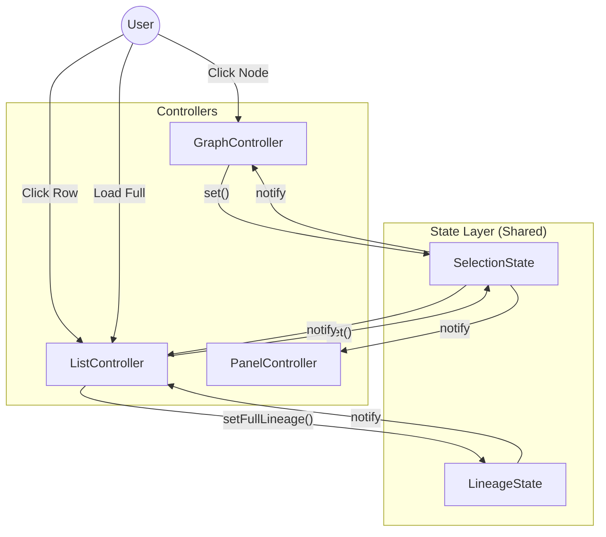

# Frontend Architecture & State Management Design

This document details the frontend implementation strategy for the new **List View** feature, specifically focusing on the "Shared State" (Pub/Sub) pattern.

## 1. The Challenge: Component Synchronization

In the existing application, three main components need to stay in sync:

1.  **Graph View** (Cytoscape): Displays a partial visual graph.
2.  **List View** (New): Displays either the current graph nodes OR a hierarchical full lineage tree.
3.  **Detail Panel**: Displays details for the *currently selected* item.

**Problem**: Without a central state, clicking a node in the Graph requires the GraphController to manually find and update the DetailPanel and the ListView. Clicking a row in the ListView would require the ListController to manually manipulate the Graph and Panel. This leads to "spaghetti code" and tight coupling.

## 2. The Solution: Pub/Sub State Stores

We introduce two lightweight State classes that act as the "Source of Truth". Components **subscribe** to changes and **publish** actions.

### A. SelectionState

Manages "What is currently selected?".

*   **State Data**:
    ```javascript
    {
      selectedNode: {
        id: "t123",       // ID of the job or table
        type: "table",    // "job" or "table"
        source: "graph",  // "graph" or "list" (who initiated?)
        label: "my_table"
      }
    }
    ```
*   **Flow**:
    1.  User clicks a Node in Graph.
    2.  `GraphController` calls `selectionState.set({ ... })`.
    3.  `SelectionState` notifies all subscribers.
    4.  **DetailPanel** receives update → Fetches/Displays details.
    5.  **ListView** receives update → Highlights the corresponding row.

### B. LineageState

Manages "What data do we have?".

*   **State Data**:
    ```javascript
    {
      graphData: { nodes: [...], edges: [...] }, // Current Cytoscape elements
      fullLineage: { upstream: [...], downstream: [...] } // Full hierarchy from API
    }
    ```
*   **Flow**:
    1.  User clicks "Load Full Lineage".
    2.  `ListController` fetches API data (`/hierarchy`).
    3.  `ListController` calls `lineageState.setFullLineage(data)`.
    4.  `LineageState` notifies subscribers.
    5.  **ListView** re-renders the Full Hierarchy tab.
    6.  (Optional future) **GraphView** could show a "Has more data" indicator.

## 3. Data Flow Diagram



## 4. Implementation Details

### `state.js` (Implemented)
Contains the `SelectionState` and `LineageState` classes with simple `subscribe()` and `notify()` methods.

### `GraphController` Refactoring
*   **Old**: `cy.on("tap", ...)` -> calls `this.panelController.update(...)`
*   **New**: `cy.on("tap", ...)` -> calls `selectionState.set(...)`
*   **New**: `selectionState.subscribe(node => { if (node.source !== 'graph') this.selectNode(node.id) })`

### `ListController` (New)
*   Render table.
*   On row click -> `selectionState.set({ source: 'list', ... })`
*   On subscription update -> Highlight row matching `state.selectedNode.id`.

### `PanelController` Refactoring
*   **Old**: Exposes methods like `loadJob(...)`, `loadTable(...)` called by others.
*   **New**: `selectionState.subscribe(node => { this.fetchAndShow(node) })`

## 5. Benefits

1.  **Decoupling**: `GraphController` doesn't need to know `ListController` exists.
2.  **Scalability**: Adding a 4th view (e.g., a "History Timeline" view) just requires subscribing to the state; no existing code needs to change.
3.  **Consistency**: There is only one active "Selected Node" at any time.
