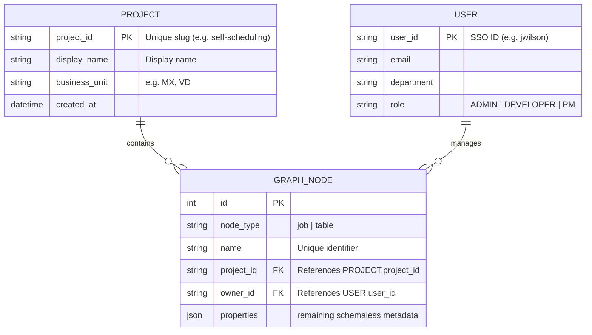

# Admin Console DB Optimization Design

## Fast Search for Projects, Users, and Related Jobs

---

## 1. 개요 (Background)

현재 `lineage-manager`는 모든 개체(Job, Table 등)를 `graph_node` 테이블에 저장하며, 프로젝트(`project_id`)나 소유자(`owner_id`)와 같은 메타데이터를 `properties` JSON 컬럼 내부에 보관하고 있습니다.

### 현 구조의 한계점

- **검색 성능 저하**: 인덱싱되지 않은 JSON 내부 필드를 조건절(`WHERE properties->>...`)에 사용할 경우, 데이터 증가에 따라 **Full Table Scan**이 발생합니다.
- **데이터 무결성 위협**: 프로젝트 이름이나 사용자 정보가 변경될 경우 모든 관련 노드의 JSON을 업데이트해야 하며, 외래키(Foreign Key) 제약 조건이 없어 데이터가 파편화될 위험이 있습니다.

---

## 2. DB 구조 개선 전략

### Phase 1: 가상 컬럼(Virtual Columns) 도입 (단기 해결책)

기존 정적 스키마와 쓰기 로직을 전혀 고치지 않고 **인덱스**를 즉시 적용할 수 있는 MySQL의 Generated Columns 기능을 활용합니다.

#### 상세 스키마 정의 (DDL)

```sql
-- 검색 빈도가 높은 필드를 가상 컬럼으로 추출
ALTER TABLE graph_node
ADD COLUMN project_id VARCHAR(100) GENERATED ALWAYS AS (properties->>'$.project_id') VIRTUAL,
ADD COLUMN owner_id VARCHAR(100) GENERATED ALWAYS AS (properties->>'$.owner_id') VIRTUAL;

-- 추출된 컬럼에 일반 B-Tree 인덱스 생성
CREATE INDEX idx_node_project_id ON graph_node(project_id);
CREATE INDEX idx_node_owner_id ON graph_node(owner_id);
```

#### 선택 이유

- **No Refactoring**: 애플리케이션의 `INSERT` 및 `UPDATE` 쿼리 수정이 필요 없습니다.
- **Direct Performance Gain**: 기존 JSON 파싱 비용을 제거하고 인덱스를 직접 탈 수 있습니다.

---

### Phase 2: 정규화 및 엔티티 독립 (중장기 설계)

프로젝트와 사용자를 **일급 시민(First-class Citizen)** 형태의 독립 테이블로 승격시켜 관계 중심의 설계를 완성합니다.

#### 권장 데이터 도메인 구조



#### 선택 이유

- **확장성**: 향후 프로젝트별 대시보드나 사용자 권한 관리(RBAC) 기능을 추가하기 용이합니다.
- **일관성**: 외래키 제약 조건을 통해 유령 프로젝트 참조나 중복 사용자 데이터를 방지합니다.

---

## 3. 기대되는 성능 개선치

| 작업 (Scenario)                 | As-is (JSON 검색)             | To-be (가상 컬럼/정규화) | 개선 효과                     |
| :------------------------------ | :---------------------------- | :----------------------- | :---------------------------- |
| **특정 프로젝트내 Job 조회**    | $O(N)$ - Full Scan            | $O(\log N)$ - Index Scan | **10배 ~ 100배 이상**         |
| **사용자별 활동 통계**          | JSON 파싱 및 임시 테이블 생성 | 인덱스 기반 집계 연산    | **수십 배 연산 속도 향상**    |
| **유연성 (Schema Flexibility)** | 높음                          | 보통 (핵심키만 고정)     | 인덱싱 성능과 유연성의 균형점 |

---

## 4. 백엔드 Repository 구현 방향

개선된 스키마를 활용하기 위해 `JobRepository` 등에서 다음과 같은 메서드 구조를 권장합니다.

```python
# lineage-manager/repositories/job_repository.py
def find_by_project(self, project_id: str):
    """
    프로젝트에 속한 모든 노드를 고속 인덱스 스캔으로 반환.
    가상 컬럼이 적용된 상태라면 native column처럼 쿼리 가능.
    """
    stmt = select(GraphNode).where(GraphNode.project_id == project_id)
    return self.db.execute(stmt).scalars().all()
```

---

## 5. 결론 및 제언

Admin Console의 유기적인 페이지 내비게이션(Job ↔ Project ↔ User)을 지원하기 위해서는 **인덱싱 가능한 구조**가 필수적입니다.

1. 우선 **Phase 1(가상 컬럼)**을 적용하여 현재 67.mfe_loading 브랜치에서 진행 중인 시연 UI의 응답 속도를 확보할 것을 권장합니다.
2. 이후 프로젝트 생성/수정 기능이 추가되는 시점에 **Phase 2(정규화)**로 전환하여 데이터 정합성을 확보하는 로드맵이 가장 안정적입니다.
