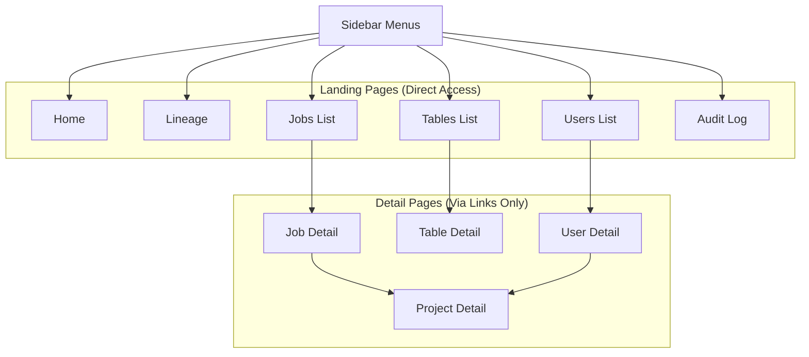

# Admin Console Navigation & Routing Specification

## Page Hierarchy, Navigation Rules, and Breadcrumb Policy

---

## 1. Purpose

본 문서는 Admin Console 내의 **페이지 이동 규칙(Navigation)**, **페이지 계층 구조(Page Hierarchy)**, 그리고 **브레드크럼(Breadcrumb) 정책**을 명확히 정의합니다.

### 목적

- **화면 이동의 일관성 유지**: 사용자가 어떤 MFE(Micro Frontend) 영역에 있더라도 동일한 탐색 경험을 제공합니다.
- **명시적 근거 제공**: 메뉴의 유무나 특정 이동 경로에 대한 정책적 근거를 제공합니다.

---

## 2. Page Hierarchy



### 2.1 Top-level Landing Pages (Sidebar Menus)

사이드바에 항상 노출되는 최상위 진입점입니다. 시스템 전반을 조망하는 출발점 역할을 합니다.

- **Home**: 대시보드 및 시스템 전체 현황 요약
- **Lineage**: 데이터 흐름 및 상호 연결성 분석 (Graph View)
- **Jobs**: 전체 배치 및 스트리밍 작업 목록 (List View)
- **Tables**: 데이터 테이블 및 데이터셋 메타데이터 목록 (List View)
- **Users (Job Owners)**: 시스템 사용자 및 작업 소유자 목록 (List View)
- **Audit**: 시스템 전체 이벤트 및 변경 이력 로그

**공통 특성**:

- 해당 도메인의 '리스트' 또는 '요약' 성격을 띱니다.
- URL을 통한 직접 접근(Deep-linking)이 보장되어야 합니다.

### 2.2 Detail Pages (Non-Landing)

단독 랜딩 페이지를 가지지 않으며, 특정 엔티티 하나에 집중한 페이지입니다.

- **Lineage Detail** (`/lineage/{entity_name}`): 특정 엔티티를 중심으로 한 리니지 전용 뷰
- **Job Detail** (`/jobs/{job_name}`)
- **Table Detail** (`/tables/{table_name}`)
- **Project Detail** (`/projects/{project_name}`)
- **User Detail** (`/users/{user_id}`)

**공통 특성**:

- 사이드바 메뉴에 직접 노출되지 않습니다.
- 반드시 다른 리스트 페이지나 상세 페이지의 링크를 통해서만 진입할 수 있습니다.

### 2.3 Project Page Policy (중요)

**Project는 Top-level Landing Page를 가지지 않습니다.**

- **독립적 탐색 불가**: "전체 프로젝트 목록" 페이지는 존재하지 않습니다.
- **Contextual Entity**: Project는 Job이나 User의 소속 정보(맥락)를 나타내는 엔티티로 취급합니다.
- **접근 경로 제한**: Project Detail 페이지는 오직 다음의 경로를 통해서만 접근 가능합니다.
  - **Job Detail** → 소속 Project 링크 클릭
  - **User Detail** → 소속 Project 링크 클릭

> [!NOTE]
> 이 정책은 Project를 독립적인 '관리 대상'이 아닌 '분류 및 맥락' 단위로 유지하여, 사이드바의 복잡도를 낮추고 Job/User 중심의 탐색 흐름을 강화하기 위함입니다.

---

## 3. Navigation Rules

### 3.1 기본 이동 규칙

1.  **List → Detail**: 가장 기본적인 탐색 흐름입니다.
2.  **Detail → Detail**: 엔티티 간 연관 관계가 있을 때 참조 링크(Cross-link)를 통해서만 허용합니다.
3.  **Sidebar**: 언제나 최상위 Landing Page의 초기 상태로 이동합니다.

### 3.2 엔티티 간 상세 이동 규칙

```mermaid
graph LR
    subgraph Landing ["Landing Pages (Sidebar Context)"]
        J[Jobs List]
        T[Tables List]
        U[Users List]
        L[Lineage View]
    end

    J --> JD[Job Detail]
    T --> TD[Table Detail]
    U --> UD[User Detail]
    L --> LD[Lineage Detail]

    JD -.-> TD
    JD -.-> UD
    JD -.-> PD[Project Detail]
    JD -.-> LD

    TD -.-> LD
    TD -.-> JD

    UD -.-> JD
    UD -.-> PD

    LD -.-> JD
    LD -.-> TD

    style PD fill:#f1f5f9,stroke:#64748b,stroke-width:2px
    style LD fill:#f8fafc,stroke:#94a3b8,stroke-width:2px
    linkStyle 4,5,6,7,8,9,10,11,12,13,14 stroke:#cbd5e1,stroke-width:1px,stroke-dasharray: 5;
```

- **Jobs domain**:
  - `Jobs (List)` → `Job Detail`
  - `Job Detail` → `Project Detail` | `User Detail` | `Table Detail (I/O)` | `Lineage Detail`
- **Tables domain**:
  - `Tables (List)` → `Table Detail`
  - `Table Detail` → `Job Detail (Upstream/Downstream)` | `Lineage Detail`
- **Lineage domain**:
  - `Lineage (Graph View)` → `Job Detail` (Node 클릭 시) | `Table Detail` (Node 클릭 시)
- **Users domain**:
  - `Users (List)` → `User Detail`
  - `User Detail` → `Job Detail` | `Project Detail`
- **Projects domain**:
  - `Project Detail` → `Job Detail` | `User Detail`
  - ❌ `Project Detail` → `Project List` (존재하지 않음)

---

## 4. Breadcrumb Policy

### 4.1 기본 원칙

- **개념적 계층 표현**: 브레드크럼은 사용자의 실제 클릭 이력(History)이 아니라, 시스템의 **개념적 계층 구조**를 나타냅니다.
- **Root 기준**: 항상 사이드바의 최상위 메뉴(Home 또는 해당 도메인 정적 텍스트)를 Root로 시작합니다.

### 4.2 브레드크럼 구성 규칙

- **Job Detail**: `Home` > `Jobs` > `{job_name}`
- **Table Detail**: `Home` > `Tables` > `{table_name}`
- **User Detail**: `Home` > `Users` > `{user_id}`
- **Project Detail**: `Home` > `Projects` > `{project_name}`
- **Lineage Detail**: `Home` > `Lineage` > `{entity_name}` (Table/Job 명칭)

> [!TIP]
> **Lineage 진입 규칙**: Jobs나 Tables의 상세 페이지에서 "리니지 보기"를 클릭하여 이동한 경우에도, 브레드크럼은 현재 도메인인 `Home > Lineage > ...` 기준을 따릅니다. 이는 사용자의 분석 문맥이 '대상 식별'에서 '관계 분석'으로 전환되었음을 의미합니다.

> [!CAUTION]
> `Home > Jobs > job_a > Project_x` 와 같은 **중첩 브레드크럼은 허용하지 않습니다.** 엔티티를 이동하면 브레드크럼은 해당 상세 페이지의 표준 형식을 따릅니다.

---

## 5. Cross-Entity Link Rules

- **가시성**: 시스템 내 모든 엔티티 이름(Job Name, Table Name 등)은 클릭 가능한 강조 텍스트로 표시합니다.
- **Destination**: 링크 클릭 시 항상 해당 엔티티의 전용 상세 페이지로 이동합니다.
- **Context Refresh**: 상세 페이지 간 이동 시 브레드크럼은 즉시 새 엔티티 기준으로 재구성됩니다.
  - _예: Job Detail에서 소속 Project 클릭 시 이동 후 브레드크럼은 `Home > Projects > project_name`이 됩니다._

---

## 6. Audit & Activity 위치 정책

### 6.1 Audit (Sidebar 전용)

- **범위**: 시스템 전체에서 일어나는 모든 이벤트 로그입니다.
- **대상**: 전체 작업 결과, 시스템 설정 변경, 명령어 실행 등 관리자 관점의 추적 데이터입니다.

### 6.2 User Activity (User Detail 내부)

- **범위**: 특정 사용자에 국한된 활동 로그입니다.
- **특징**: 해당 사용자가 등록/수정/실행한 Job 중심의 데이터를 노출합니다.
- **관계**: Audit 전체 로그의 부분 집합(Subset View)으로 간주합니다.

---

## 7. Non-Goals (명시적 제외 사항)

- **Project List 추가**: 별도의 프로젝트 목록 페이지 개발은 범위에서 제외됩니다.
- **History-based Breadcrumb**: 브레드크럼에 사용자의 이전 페이지 정보를 남기지 않습니다.
- **Multi-step Drill-down**: 엔티티 간 3단계 이상의 깊은 상속 구조 탐색은 지양합니다.

---

## 8. Summary

1. Admin Console 탐색의 3대 핵심축은 **Jobs**, **Tables**, **Users**입니다.
2. **Project**는 독립적 엔티티가 아닌, 상위 엔티티의 맥락(Context)을 제공하는 용도로만 사용됩니다.
3. 모든 이동과 표식(Breadcrumb)은 단순하고 예측 가능해야 하며, 명확한 링크 규칙을 따릅니다.
