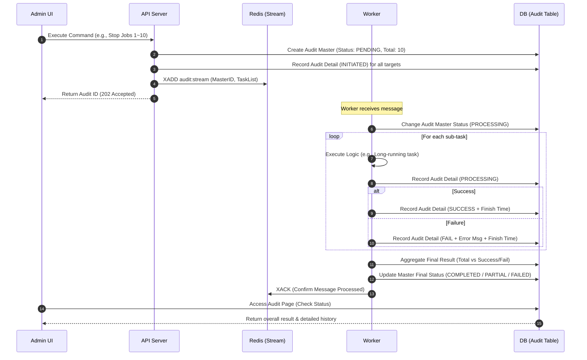

# 📑 Asynchronous Command Execution & Audit System Design Document

This document outlines the design for tracking the full lifecycle of asynchronous operations (e.g., graph initialization, batch job stops, permission changes) executed from the Admin Console, providing real-time progress and detailed results to users.

## 1. System Architecture & Deployment Structure
The system adopts a **Producer-Consumer pattern** for asynchronous processing. **Redis Streams** is used as the message broker to ensure reliable event delivery and distributed processing capability.

```mermaid
graph TD
    subgraph "Admin Console (UI)"
        UI[Audit Dashboard]
    end

    subgraph "API Gateway / Producer"
        API[Admin API Server]
    end

    subgraph "Event Broker"
        Redis[(Redis Streams<br/>'audit:stream')]
    end

    subgraph "Worker Layer (Consumer)"
        W1[Command Worker A]
        W2[Command Worker B]
    end

    subgraph "Persistence"
        DB[(RDBMS<br/>Audit DB)]
    end

    UI -->|1. Request Command Execution (with UserID)| API
    API -->|2. Create Master Audit (Store Actor Info)| DB
    API -->|3. Publish Job Event| Redis
    API -.->|4. Respond Task ID| UI
    
    Redis -->|5. Consume Event| W1
    Redis -->|5. Consume Event| W2
    
    W1 & W2 -->|6. Record Sub-task Status| DB
    W1 & W2 -->|7. Update Final Result & Notify Actor| DB
    
    UI -->|8. Real-time Status Inquiry (SSE/Polling)| DB
```

## 2. Workflow (Sequence Diagram)
Describes the creation and state transitions of the **Master Audit** (parent) and **Detail Audit** (child).



## 3. Data Schema Definition

### 3.1. RDBMS Table Schema

#### 1) `audit_masters` (High-level Command Management)
| Column Name | Type | Constraints | Description |
| :--- | :--- | :--- | :--- |
| `audit_id` | UUID | PK | Unique Task Identifier |
| `command_type` | VARCHAR(50) | NOT NULL | GRAPH_INIT, BATCH_STOP, etc. |
| `status` | VARCHAR(20) | NOT NULL | PENDING, PROCESSING, COMPLETED, PARTIAL, FAILED |
| `performed_by` | VARCHAR(100) | NOT NULL | User ID/Email who executed the command |
| `request_payload`| JSON / TEXT | - | Original request parameters (for debugging) |
| `total_count` | INT | NOT NULL | Total number of targets |
| `success_count`| INT | DEFAULT 0 | Number of successes |
| `fail_count` | INT | DEFAULT 0 | Number of failures |
| `created_at` | TIMESTAMP | DEFAULT NOW | Command start time |
| `updated_at` | TIMESTAMP | - | Last update time |

#### 2) `audit_details` (Sub-task Specific Logs / Events)
| Column Name | Type | Constraints | Description |
| :--- | :--- | :--- | :--- |
| `detail_id` | BIGINT | PK, AI | Detailed log ID |
| `parent_id` | UUID | FK | Reference to `audit_masters.audit_id` |
| `target_id` | VARCHAR(255) | - | Target resource identifier (e.g., job_123) |
| `task_name` | VARCHAR(100) | NOT NULL | Human-readable target name (for display) |
| `status` | VARCHAR(20) | NOT NULL | INITIATED, PROCESSING, SUCCESS, FAIL |
| `message` | TEXT | - | Event description, success details or error message |
| `created_at` | TIMESTAMP | DEFAULT NOW | Time when the event occurred |

## 4. Redis Message Structure & Implementation Examples

### 4.1. Redis Stream Message Payload
The messages in the Redis Stream include minimal metadata and the list of target objects for traceability.

```json
{
  "audit_id": "550e8400-e29b-41d4-a716-446655440000",
  "command": "BATCH_STOP",
  "targets": ["job_01", "job_02", "job_03", "...", "job_10"]
}
```

### 4.2. Implementation Example (Python-based)

#### [Producer] Command Issuance
```python
import redis
import uuid
import json

r = redis.StrictRedis(host='localhost', port=6379, decode_responses=True)

def execute_batch_stop(target_jobs, admin_id):
    audit_id = str(uuid.uuid4())
    
    # 1. DB: Create Master Record
    db.execute(
        "INSERT INTO audit_masters (audit_id, command_type, status, total_count, performed_by) VALUES (%s, %s, %s, %s, %s)",
        (audit_id, 'BATCH_STOP', 'PENDING', len(target_jobs), admin_id)
    )

    # 1-1. DB: Record Detail Start (INITIATED)
    for target in target_jobs:
        db.execute(
            "INSERT INTO audit_details (parent_id, target_id, task_name, status, message) VALUES (%s, %s, %s, %s, %s)",
            (audit_id, target, target, 'INITIATED', f'Command received and queued for {target}')
        )

    # 2. Redis: Publish Event (Stream)
    payload = {
        "audit_id": audit_id,
        "command": "BATCH_STOP",
        "targets": json.dumps(target_jobs)
    }
    r.xadd("audit:stream", payload)
    
    return audit_id
```

#### [Consumer] Event Processing & Audit Update
```python
def audit_worker():
    group_name = "audit_workers"
    stream_key = "audit:stream"
    
    try:
        r.xgroup_create(stream_key, group_name, id='0', mkstream=True)
    except:
        pass

    while True:
        # Wait for and receive messages
        messages = r.xreadgroup(group_name, "worker_1", {stream_key: ">"}, count=1, block=5000)
        
        for _, msg_list in messages:
            for msg_id, data in msg_list:
                audit_id = data['audit_id']
                targets = json.loads(data['targets'])
                
                # Update Master status to PROCESSING
                db.execute("UPDATE audit_masters SET status='PROCESSING' WHERE audit_id=%s", (audit_id,))
                
                s_count, f_count = 0, 0
                for target in targets:
                    try:
                        # Record Detail Processing when actual task is picked up by worker
                        db.execute(
                            "INSERT INTO audit_details (parent_id, target_id, task_name, status, message) VALUES (%s, %s, %s, %s, %s)", 
                            (audit_id, target, target, 'PROCESSING', f'Task {target} is now processing')
                        )
                        
                        # [Execute actual business logic]
                        # stop_job(target)
                        
                        # Record Detail Success
                        db.execute(
                            "INSERT INTO audit_details (parent_id, target_id, task_name, status, message) VALUES (%s, %s, %s, %s, %s)", 
                            (audit_id, target, target, 'SUCCESS', 'Task completed successfully')
                        )
                        s_count += 1
                    except Exception as e:
                        # Record Detail Failure
                        db.execute(
                            "INSERT INTO audit_details (parent_id, target_id, task_name, status, message) VALUES (%s, %s, %s, %s, %s)", 
                            (audit_id, target, target, 'FAIL', str(e))
                        )
                        f_count += 1
                
                # Aggregate final results and update Master status
                final_status = 'COMPLETED' if f_count == 0 else ('FAILED' if s_count == 0 else 'PARTIAL')
                db.execute("""
                    UPDATE audit_masters 
                    SET status=%s, success_count=%s, fail_count=%s, updated_at=NOW() 
                    WHERE audit_id=%s
                """, (final_status, s_count, f_count, audit_id))

                # Redis Ack processing
                r.xack(stream_key, group_name, msg_id)
```

## 5. UI/UX Considerations (Search & Monitoring)

- **Audit Main List**: Displays `audit_masters` with a progress bar and final status for an at-a-glance overview of business progress.
- **Detailed View (Drill-down)**: Selecting a specific `audit_id` expands to show the full lifecycle of the command. For long-running tasks, the frontend computes and prominently displays:
  - **Queued Time**: Delay between the `INITIATED` event and the `PROCESSING` event.
  - **Start Time**: Extracted from the `PROCESSING` event timestamp.
  - **End Time / Result**: Extracted from the `SUCCESS` or `FAIL` event timestamp, showing final outcome and any messages.
  Below this summary, it displays the chronological list of all sub-events (`audit_details`) related to that parent command.
- **Real-time Updates**: While the page is open, the progress (success_count / total_count) and incoming events are updated via 5-10 second polling or WebSocket/SSE for live monitoring.
- **Summary Header**: Displays summaries like "8 of 10 succeeded, 2 failed" at the top of the details view.

## 6. Reliability & Recovery
- **Redis Streams PEL**: If a worker fails before sending `XACK`, messages remain in the PEL. Monitor using `XPENDING` and re-assign via `XCLAIM` to prevent task loss.
- **Exponential Backoff**: Use backoff strategies for external API calls. Record `FAIL` in `audit_details` only after exhausting retries.
- **Dead Letter Queue (DLQ)**: Move persistent failures to `audit:stream:dead` for manual intervention.

## 7. Operations & Performance
- **Retention Policy**:
  - **Hot Data (30 days)**: Keep in RDBMS for immediate access.
  - **Cold Data (1 year)**: Archive to BigQuery/S3 and purge from DB.
  - **Auto Cleanup**: Use `MAXLEN` during `XADD` or periodic `XTRIM` for Redis.
- **Indexing**: Frequent filters on `performed_by` and `parent_id` must be indexed.
- **Batch Processing**: For thousands of sub-tasks, use **Bulk Updates** to RDBMS instead of row-by-row commits.

## 8. Real-time Notifications
- **Server-Sent Events (SSE)**: For notifying users of command completion even if they aren't on the audit page.
- **Slack/Email Integration**: Trigger alerts for `FAILED` or `PARTIAL` status.

## 9. Frontend Implementation Details

### 9.1. Components & Pages
- **`AuditLandingPage`**: Located at `apps/frontend/container/src/pages/audit/`. This page should list the `audit_masters`.
- **`AuditDetailModal` / `AuditDetailView`**: A new component to display the list of `audit_details` for a specific master.
- **`AuditStatusIcon`**: A reusable component to map statuses (`PENDING`, `PROCESSING`, `COMPLETED`, `PARTIAL`, `FAILED`) to specific icons and colors.
- **`RealTimeAuditProvider`**: (Optional) A Context Provider that manages SSE/WebSocket connections to receive live updates.

### 9.2. Required Modifications
- **State Management**: Integrate a store (e.g., Redux/Zustand) to handle the list of active audits and their progress.
- **Navigation**: Update the sidebar to include a link to the "Audit Logs" menu.
- **Interceptors**: (Optional) Add a logic to the API interceptor to detect `202 Accepted` responses and automatically show a global progress notification.

## 10. Backend Implementation Details

### 10.1. Core Components to Implement
- **`AuditService`**: 
  - `start_batch_audit()`: Create `AuditMaster` and return `audit_id`.
  - `add_detail_log()`: Record individual task results.
  - `finalize_batch()`: Calculate final status and counts.
- **`CommandProducer`**: A utility within `lineage_manager.core` to interact with Redis Streams.
- **`CommandWorker` (Consumer App)**: A standalone process (or a Celery/FastAPI task) that listens to `audit:stream`, executes the actual business logic, and calls `AuditService` to update status.
- **`AuditRepository`**: Extend the current repository to support the Master-Detail schema.

### 10.2. Component Interfaces
- **`IAuditTask`**: An interface/base class for all async tasks to ensure they return a standardized result for the worker to log.
- **Endpoints**:
  - `GET /api/v1/audits`: Fetch master list with pagination and actor filtering.
  - `GET /api/v1/audits/{audit_id}/details`: Fetch sub-tasks for a specific master.
  - `GET /api/v1/audits/stream`: SSE endpoint for real-time updates.

## 11. Phase 1: Proof of Concept (MVP)

The initial implementation will focus on a simple, single-job control feature to verify the end-to-end Audit flow.

### 11.1. Feature Scope: Single Job Status Toggle
- **Interaction**: Change a job's status from **Running** to **Stopped** (or vice versa) using a toggle switch for the `is_active` property on the **Job Detail** page.
- **Audit Execution**:
    1. A user flips the `is_active` switch.
    2. The API creates an `AuditMaster` entry and publishes a command to Redis.
    3. The Worker consumes the command, performs the status change, and logs the result.

### 11.2. Audit Detail Requirements
The audit log for this phase must capture the following lifecycle events:
1. **Change Initiation**: Record "Job status change initiated" with the target job ID and actor information.
2. **Change Completion**: Record "Job status change completed" with the final status.
3. **Execution Metadata**: Track and display the total time taken for the operation (e.g., "Execution Time: 1.2s").

### 11.3. Verification
- Users can verify the change by navigating to the **Audit Logs** menu.
- The list should display the job status change event, and clicking it should reveal the detailed events (initiation, completion, and duration).

## 12. Audit Message Scheme for MVP

To support the dropdown (expandable) view in the frontend, the backend must provide a structured JSON response where each `AuditMaster` contains a list of `AuditDetails` as `events`.

### 12.1. Backend to Frontend Data Mapping
The existing `AuditPage.tsx` expects the following mapping:
- **`AuditMaster`** → **`AuditCommand`** (Main row in the list)
- **`AuditDetail`** → **`AuditEvent`** (Rows inside the dropdown)

| Frontend Field (`AuditCommand`) | Backend Source (`AuditMaster`) | Example Value |
| :--- | :--- | :--- |
| `id` | `audit_id` | `uuid-1234` |
| `timestamp` | `created_at` | `2026-02-20 00:20:00` |
| `type` | `command_type` | `JOB_STATUS_TOGGLE` |
| `summary` | Computed String | `Changed job 'my-task' to Stopped` |
| `actor` | `performed_by` | `admin@team.com` |
| `status` | `status` | `SUCCESS` |
| `events` | `List[audit_details]` | (See 12.2) |

### 12.2. MVP Event Lifecycle Messages
When a user toggles a job status, the following events must be recorded in `audit_details`. Multiple events are grouped under the single parent `audit_master` object:

| Event Order | `description` (Frontend) | `status` | Metadata Included |
| :--- | :--- | :--- | :--- |
| **1. Queued** | `Request received and queued (Target: Daily_Sync)` | `INITIATED` | Request handling timestamp |
| **2. Processing** | `Worker started processing command` | `PROCESSING` | Queue pop & start timestamp |
| **3. Completion** | `Job status change completed (New Status: Stopped)` | `SUCCESS` | Finish timestamp |
| **4. Metric** | `Execution metadata: took 1.24s (Queue: 0.1s)` | `SUCCESS` | Calculated duration |

### 12.3. Frontend Dropdown Implementation
The `AuditPage.tsx` already supports expandable rows. When a user clicks an audit record:
1. The `toggleCommandExpansion` function triggers.
2. The `AuditCommand.events` array is rendered in the expanded area.
3. For the MVP, the backend will return the three events defined above in the `events` field of the `/api/v1/audit/commands` response.

```json
// Example Response for MVP
[
  {
    "id": "uuid-001",
    "timestamp": "2026-02-20 00:20:00",
    "type": "JOB_CONTROL",
    "summary": "Toggled 'Daily_Sync' to Stopped",
    "actor": "admin@team.com",
    "status": "SUCCESS",
    "events": [
      {
        "id": "event-01",
        "timestamp": "00:20:00.100",
        "description": "Request received and queued for (Daily_Sync)",
        "status": "INITIATED"
      },
      {
        "id": "event-02",
        "timestamp": "00:20:00.500",
        "description": "Worker started processing command",
        "status": "PROCESSING"
      },
      {
        "id": "event-03",
        "timestamp": "00:20:02.000",
        "description": "Job status change completed (New Value: is_active=False)",
        "status": "SUCCESS"
      },
      {
        "id": "event-04",
        "timestamp": "00:20:02.010",
        "description": "Execution metadata: took 1.5s (Queue wait: 0.4s)",
        "status": "SUCCESS"
      }
    ]
  }
]
```

## 13. Concrete Storage Examples

This section illustrates how actual records are stored in the `audit_log` table for different operation profiles.

### 13.1. SIMPLE Operation Example (User Role Change)
Simple operations typically involve only a Master record, as there are no sub-tasks to track.

**`audit_log` Table Record:**
| Column | Value |
| :--- | :--- |
| `id` | 101 |
| `parent_id` | NULL |
| `action` | `UPDATE_USER_ROLES` |
| `target_type` | `USER` |
| `target_id` | `frank` |
| `user_email` | `admin@company.com` |
| `status` | `SUCCESS` |
| `payload` | `{"old_roles": ["viewer"], "new_roles": ["editor", "admin"]}` |
| `timestamp` | `2026-03-10 15:30:00` |

---

### 13.2. BATCH Operation Example (Graph Initialization)
Batch operations use the Master/Detail pattern to track overall progress and individual task outcomes.

#### 1) Master Record (The Parent)
Used for overall progress tracking and grouping.

| Column | Value |
| :--- | :--- |
| `id` | 200 |
| `parent_id` | NULL |
| `action` | `GRAPH_INIT` |
| `target_type` | `SYSTEM` |
| `target_id` | NULL |
| `user_email` | `system` |
| `status` | `COMPLETED` |
| `total_count` | 31 |
| `success_count` | 31 |
| `fail_count` | 0 |
| `payload` | `{"drop_existing": true}` |

#### 2) Detail Record (The Child)
Multiple entries linked to Master via `parent_id`.

| Column | Value |
| :--- | :--- |
| `id` | 201 |
| `parent_id` | 200 |
| `action` | `GRAPH_INIT_JOB` |
| `target_type` | `JOB` |
| `target_id` | `finance.DAILY_SYNC_01` |
| `task_name` | `finance.DAILY_SYNC_01` |
| `user_email` | `system` |
| `status` | `SUCCESS` |
| `timestamp` | `2026-03-10 15:35:05` |
