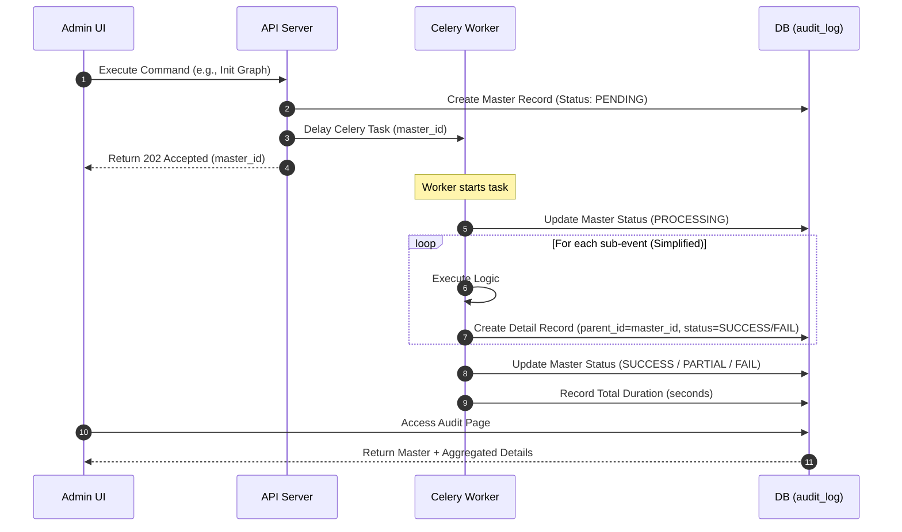

# 📑 Asynchronous Command Execution & Audit System Design Document (v2 Finalized)

This document outlines the design for tracking the full lifecycle of asynchronous operations (e.g., graph initialization, job controls, permission changes) executed from the Admin Console, providing real-time progress, detailed results, and performance metrics to users.

## 1. System Architecture & Deployment Structure
The system adopts an **Asynchronous Task Pattern** using **Celery** with **Redis** as the broker. This ensures reliable execution of long-running tasks without blocking the API response.

```mermaid
graph TD
    subgraph "Admin Console (UI)"
        UI[Audit Dashboard]
    end

    subgraph "API Gateway / Producer"
        API[Admin API Server]
    end

    subgraph "Task Broker"
        Redis[(Redis<br/>Celery Queue)]
    end

    subgraph "Worker Layer (Consumer)"
        W1[Celery Worker A]
        W2[Celery Worker B]
    end

    subgraph "Persistence"
        DB[(MySQL<br/>lineage_manager_v2)]
    end

    UI -->|1. Request Command Execution| API
    API -->|2. Create Master Audit (PENDING)| DB
    API -->|3. Dispatch Async Task| Redis
    API -.->|4. Respond Task ID (202)| UI
    
    Redis -->|5. Consume Task| W1
    Redis -->|5. Consume Task| W2
    
    W1 & W2 -->|6. Record Status (PROCESSING)| DB
    W1 & W2 -->|7. Execute Business Logic| W1
    W1 & W2 -->|8. Record Final Result & Duration| DB
    
    UI -->|9. Refresh/Poll Audit History| DB
```

## 2. Workflow (Sequence Diagram)
Describes the creation and state transitions of the **Audit Master** (parent) and **Audit Detail** (child) within the unified `audit_log` table.



## 3. Data Schema Definition (Unified v2)

The system uses a single `audit_log` table to store both high-level commands (Masters) and their sub-events (Details), identified by the `parent_id` column.

### 3.1. `audit_log` Table
| Column Name | Type | Description |
| :--- | :--- | :--- |
| `id` | INT (PK) | Unique Identifier |
| `parent_id` | INT | Link to Master (NULL for Master, ID for Detail) |
| `action` | VARCHAR(50) | Command type (GRAPH_INIT, PAUSE_JOB, etc.) |
| `target_type` | VARCHAR(50) | SYSTEM, JOB, USER, etc. |
| `target_id` | VARCHAR(255) | Identifier of the target resource |
| `user_email` | VARCHAR(255) | Email of the actor who performed the action |
| `status` | VARCHAR(20) | PENDING, PROCESSING, SUCCESS, PARTIAL, FAIL |
| `payload` | JSON | Request arguments / context |
| `error_message`| TEXT | Detailed error stack or message |
| `total_count` | INT | Total items to process (Master only) |
| `success_count`| INT | Successful items (Master only) |
| `fail_count` | INT | Failed items (Master only) |
| `duration` | FLOAT | Execution time in seconds (1 decimal place) |
| `timestamp` | DATETIME | Event occurrence time |

## 4. Implementation Pattern (Celery)

### 4.1. [Producer] Dispatching Tasks
```python
# API Endpoint
async def trigger_init_graph():
    # 1. Create Master Audit Record
    master_id = await audit_service.create_master(
        action="GRAPH_INIT",
        user_email=current_user.email,
        payload={"drop_existing": False}
    )
    
    # 2. Dispatch Task to Celery
    initialize_graph_task.delay(
        master_id=master_id,
        user_email=current_user.email
    )
    return {"audit_id": master_id}
```

### 4.2. [Consumer] Celery Worker Task
```python
@celery_app.task
def initialize_graph_task(master_id, user_email):
    # Update to PROCESSING
    audit_service.update_master(master_id, status="PROCESSING")
    start_time = time.time()
    
    try:
        # Create Start Detail event
        audit_service.create_detail(master_id, "Graph Init Started", status="SUCCESS")
        
        # ... Business Logic ...
        
        # Create End Detail event
        audit_service.create_detail(master_id, "Graph Init Completed", status="SUCCESS")
        
        duration = round(time.time() - start_time, 1)
        audit_service.update_master(master_id, status="SUCCESS", duration=duration)
    except Exception as e:
        audit_service.update_master(master_id, status="FAIL", error_message=str(e))
```

## 5. UI/UX: Command History & Duration
- **Simplified Granularity**: For batch operations like `GRAPH_INIT`, individual sub-tasks (thousands of jobs) are **not** logged individually to avoid DB bloat. Instead, high-level lifecycle events ("Discovery Start", "Sync Complete") are logged as details.
- **Duration Tracking**: The `duration` field is displayed in the Audit History table, showing exactly how long an operation took (e.g., "12.5s").
- **Status Guards**: The `AuditRepository` prevents terminal states (`SUCCESS`, `FAIL`) from being accidentally overwritten by late-arriving `PROCESSING` signals.

- **Audit Main List**: Displays `audit_masters` with a progress bar and final status for an at-a-glance overview of business progress.
- **Detailed View (Drill-down)**: Selecting a specific `audit_id` expands to show the full lifecycle of the command. For long-running tasks, the frontend computes and prominently displays:
  - **Queued Time**: Delay between the `INITIATED` event and the `PROCESSING` event.
  - **Start Time**: Extracted from the `PROCESSING` event timestamp.
  - **End Time / Result**: Extracted from the `SUCCESS` or `FAIL` event timestamp, showing final outcome and any messages.
  Below this summary, it displays the chronological list of all sub-events (`audit_details`) related to that parent command.
- **Real-time Updates**: While the page is open, the progress (success_count / total_count) and incoming events are updated via 5-10 second polling or WebSocket/SSE for live monitoring.
- **Summary Header**: Displays summaries like "8 of 10 succeeded, 2 failed" at the top of the details view.

## 6. Reliability & Recovery
- **Celery Retries**: Use Celery's built-in retry mechanism for transient failures.
- **Status Guards**: The `AuditRepository` uses explicit checks to ensure that a task that has already reached a successful or failed state is not erroneously updated back to 'PROCESSING' by a delayed message.
- **Atomic Transactions**: All audit updates are performed within the `UnitOfWork` context to ensure DB consistency.

## 7. Performance Optimization
- **Simplified Logging**: Thousands of individual job metadata updates are NOT logged as separate audit details. Only high-level "Discovery Start" and "Discovery Complete" events are recorded to minimize DB I/O.
- **Indexing**: The `audit_log` table is indexed on `parent_id`, `action`, and `user_email` for fast retrieval during UI rendering.
- **Duration Pre-calculation**: Duration is calculated in the worker and stored as a simple `FLOAT` to avoid expensive runtime calculations.

## 8. Concrete Storage Examples

This section illustrates how actual records are stored in the `audit_log` table.

### 8.1. SIMPLE Operation Example (User Role Change)
Single record for instantaneous actions.

| Column | Value |
| :--- | :--- |
| `id` | 101 |
| `parent_id` | NULL |
| `action` | `UPDATE_USER_ROLES` |
| `target_id` | `frank` |
| `user_email` | `admin@company.com` |
| `status` | `SUCCESS` |
| `duration` | 0.2 |
| `payload` | `{"old_roles": ["viewer"], "new_roles": ["editor"]}` |

---

### 8.2. BATCH Operation Example (Graph Initialization)
Hierarchical records for overall progress and high-level events.

#### 1) Master Record (The Parent)
| Column | Value |
| :--- | :--- |
| `id` | 200 |
| `parent_id` | NULL |
| `action` | `GRAPH_INIT` |
| `status` | `SUCCESS` |
| `total_count` | 31 |
| `success_count` | 31 |
| `duration` | 12.5 |

#### 2) Detail Records (The Children)
Multiple entries linked via `parent_id`.

| id | parent_id | action | target_id | status | timestamp |
| :--- | :--- | :--- | :--- | :--- | :--- |
| 201 | 200 | `GRAPH_INIT_EVENT` | `Graph Initialization Start` | `SUCCESS` | `15:30:01` |
| 202 | 200 | `GRAPH_INIT_EVENT` | `Graph Initialization Complete` | `SUCCESS` | `15:30:13` |
