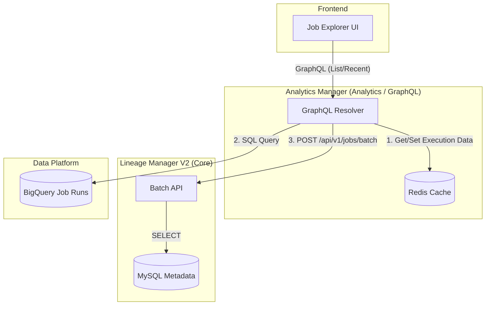
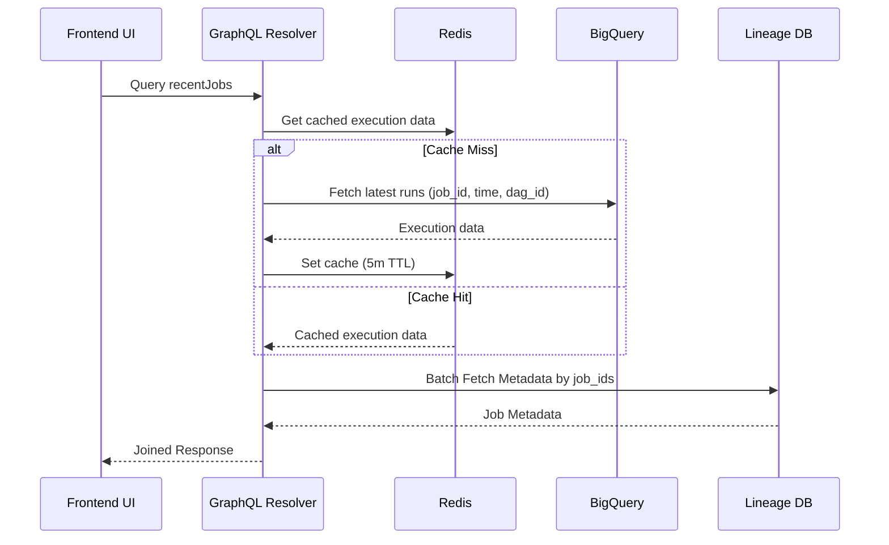
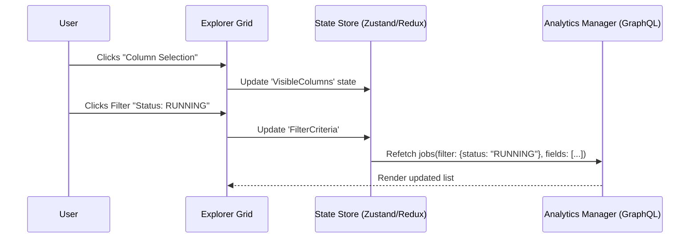

# Design: GraphQL Job Explorer (Analytics Manager)

Date: 2026-02-23  
Status: Draft  
Feature: Job Fleet Explorer / Analytics Hub

## 1. Background
To support a high-performance "Job Explorer" UI similar to GCP with dynamic filtering and field selection, we are moving the "read-only/explorer" responsibility to `analytics-manager`. This service act as a BFF (Backend for Frontend) that aggregates data from core services and historical logs.

## 2. Technical Architecture

### 2.1 Service Responsibility & Data Flow



### 2.2 Lineage Manager V2: Batch Metadata API Spec

To support data federation in an MSA environment, LM-V2 exposes a dedicated bulk lookup endpoint.

- **Endpoint**: `POST /api/v1/jobs/batch`
- **Request Body**:
    ```json
    {
      "job_ids": ["project_a-job_1", "project_b-job_2"]
    }
    ```
- **Response Body**:
    ```json
    {
      "results": {
        "project_a-job_1": {
          "id": 101,
          "job_id": "project_a-job_1",
          "project_id": "project_a",
          "name": "job_1",
          "owners": ["user_1"],
          "properties": {
            "type": "SELF-TYPE",        # Valid: SELF-TYPE, REQUEST-TYPE
            "status": "active",
            "logic_type": "sql",
            "labels": { "env": "prod", "team": "analytics" }
          },
          "created_at": "2024-01-01T00:00:00Z"
        }
      }
    }
    ```

### 2.3 Analytics Manager: GraphQL Specification

The GraphQL layer in Analytics Manager provides a unified interface for the frontend Explorer.

#### GraphQL Types
```graphql
"""
Core Metadata for a Job, provided by Lineage Manager
"""
type JobMetadata {
  id: ID!
  jobId: String!
  projectId: String!
  name: String!
  type: String
  status: String
  owners: [String!]
  createdAt: DateTime!
}

"""
Combined record of a Job Execution (BQ) joined with its Metadata (LM)
"""
type JobRunRecord {
  jobId: String!
  executionTime: DateTime!
  dagRunId: String!
  metadata: JobMetadata
}

input JobFilterInput {
  projectId: String
  status: String
  type: String
  owner: String
  searchTerm: String
}
```

#### Queries
```graphql
type Query {
  """
  Fetches the latest job execution records from BigQuery + LM Metadata
  """
  recentJobRuns(limit: Int = 20): [JobRunRecord!]!

  """
  Explores all known jobs with advanced filtering
  """
  jobs(
    filter: JobFilterInput
    limit: Int = 10
    offset: Int = 0
  ): [JobMetadata!]!
}
```

### 2.4 Implementation Detail
The `analytics-manager` will execute asynchronous SQLAlchemy queries against the `lineage_manager` DB. 
- **Dynamic Field Selection**: GraphQL naturally handles this. If a user asks for only `job_id`, only that is returned.
- **JSON Filtering**: Use MySQL's `JSON_EXTRACT` for filtering `status` and `type` stored in the `properties` column.

### 2.5 Recently Running Jobs Logic
The "Recently Running Jobs" view requires data from multiple sources:

1.  **Execution Data (BigQuery)**: Fetch the **100 most recent records** from the history table.
    - Configuration: Loaded from `.env` via `FEATURE_HISTORY_TABLE` (e.g., `gizmopool.test_data.table_load_history`).
    - Query Logic: `SELECT job_id, start_date as execution_time, dag_run_id FROM {table} ORDER BY start_date DESC LIMIT 100`
2.  **Metadata (Internal API)**: Using the `job_id` list from BQ (formatted as `{project_id}-{job_id}`), fetch additional details via `lineage-manager-v2` Batch API.
    - Fields: `project_id`, `name`, `status`, `type`, `owners`, `created_at`
3.  **Caching (Redis)**: Since BigQuery queries are expensive and slow, the list of recent execution data will be cached in Redis with a **5-minute TTL**.

### 2.6 Configuration Management
- Standard `FEATURE_` prefix used for feature-specific settings.
- `.env` file used for local development and Docker deployment.
- Helm charts used for production environment variables.



## 3. Frontend UI Design & Interaction

### 3.1 Layout Architecture
The Job Explorer is divided into three main zones:
1.  **Toolbar (Top)**: Global Search, Quick Filters (Project, Status), and Data Refresh.
2.  **Explorer Grid (Center)**: Dynamic table with sortable columns.
3.  **Config Panel (Right/Popover)**: Column Selection (Show/Hide fields like `owners`, `logic_type`).

#### UI Layout Mockup
```text
+-----------------------------------------------------------------------+
| Search [________________]  [Project v] [Status v] [Columns v] [Reload]|
+-----------------------------------------------------------------------+
| Name             | Job ID         | Status   | Type        | Last Run |
|------------------|----------------|----------|-------------|----------|
| Request-Filter-1 | api-gateway-...| DEPLOYED | REQUEST-TYPE| 2m ago   |
| Self-Stats-Core  | analytics-p... | RUNNING  | SELF-TYPE   | 15m ago  |
| ...              | ...            | ...      | ...         | ...      |
+-----------------------------------------------------------------------+
|                                  Pagination: < 1 2 3 > (100 total)    |
+-----------------------------------------------------------------------+
```

### 3.2 User Interaction Scenarios

| User Action | Frontend Logic (GraphQL) | Backend/Data Result |
| :--- | :--- | :--- |
| **Search "api"** | Query `jobs(filter: {searchTerm: "api"})` | Filters by `job_id` or `name` containing "api" |
| **Select "SELF-TYPE"** | Query `jobs(filter: {type: "SELF-TYPE"})` | Filters JSON `properties.type` |
| **Hide "Owners" Col** | UI state update (Don't request `owners`) | GraphQL prevents over-fetching of `owners` field |
| **Refresh Recent** | Query `recentJobRuns` (refetch) | BQ/Cache update; grid shows latest executions |

### 3.3 State & Interaction Flow


## 4. Implementation Plan

### Phase 1: Lineage Manager V2 (Batch API)
- Implement `POST /api/v1/jobs/batch`.
- Normalize `job_id` separator in repository logic.

### Phase 2: Analytics Manager (Core Infrastructure)
- Set up `strawberry-graphql` and Redis client.
- Implement BigQuery fetcher with caching logic.
- Implement Internal API client for LM-V2 communication.

### Phase 3: GraphQL Layer
- Define Schema (Types, Inputs, Queries).
- Implement Dynamic Search and Filtering resolvers.

### Phase 4: Frontend Development
- Create `JobExplorer` view with dynamic grid.
- Implement GraphQL client integration and state management.
