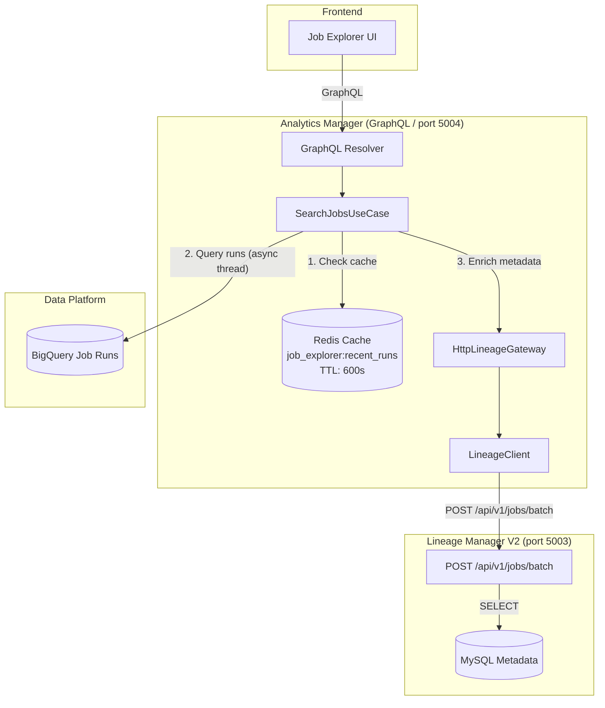
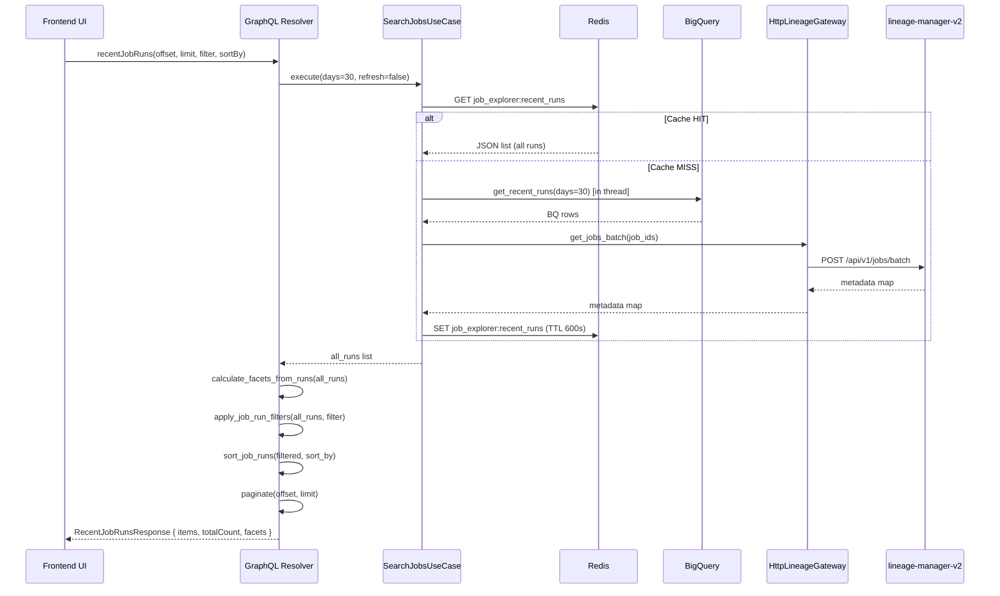

# Design: GraphQL Job Explorer (Analytics Manager)

Date: 2026-02-23
Updated: 2026-03-29
Status: Implemented
Feature: Job Fleet Explorer / Analytics Hub

## 1. Background
To support a high-performance "Job Explorer" UI similar to GCP with dynamic filtering and field selection, we moved the "read-only/explorer" responsibility to `analytics-manager`. This service acts as a BFF (Backend for Frontend) that aggregates execution data from BigQuery and job metadata from `lineage-manager-v2` via internal API calls.

## 2. Technical Architecture

### 2.1 Service Responsibility & Data Flow

**Key principle:** `analytics-manager` never reads the MySQL database directly. All job metadata is obtained by calling the `lineage-manager-v2` Batch API.



### 2.2 Lineage Manager V2: Batch Metadata API Spec

`lineage-manager-v2` exposes a dedicated bulk lookup endpoint for MSA data federation.

- **Endpoint**: `POST /api/v1/jobs/batch`
- **Request Body**:
    ```json
    {
      "job_ids": ["project_a.job_1", "project_b.job_2"]
    }
    ```
- **Response Body**:
    ```json
    {
      "results": {
        "project_a.job_1": {
          "id": 101,
          "job_id": "project_a.job_1",
          "project_id": "project_a",
          "name": "job_1",
          "owners": ["user_1"],
          "properties": {
            "type": "SELF-TYPE",
            "status": "active",
            "logic_type": "sql",
            "labels": { "env": "prod", "team": "analytics" }
          },
          "created_at": "2024-01-01T00:00:00Z"
        }
      }
    }
    ```

### 2.3 Analytics Manager: GraphQL Specification

#### GraphQL Types (Implemented)

```graphql
"""Core execution record from BigQuery + enriched metadata from Lineage Manager."""
type JobRun {
  jobId: String!
  dagId: String!
  projectId: String
  type: String               # SELF-TYPE | REQUEST-TYPE
  destination: String
  owners: [String!]!
  issuer: String             # e.g. "Self Scheduling", "Data Scheduling"
  startTime: String!
  nextStartTime: String
  period: String
  date: String
  hour: String
  publishTime: String
}

"""Paginated response with facets and sort state."""
type RecentJobRunsResponse {
  items: [JobRun!]!
  totalCount: Int!
  facets: JobRunFilterFacets
  sortBy: String
  sortOrder: SortOrder
}

"""Unique values for all filter dimensions (computed from full unfiltered dataset)."""
type JobRunFilterFacets {
  owners: [String!]!
  projects: [String!]!
  types: [String!]!
  issuers: [String!]!
  statuses: [String!]!
}

enum SortOrder { ASC DESC }

input JobRunFilter {
  jobId: String
  dagId: String
  types: [String!]
  destination: String
  owners: [String!]
  issuers: [String!]
  period: String
  projects: [String!]
  statuses: [String!]
  startedAtSince: String     # ISO datetime
  startedAtUntil: String
}

"""Aggregated job statistics across multiple dimensions."""
type JobAggregation {
  total: Int!
  byDepartment: [DepartmentCount!]!
  byType: [TypeCount!]!
  byOwner: [OwnerCount!]!
  byCreatedMonth: [MonthCount!]!
}
```

#### Queries (Implemented)

```graphql
type Query {
  """
  Paginated recent job runs with filtering, sorting, and facets.
  Facets are computed from the full unfiltered dataset before applying filters.
  """
  recentJobRuns(
    offset: Int = 0
    limit: Int = 10
    refresh: Boolean = false
    sortBy: ID
    sortOrder: SortOrder = DESC
    filter: JobRunFilter
  ): RecentJobRunsResponse!

  """
  Search jobs via connection-style pagination.
  """
  jobs(
    first: Int = 20
    after: String
    filter: JobFilter
  ): JobConnection!

  """
  Consolidated job statistics (by department, type, owner, month).
  """
  jobStats: JobAggregation!
}
```

**Note:** `tables`, `user`, `users`, `project`, `projects` queries exist in the schema but are currently **stubs returning mock data**.

### 2.4 Implementation: SearchJobsUseCase

The core use case (`app/application/usecase/job_explorer/search_jobs.py`) executes the following pipeline:

```
1. Check Redis cache (key: "job_explorer:recent_runs")
   └─ HIT  → return cached list immediately
   └─ MISS → continue

2. Query BigQuery (via JobExplorerRepository.get_recent_runs)
   - Run in asyncio.to_thread() to avoid blocking event loop
   - Fetches runs from last N days (default: 30)
   - Returns: job_id, dag_id, execution_time, next_start_time, publish_time,
              destination, issuer, period, date, hour, duration, progress

3. If BigQuery returns 0 rows:
   - Cache empty result with CACHE_TTL_EMPTY = 60s
   - Return []

4. Extract unique job_ids → call HttpLineageGateway.get_jobs_batch(job_ids)
   - Gateway delegates to LineageClient → POST /api/v1/jobs/batch
   - Returns metadata map: { job_id → { name, project_id, owners, properties } }

5. Merge: for each BQ row, join metadata by job_id
   - issuer auto-assigned if missing:
       REQUEST-TYPE → "Data Scheduling"
       SELF-TYPE    → "Self Scheduling"
       other        → "System"

6. Cache merged result with CACHE_TTL = 600s (10 minutes)
7. Return list of JobRunContext dicts
```

**Cache TTL constants:**

| Constant | Value | Description |
|----------|-------|-------------|
| `CACHE_TTL` | 600s (10 min) | Normal TTL for populated result |
| `CACHE_TTL_EMPTY` | 60s (1 min) | Short TTL when BQ returns 0 rows |

Both constants can be overridden via `settings.ANALYTICS_CACHE_TTL_SEC` and `settings.ANALYTICS_CACHE_TTL_EMPTY_SEC`.

### 2.5 Implementation: GraphQL Resolver (`recent_job_runs`)

```
1. Call SearchJobsUseCase.execute(days=30, refresh=refresh)
   → returns full run list (all runs in cache period)

2. calculate_facets_from_runs(all_runs)
   → compute distinct owners, projects, types, issuers, statuses
   → IMPORTANT: computed BEFORE applying filters so UI always shows all available options

3. apply_job_run_filters(all_runs, ...filter fields...)
   → field-by-field filtering (job_id: substring, types/owners/projects/statuses/issuers: exact list match)
   → date range: started_at_since / started_at_until filtered on publish_time

4. sort_job_runs(filtered, sort_by, descending)
   → sort_by maps frontend column IDs via _SORT_FIELD_MAP:
     "job" → "job_id", "dag" → "dag_id", "project" → "project_id",
     "start_time" → "execution_time", "next_start" → "next_start_time"

5. Paginate: filtered[offset : offset + limit]

6. Return RecentJobRunsResponse(items, total_count, facets, sort_by, sort_order)
```

### 2.6 Infrastructure: HttpLineageGateway → LineageClient

```
analytics-manager
  └── GraphQL Resolver
        └── SearchJobsUseCase
              └── HttpLineageGateway      (implements domain LineageGateway interface)
                    └── LineageClient     (HTTP client)
                          └── POST /api/v1/jobs/batch  →  lineage-manager-v2
```

`HttpLineageGateway` is a thin adapter that bridges the domain `LineageGateway` interface to the infrastructure `LineageClient`. This keeps domain logic free of HTTP concerns.

### 2.7 Configuration Management

- Standard `ANALYTICS_` prefix for service-specific settings.
- `.env` / `settings` for local and Docker deployment.
- Helm charts for production.

| Setting | Default | Description |
|---------|---------|-------------|
| `ANALYTICS_CACHE_TTL_SEC` | 600 | Redis TTL for full result set |
| `ANALYTICS_CACHE_TTL_EMPTY_SEC` | 60 | Redis TTL when BQ returns no data |
| `FEATURE_HISTORY_TABLE` | — | BigQuery table path for job run history |

---

## 3. Data Flow: Request to Response



---

## 4. Frontend Integration

### 4.1 GraphQL Hook (`useJobLanding.ts`)

The frontend uses a custom hook in `mfe-catalog/src/widgets/job-landing/useJobLanding.ts` that calls the `recentJobRuns` query. The hook maps between camelCase (GraphQL) and snake_case (internal data model) where needed.

### 4.2 UI Layout

```text
+-----------------------------------------------------------------------+
| Search [________________]  [Project v] [Type v] [Issuer v] [Reload]  |
+-----------------------------------------------------------------------+
| Job ID           | Project        | Type         | Issuer   | Start   |
|------------------|----------------|--------------|----------|---------|
| payment-gw-...   | payment-gateway| REQUEST-TYPE | Data...  | 2m ago  |
| analytics-core   | analytics-prod | SELF-TYPE    | Self...  | 15m ago |
+-----------------------------------------------------------------------+
|                              Pagination: < 1 2 3 > (N total)         |
+-----------------------------------------------------------------------+
```

### 4.3 Filter Behavior

| User Action | Query Parameter | Backend Logic |
|:---|:---|:---|
| Search "api" | `filter: { jobId: "api" }` | Substring match on `job_id` |
| Select type "SELF-TYPE" | `filter: { types: ["SELF-TYPE"] }` | Exact list match on `type` |
| Select project | `filter: { projects: ["proj-a"] }` | Exact list match on `project_id` |
| Date range filter | `filter: { startedAtSince, startedAtUntil }` | Filter on `publish_time` |
| Click column header | `sortBy: "start_time", sortOrder: DESC` | Mapped via `_SORT_FIELD_MAP` |

---

## 5. Implementation Status

| Component | Status | Notes |
|-----------|--------|-------|
| `POST /api/v1/jobs/batch` (lineage-manager-v2) | Implemented | Used by analytics-manager |
| `SearchJobsUseCase` | Implemented | BigQuery + LineageGateway + Redis cache |
| `HttpLineageGateway` → `LineageClient` | Implemented | HTTP adapter over domain interface |
| `recent_job_runs` resolver | Implemented | Pagination, filter, sort, facets |
| `jobs` resolver (connection-style) | Implemented | Basic filter via `apply_job_run_filters` |
| `job_stats` resolver | Implemented | Delegates to `MetricsUseCase.get_job_aggregation_stats()` |
| `tables` resolver | **Stub** | Returns mock data |
| `user` / `users` / `project` / `projects` | **Stub** | Returns mock data |
| Frontend `useJobLanding.ts` | Implemented | GraphQL integration hook |
