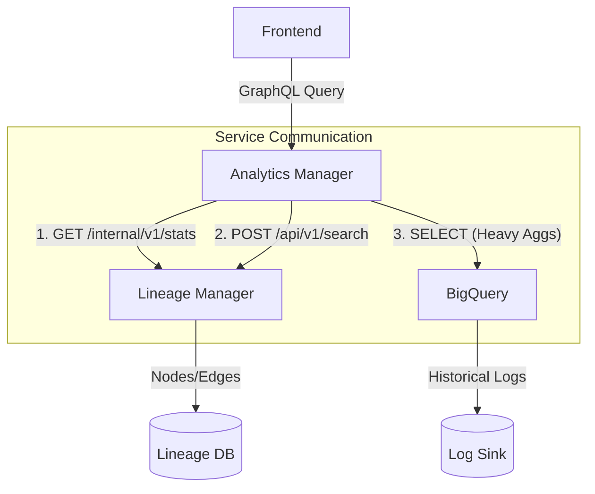

# Design: Unified GraphQL API for Admin Console

Date: 2026-02-23  
Status: Draft  
Feature: Metric Registry & Data Exploration Hub
Related Docs: [Detailed Implementation Specification](2026-02-24_detailed_implementation_spec.md)

## 1. Background
The Admin Console requires consistent data presentation across various landing pages (Overview, Jobs, Tables, Users). To solve redundancy, over-fetching, and inconsistent structures, this design proposes a **Unified GraphQL API** acting as a BFF (Backend for Frontend).

## 2. Requirement Categories

### 2.1 Simple Metrics (Top Layer)
- **Definition**: Single numeric or status values.
- **Goal**: Display exactly 5 metrics at the top of each landing page.
- **Examples**: "Total Jobs", "SLA Status", "Active Users".
- **Dynamic requirement**: If fewer than 5 real metrics exist, dummy metrics will be used for UI symmetry.

### 2.2 Complex Metrics (Middle Layer - 2D/3D Data)
- **Definition**: Multi-dimensional data such as trends, breakdowns, or leaderboards.
- **Types**:
    - **Trends**: Line charts (e.g., 30-day growth).
    - **Top N**: Ranked lists (e.g., Top slots consumer).
    - **YoY Comparison**: Multi-series comparison (e.g., 2025 vs 2026 MAU).

### 2.3 Filtered List Data (Bottom Layer)
- **Definition**: Paginated and filterable entity tables.
- **Features**: Server-side search, status filtering, and project-based scoping.

---

## 3. Technical Architecture

### 3.1 GraphQL Schema Design (Benchmarked: Cloudflare Analytics API)

Following the **Cloudflare GraphQL Analytics API** best practice, we utilize specialized "Analytics Groups" that support filtering and multi-dimensional aggregation.

```graphql
"""
Specialized Analytics Node (Inspired by Cloudflare's Groups pattern)
"""
type MetricGroups {
  # Simple Value / Aggregate (Top Layer)
  count: Int
  sum: Float
  avg: Float
  status: MetricStatus    # Success, Warning, etc.
  label: String           # Display name

  # Complex (Middle Layer - Breakthroughs/Top N)
  dimensions: MetricDimensions
  
  # Complex (Middle Layer - Trends)
  history: [TrendPoint!]
}

type MetricDimensions {
  type: String
  project: String
  status: String
  name: String            # Used for Top N identity
}

type TrendPoint {
  time: String!
  value: Float!
  series: String          # e.g., "2025"
}

enum MetricStatus {
  DEFAULT
  SUCCESS
  INFO
  WARNING
  CRITICAL
  DESTRUCTIVE
}
```

### 3.2 List Data & Connection Pattern
Entities are exposed via the **Relay Connection** standard for consistent pagination.

```graphql
type JobConnection {
  edges: [JobEdge!]!
  pageInfo: PageInfo!
  totalCount: Int!
}

type JobEdge {
  node: Job!
  cursor: String!
}

type PageInfo {
  hasNextPage: Boolean!
  nextOffset: Int
  endCursor: String
}
```

---

## 4. Page-Specific Request Mapping

Each landing page fetches its entire state (3-layer design) in a single request.

| Page | Simple Metrics (Top - ID List) | Complex Metrics (Middle) | Filtered List (Bottom) |
| :--- | :--- | :--- | :--- |
| **Overview** | `total_jobs`, `active_users`, `total_tables`, `system_health`, `failed_jobs` | `top_visited_pages` | - |
| **Jobs** | `total_jobs`, `running_now`, `failed_24h`, `avg_duration_dummy`, `queued_jobs_dummy` | `top_jobs_by_slots`, `top_long_running_jobs` | `jobs(limit, offset, filter)` |
| **Tables** | `total_tables`, `total_size`, `expiring_soon`, `lineage_coverage`, `metadata_health_dummy` | `table_count_trend_30d`, `storage_size_trend_30d`, `ingestion_volume_trend_30d` | `tables(limit, offset, filter)` |
| **Users** | `total_users`, `active_users_dummy`, `admin_users_dummy`, `last_login_stats_dummy` | `active_users_yoy_comparison`, `new_user_trends` | `users(limit, offset, filter)` |

> [!NOTE]
> **active_users_yoy_comparison** returns two series within the `history` field (one for 2025, one for 2026) to enable line chart comparison.

---

## 5. Technical Comparison: REST vs GraphQL

| Feature | REST API | GraphQL (Chosen) |
| :--- | :--- | :--- |
| **Payload Optimization** | High risk of over-fetching. | **Precise field selection.** |
| **Network Efficiency** | 3+ calls per landing page. | **Single Round Trip.** |
| **Development Speed** | Needs new DTOs for every view. | **Reusable schema components.** |
| **Type Safety** | Implicit (or requires OpenAPI). | **Schema-driven contract.** |

## 7. Simple Metric Catalog (Appendix)

This catalog serves as a registry for current implementation and future brainstorming.

### 7.1 Job Metrics
| Metric ID | Label | Description | Status |
| :--- | :--- | :--- | :--- |
| `total_jobs` | Total Jobs | Total number of registered jobs. | Real |
| `running_now` | Running Now | Currently executing job instances. | Real |
| `failed_24h` | Failed (24h) | Jobs that reached FAILED status in last 24h. | Real |
| `avg_duration` | Avg. Duration | Historical average of job execution time. | Dummy |
| `queued_jobs` | Queued Jobs | Jobs waiting for available slots. | Dummy |
| `success_rate` | Success Rate | Percentage of successful runs vs total runs. | Future |
| `sla_compliance` | SLA Compliance | % of jobs meeting their defined SLA. | Future |
| `stale_jobs` | Stale Jobs | Jobs not executed for more than 30 days. | Future |

### 7.2 Table Metrics
| Metric ID | Label | Description | Status |
| :--- | :--- | :--- | :--- |
| `total_tables` | Total Tables | Total number of cataloged tables. | Real |
| `total_size` | Total Storage | Aggregate size of all managed tables in BQ. | Real |
| `expiring_soon` | Expiring Soon | Tables with partitions/TTL expiring in < 7d. | Real |
| `lineage_coverage` | Lineage Coverage | % of tables with at least one lineage edge. | Real |
| `metadata_health` | Metadata Health | Score based on description/schema completeness. | Dummy |
| `abandoned_tables`| Abandoned | Tables not queried in the last 60 days. | Future |
| `pii_tables` | PII Tables | Tables flagged with sensitive attributes. | Future |

### 7.3 User Metrics
| Metric ID | Label | Description | Status |
| :--- | :--- | :--- | :--- |
| `total_users` | Total Users | Total registered platform users. | Real |
| `active_users` | Active (24h) | Users who logged in during the last 24h. | Dummy |
| `admin_users` | Admins | Count of users with Administrative privileges. | Dummy |
| `api_keys` | Active API Keys | Currently valid API service keys. | Dummy |
| `security_score` | Security Score | Overall platform security posture (0-100). | Future |

### 7.4 System & Infrastructure
| Metric ID | Label | Description | Status |
| :--- | :--- | :--- | :--- |
| `daily_rows` | Daily Ingestion | Number of rows ingested via BigQuery in 24h. | Real |
| `system_health` | System Health | Overall health of analytics-manager and LM-V2. | Real |
| `api_latency` | API Latency | P95 response time for core APIs. | Future |
| `bq_cost_24h` | BQ Cost (24h) | Estimated BigQuery query costs in last 24h. | Future |
| `cache_hit_rate` | Cache Hit Rate | Redis cache efficiency percentage. | Future |

---

---

## 9. Design Review: Pragmatism & Industry Standards

Addressing the concern of "Over-engineering": Is this design too complex?

### 9.1 Comparison with Standard Approaches

| Approach | Level | Pros | Cons |
| :--- | :--- | :--- | :--- |
| **Simple REST** | Low | Fast initial implementation. | Frontend duplication. 3-5 calls per page. Hard to join MySQL + BQ. |
| **Unified GQL (Proposed)** | **Mid** | **UI Reuse.** Single request. Clean separation of concerns. | Learning curve for GraphQL. Registry setup overhead. |
| **BI Engine (Grafana)** | High | Infinite flexibility. | Extremely complex. Custom DSL required. |

### 9.2 Alignment with Industry Best Practices

This design is not a custom "new pattern" but an implementation of three recognized industry standards:

1.  **Backend-for-Frontend (BFF)**: 
    - **Concept**: A dedicated service that aggregates data from multiple downstream microservices (Lineage-Manager, BigQuery) to serve a specific UI's needs. 
    - **Industry Standard**: Popularized by SoundCloud and Netflix to handle MSA data fragmentation.

2.  **Product-Driven Schema Design**:
    - **Concept**: Designing the GraphQL schema around the **UI Component needs** (e.g., a `Metric` type for card widgets) rather than the database structure.
    - **Best Practice**: Recommended by **Apollo GraphQL** and **Meta** to maximize frontend developer velocity and UI reusability.

3.  **GraphQL Analytics API (Cloudflare Pattern)**:
    - **Concept**: Providing a single GraphQL endpoint to query datasets and metrics with flexible dimensions/filters.
    - **Real-world Example**: **Cloudflare** uses a dedicated "GraphQL Analytics API" to power all its dashboard visualizations, consolidating simple counts and complex historical trends into one schema.

### 9.3 Why this is the "Pragmatic Middle Ground"
- **UI Reusability**: Standardizing the `Metric` type allows the complex `SummaryGrid` (with tooltips, charts, etc.) to be written **exactly once**.
- **Data Orchestration**: It effectively "joins" operational data (MySQL) and analytical data (BigQuery) without polluting the core `lineage-manager` domain logic.
- **Low Overhead**: The "Metric Registry" is a simple Python dictionary mapping IDs to internal functions, keeping the implementation lightweight.

### 9.3 Conclusion
This design is a **Standard BFF (Backend for Frontend)** pattern used in modern tech companies (Netflix, SoundCloud, etc.) when building dashboards that aggregate data from multiple microservices. It is optimized for **frontend developer speed** and **consistent UX**.

## 8. MSA Data Fetching Strategy

In a microservices architecture, `analytics-manager` must not access the `lineage-manager` database directly. The following strategy ensures data sovereignty while maintaining performance.

### 8.1 Strategy by Data Category

| Category | Source of Truth | Fetching Mechanism | Description |
| :--- | :--- | :--- | :--- |
| **Simple Metrics** | `lineage-manager` (MySQL) | **Internal Stats API** | `lineage-manager` exposes a generic `/internal/v1/stats` that returns counts for all its managed entities. |
| **Complex Metrics** | BigQuery (Sink) | **Direct BQ Query** | Trends and Top N lists are fetched from BigQuery, which receives periodic/event-based data from the ecosystem. |
| **Filtered Lists** | `lineage-manager` + BigQuery | **Proxy & Join** | `analytics-manager` calls the `lineage-manager` search API for metadata and joins it with recent execution status from BigQuery or Redis. |

### 8.2 Architectural Flow



### 8.3 Key Components

1.  **Internal Stats API (Lineage Manager)**:
    - Avoids creating 20+ small APIs.
    - One endpoint returns a structured JSON: `{ "counts": { "jobs": 120, "tables": 450, "users": 30 }, "status": { ... } }`.
2.  **Analytical Sink (BigQuery)**:
    - Used for metrics that are too expensive for transactional DBs.
    - `analytics-manager` caches BQ results in Redis to handle high traffic and avoid BQ costs.
3.  **Data Joiner (Analytics Manager)**:
    - The GraphQL layer acts as an orchestrator. It fetches the "Skeleton" (metadata) from `lineage-manager` and attaches "Skin" (metrics/status) from its own analytical stores.
