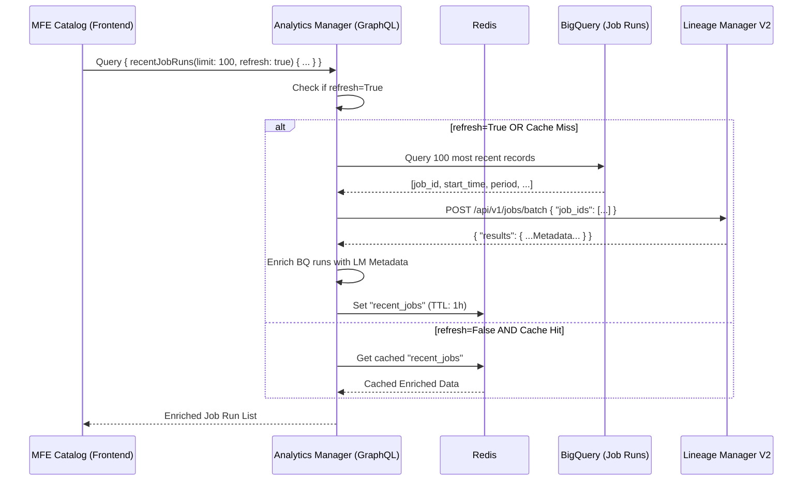

# Design: Job Filtering Detail (Recently Running Jobs)

**Date**: 2026-03-02  
**Status**: Draft  
**Target Services**: `analytics-manager`, `lineage-manager-v2`, `mfe-catalog`  

## 1. Overview
The "Recently Running Jobs" section on the Job Landing page requires an advanced filtering and enrichment layer. This feature aggregates execution history from BigQuery and combines it with job metadata fetched from the core lineage service.

## 2. Technical Architecture

### 2.1 Component Interaction
`analytics-manager` acts as a Backend-for-Frontend (BFF) providing a **GraphQL** interface. It orchestrates data from BigQuery and Lineage Manager with a caching layer.



## 3. Data Specification

### 3.1 BigQuery Source
- **Table**: `gizmopool.test_data.admin_job_run_history`
- **Fields used**: 
    - `dag_id`, `job_id`, `destination`, `issuer`, `cron_schedule`, `period`, `date`, `hour`, `start_time`, `next_start_time`, `publish_time`.

### 3.2 Metadata Enrichment (Lineage Manager V2)
- **Endpoint**: `POST /api/v1/jobs/batch`
- **Fields required**: `job_id`, `type` (properties.type), `owners`.

### 3.3 Final API Response (Analytics Manager)
```json
[
  {
    "job_id": "api-gateway.REQUEST-TYPE_L1_JOB_001",
    "type": "REQUEST-TYPE",
    "destination": "analytics.api.request_logs",
    "owners": ["oliver"],
    "issuer": "Data Scheduling",
    "start_time": "2026-03-01T10:00:00Z",
    "next_start_time": "2026-03-01T11:00:00Z",
    "period": "hourly",
    "date": "20260301",
    "hour": "10",
    "publish_time": "2026-03-01T10:00:10Z"
  },
  ...
]
```

## 4. Implementation Details

### 4.1 Backend (Analytics Manager)
- **GraphQL API**: 
    - Query: `recentJobRuns(offset: Int, limit: Int, filter: JobRunFilter, refresh: Boolean)`
    - Response: `RecentJobRunsResponse` containing `items: [JobRun]` and `total_count: Int`.
- **Filtering Logic**: Implemented in `resolvers.py`. Supports case-insensitive substring matching for `job_id`, `dag_id`, `owner`, etc.
- **Multi-select Support**: `types` and `issuers` are passed as arrays to support multi-select filtering.
- **Cache Invalidation**: Bypass cache if `refresh=True` is provided.

### 4.2 Frontend (MFE Catalog)
- **State Management**: `useJobLanding` hook manages `currentPage`, `filters`, and `totalCount`.
- **Data Fetching**: Requests 10 items at a time based on `offset` and `limit`.
- **UX Improvements**:
    - **Pagination**: "Previous/Next" navigation and page numbers.
    - **Timestamp Formatting**: Standardized `YYYY-MM-DD HH:mm:ss` format.
    - **Multi-select Filters**: `Type` and `Issuer` use checkbox/pill UI instead of plain text inputs.
    - **Column Reordering**: `Publish Time` moved to the end of the timestamp group (`Start` -> `Next Start` -> `Publish`).

## 5. Development Phases

### Phase 1: Basic View & Enrichment
- BigQuery integration and Lineage Manager V2 batch metadata enrichment.
- Numeric timestamp formatting.

### Phase 2: Filtering & Pagination
- Server-side filtering and offset-based pagination.
- Filter panel UI integration.

### Phase 3: UX & Layout Refinement
- Checkbox-based multi-select for `Type` and `Issuer`.
- Table column reordering for better readability.

## 6. Verification Plan

### 6.1 Automated Tests
- Syntax check for backend GraphQL components.
- Verified manual query execution in GraphiQL.

### 6.2 Manual Verification
1.  **Pagination**: Verify 10 items per page and correct navigation.
2.  **Filtering**:
    - Select multiple `Type` (e.g., REQUEST-TYPE + SELF-TYPE).
    - Search by `Job ID` substring.
    - Verify `Clear All` resets all states.
3.  **Layout**: Confirm `Publish Time` is the last timestamp column and formatting is correct.