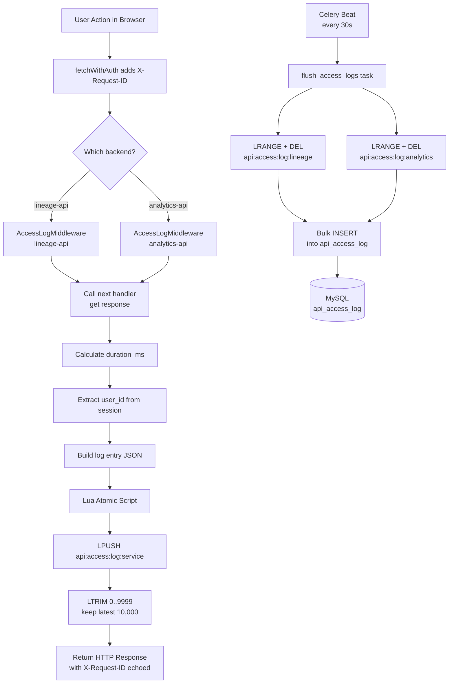
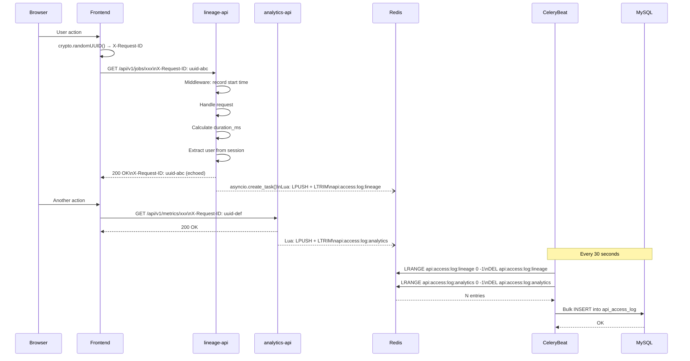

# API Access Log Design Document

**Date:** 2026-03-29
**Status:** Draft
**Scope:** Frontend + Backend (lineage-manager-v2, analytics-manager)

---

## 1. Background

Currently, the Admin Console has no mechanism to record which user called which API, when, and how long it took. The existing `AuditLog` covers only explicit business events (graph init, role changes, job pause/resume), but provides no visibility into general API access patterns.

This design introduces a **lightweight API access logging pipeline** that:

- Records every HTTP API call across both backends
- Stores logs in a single MySQL table owned by `lineage-manager-v2`
- Uses Redis as a non-blocking buffer with Lua atomic writes to prevent data loss under concurrency
- Flushes to the database periodically via Celery beat (already running in `lineage-manager-v2`)
- Allows the Audit page in the frontend to query and display access history

---

## 2. Goals

| Goal | Description |
|------|-------------|
| Traceability | Know exactly who called what API, when, and from which service |
| Non-blocking | Logging must not add latency to API responses |
| Centralized | Logs from both `lineage-api` and `analytics-api` stored in one place |
| Safe under concurrency | No log entries lost or duplicated under parallel requests |
| Bounded memory | Redis buffer capped at a fixed size to prevent OOM |

---

## 3. Architecture Overview

```
┌─────────────────────────────────────────────────────────────┐
│                        Frontend                             │
│  fetchWithAuth() adds X-Request-ID to every API call        │
└───────────────────────┬─────────────────────────────────────┘
                        │ HTTP request + X-Request-ID header
          ┌─────────────┴──────────────┐
          │                            │
  ┌───────▼──────┐             ┌───────▼──────┐
  │ lineage-api  │             │analytics-api │
  │  (port 5003) │             │  (port 5004) │
  │              │             │              │
  │ Middleware   │             │ Middleware   │
  │ intercepts   │             │ intercepts   │
  │ every request│             │ every request│
  └───────┬──────┘             └───────┬──────┘
          │ Lua atomic LPUSH+LTRIM     │ Lua atomic LPUSH+LTRIM
          │                            │
          └────────────┬───────────────┘
                       │
               ┌───────▼──────────┐
               │      Redis       │
               │                  │
               │  LIST            │
               │  api:access:log  │
               │  :lineage        │
               │                  │
               │  LIST            │
               │  api:access:log  │
               │  :analytics      │
               └───────┬──────────┘
                       │ Celery beat (every 30s)
                       │ bulk reads both lists
               ┌───────▼──────────┐
               │  lineage-api     │
               │  Celery Worker   │
               │  flush_access_   │
               │  logs task       │
               └───────┬──────────┘
                       │ bulk INSERT
               ┌───────▼──────────┐
               │     MySQL        │
               │  api_access_log  │
               └──────────────────┘
```

---

## 4. Flow Chart — Request to DB



---

## 5. Data Model

### 5.1 MySQL Table — `api_access_log`

```sql
CREATE TABLE api_access_log (
    id             BIGINT       NOT NULL AUTO_INCREMENT PRIMARY KEY,
    request_id     VARCHAR(64)  NOT NULL,          -- X-Request-ID from frontend
    user_id        VARCHAR(100) NULL,              -- from verified session
    service        VARCHAR(20)  NOT NULL,          -- 'lineage' | 'analytics'
    method         VARCHAR(10)  NOT NULL,          -- GET, POST, PATCH, DELETE
    path           VARCHAR(500) NOT NULL,          -- /api/v1/jobs/xxx
    status_code    SMALLINT     NOT NULL,          -- 200, 404, 500 ...
    duration_ms    INT          NOT NULL,          -- response time in ms
    ip_address     VARCHAR(45)  NULL,              -- supports IPv6
    requested_at   DATETIME(3)  NOT NULL,          -- millisecond precision

    INDEX idx_user_id    (user_id),
    INDEX idx_path       (path(100)),
    INDEX idx_requested_at (requested_at),
    INDEX idx_request_id (request_id)
);
```

### 5.2 Redis Buffer Keys

| Key | Owner | Description |
|-----|-------|-------------|
| `api:access:log:lineage` | lineage-api middleware | Log buffer for lineage-api requests |
| `api:access:log:analytics` | analytics-api middleware | Log buffer for analytics-api requests |

Each entry is a JSON string:
```json
{
  "request_id": "550e8400-e29b-41d4-a716-446655440000",
  "user_id": "rachel",
  "service": "lineage",
  "method": "GET",
  "path": "/api/v1/jobs/payment-gateway.REQUEST-TYPE_L1_JOB_003",
  "status_code": 200,
  "duration_ms": 42,
  "ip_address": "192.168.1.10",
  "requested_at": "2026-03-29T10:00:00.123"
}
```

---

## 6. Technology Details

### 6.1 X-Request-ID Header

A UUID generated by the frontend on every API call. It propagates through the request lifecycle and is echoed back in the response header.

**Purpose:**
- Correlate a single user action across multiple services
- Link frontend actions to backend log entries
- Debug distributed failures by searching one ID

**Frontend — `fetchWithAuth` in `AuthProvider.tsx`:**
```typescript
const fetchWithAuth = useCallback(async (url: string, options: RequestInit = {}) => {
  const headers = new Headers(options.headers);
  headers.set("X-Request-ID", crypto.randomUUID());
  return fetch(url, { ...options, headers });
}, []);
```

### 6.2 FastAPI Middleware

A `BaseHTTPMiddleware` subclass that intercepts every request, measures response time, extracts session user, and pushes a log entry to Redis asynchronously.

**Key behavior:**
- Runs for every request including 4xx and 5xx responses
- Uses `asyncio.create_task()` to push to Redis without blocking the response
- Skips health check endpoints (`/health`, `/metrics`) to reduce noise

```python
class AccessLogMiddleware(BaseHTTPMiddleware):
    async def dispatch(self, request: Request, call_next):
        start = time.monotonic()
        request_id = request.headers.get("X-Request-ID", str(uuid.uuid4()))

        response = await call_next(request)

        # Skip health/metrics noise
        if request.url.path in ("/health", "/metrics"):
            return response

        duration_ms = int((time.monotonic() - start) * 1000)
        user = request.session.get("user", {})

        entry = {
            "request_id": request_id,
            "user_id": user.get("user_id"),
            "service": SERVICE_NAME,  # "lineage" or "analytics"
            "method": request.method,
            "path": request.url.path,
            "status_code": response.status_code,
            "duration_ms": duration_ms,
            "ip_address": request.client.host if request.client else None,
            "requested_at": datetime.utcnow().isoformat(),
        }

        asyncio.create_task(push_log_entry(entry))
        response.headers["X-Request-ID"] = request_id
        return response
```

### 6.3 Lua Atomic Push with LTRIM

Redis is single-threaded. A Lua script executes atomically — no other command can interleave between its steps.

**Why needed:** Without atomicity, concurrent `LPUSH` + `LTRIM` calls from multiple requests can temporarily exceed the cap or drop entries:

```
Thread A: LPUSH → size=10001
Thread B: LPUSH → size=10002   ← LTRIM hasn't run yet
Thread A: LTRIM → trims to 10000  ← may drop Thread B's entry
```

**Lua script:**
```lua
-- Executes as one atomic unit in Redis
redis.call('LPUSH', KEYS[1], ARGV[1])
redis.call('LTRIM', KEYS[1], 0, 9999)
return 1
```

**Python usage:**
```python
# Registered once at startup — Redis compiles and caches it (EVALSHA)
LOG_PUSH_SCRIPT = redis_client.register_script("""
    redis.call('LPUSH', KEYS[1], ARGV[1])
    redis.call('LTRIM', KEYS[1], 0, 9999)
    return 1
""")

async def push_log_entry(entry: dict):
    await LOG_PUSH_SCRIPT(
        keys=[f"api:access:log:{SERVICE_NAME}"],
        args=[json.dumps(entry)]
    )
```

`register_script()` uses `EVALSHA` on subsequent calls — sends only the SHA1 hash of the script instead of the full script body, reducing network overhead.

**LTRIM behavior:**
```
List (LPUSH adds to left = newest first):
Index: 0        1        2     ...  9999    10000
       newest   ...      ...        oldest  dropped
                                    ↑
                          LTRIM 0..9999 keeps these, drops index 10000+
```

Guarantees the buffer always holds the **10,000 most recent** log entries regardless of concurrency.

### 6.4 Celery Beat Flush Task

A scheduled Celery task running every 30 seconds in `lineage-manager-v2`.

```python
# tasks/access_log_tasks.py
@celery_app.task(name="flush_access_logs")
def flush_access_logs():
    redis = get_redis_client()
    entries = []

    for service in ["lineage", "analytics"]:
        key = f"api:access:log:{service}"
        # Atomic: get all entries and clear the list
        pipe = redis.pipeline()
        pipe.lrange(key, 0, -1)
        pipe.delete(key)
        results, _ = pipe.execute()
        entries.extend(results)

    if not entries:
        return

    records = [json.loads(e) for e in entries]
    # Bulk insert
    with get_db_session() as db:
        db.bulk_insert_mappings(ApiAccessLog, records)
        db.commit()

    logger.info(f"[AccessLog] Flushed {len(records)} entries to DB")
```

**Celery beat schedule:**
```python
# core/celery_app.py
beat_schedule = {
    "flush-access-logs": {
        "task": "flush_access_logs",
        "schedule": 30.0,  # every 30 seconds
    },
}
```

---

## 7. Components to Modify

### 7.1 Frontend — `container`

| File | Change |
|------|--------|
| `src/app/providers/AuthProvider.tsx` | Add `X-Request-ID` header in `fetchWithAuth` |

### 7.2 Backend — `lineage-manager-v2`

| File | Change |
|------|--------|
| `app/core/middleware.py` | New — `AccessLogMiddleware` |
| `app/main.py` | Register `AccessLogMiddleware`; replace built-in `/docs` with auth-protected custom route |
| `app/infrastructure/models.py` | Add `ApiAccessLog` ORM model |
| `app/tasks/access_log_tasks.py` | New — `flush_access_logs` Celery task |
| `app/core/celery_app.py` | Register beat schedule |
| `alembic/versions/` | New migration — create `api_access_log` table |

### 7.3 Backend — `analytics-manager`

| File | Change |
|------|--------|
| `app/core/middleware.py` | New — same `AccessLogMiddleware` (service name = "analytics") |
| `app/main.py` | Register `AccessLogMiddleware`; replace built-in `/docs` with auth-protected custom route |

> `analytics-manager` only **writes** to Redis. It does not own the flush task or DB table.

---

## 8. Sequence Diagram



---

## 9. Swagger UI Authentication Protection

### 9.1 Background

The frontend `ApiDocsPage` provides links that open the backend Swagger UI (`/docs`) in a new browser tab. When a user clicks "Try it out / Execute" in Swagger UI, the browser sends requests **directly to the backend** — bypassing `fetchWithAuth` in the frontend.

This means:
- `X-Request-ID` is **not** added by the frontend (Swagger UI does not call `fetchWithAuth`)
- If Swagger UI is accessible without login, `user_id` in the access log will be `null`

To ensure `user_id` is always recorded, Swagger UI must be accessible only to authenticated users.

### 9.2 Design

Disable FastAPI's built-in Swagger UI and replace it with a custom route that checks the session before rendering.

**`app/main.py`:**
```python
from fastapi import FastAPI, Request
from fastapi.openapi.docs import get_swagger_ui_html
from fastapi.responses import RedirectResponse

app = FastAPI(
    docs_url=None,   # Disable built-in Swagger UI
    redoc_url=None,  # Disable built-in ReDoc
    openapi_url=f"{api_prefix}/openapi.json",
)

@app.get("/docs", include_in_schema=False)
async def swagger_ui(request: Request):
    user = request.session.get("user")
    if not user:
        return RedirectResponse(url=f"{api_prefix}/auth/login")
    root = request.scope.get("root_path", "")
    return get_swagger_ui_html(
        openapi_url=f"{root}{api_prefix}/openapi.json",
        title=f"{settings.PROJECT_NAME} - Swagger UI",
    )
```

**Flow:**
```
Browser → GET /docs
  ├─ session["user"] exists  → Render Swagger UI (authenticated)
  └─ session["user"] missing → 302 Redirect → /auth/login → OIDC → session created → /docs
```

### 9.3 Swagger UI Calls and the Access Log

Once Swagger UI requires login, all "Try it out" calls will carry the session cookie. The `AccessLogMiddleware` reads `user_id` from the session, so every Swagger-originated API call is recorded with the correct user identity.

| Call origin | `X-Request-ID` | `user_id` |
|-------------|----------------|-----------|
| Frontend `fetchWithAuth` | Generated by `crypto.randomUUID()` | From session |
| Swagger UI "Try it out" | Auto-generated by middleware (`uuid4()`) | From session ✓ |
| Unauthenticated request | Auto-generated by middleware | `null` — blocked by `/docs` auth gate |

> **Note:** The `X-Request-ID` auto-generated by the middleware for Swagger calls cannot be correlated with a specific frontend user action, but the `user_id` is still correctly recorded.

---

## 10. Trade-offs & Considerations

| Topic | Decision | Reason |
|-------|----------|--------|
| Redis buffer vs direct DB write | Redis buffer | Non-blocking; direct write adds DB latency per request |
| Separate Redis keys per service | Yes (`lineage` / `analytics`) | Flood from one service doesn't affect the other's buffer |
| Lua atomic push | Yes | Prevents race conditions under concurrent requests |
| Buffer cap | 10,000 entries | ~5 min of logs at 33 req/s; tunable via `LTRIM` argument |
| Flush interval | 30 seconds | Balance between data freshness and DB write frequency |
| Log ownership | `lineage-manager-v2` | Already has Celery worker + AuditService infrastructure |
| Path filtering | Skip `/health`, `/metrics` | Reduces noise; these are infra-level, not user actions |
| `user_id` source | Session (backend-verified) | Cannot trust client-supplied headers for identity |
| Swagger UI auth gate | Custom `/docs` route + session check | Ensures `user_id` is always populated in access logs |

---

## 11. Future Extensions

- **Read API:** `GET /api/v1/audit/access-logs?user_id=rachel&from=...&to=...` for the Audit page
- **Alerting:** Flag users with > N requests per minute (rate abuse detection)
- **Slow query report:** Surface endpoints with `avg(duration_ms) > 1000`
- **Dashboard widget:** Top callers, top endpoints, error rate trend
- **Log retention policy:** Auto-delete records older than 90 days via MySQL event or Celery periodic task
