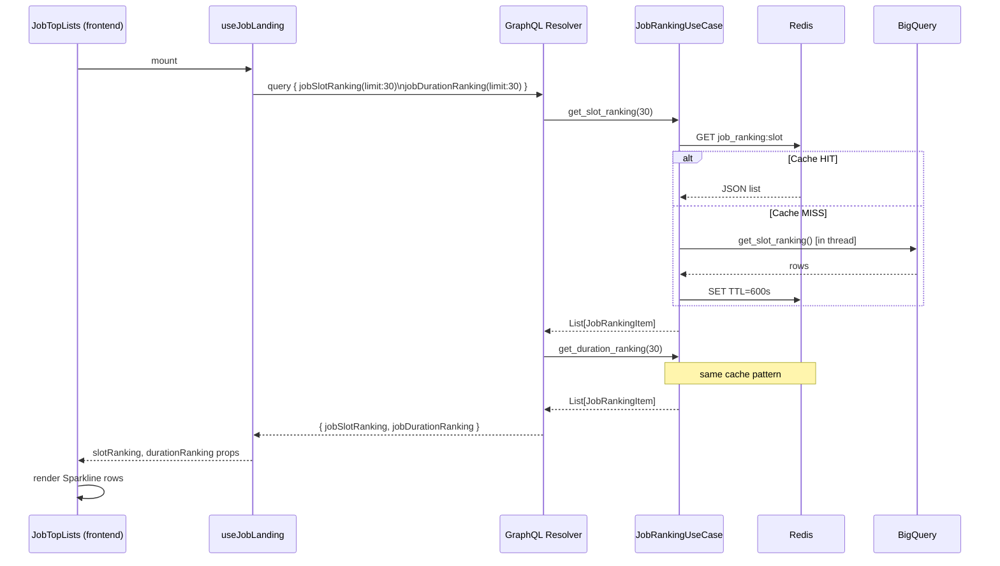

# Design: Job Top Lists — Slot Usage & Running Time Rankings

**Date:** 2026-03-29
**Status:** Implementing
**Scope:** Frontend (mfe-catalog) + Backend (analytics-manager, BigQuery)

---

## 1. Background

The Job Landing page currently displays `Top N Jobs by Slot Usage` and `Top N Long Running Jobs` using **hard-coded dummy data** in `JobTopLists.tsx`.

This feature replaces the dummy data with real BigQuery-backed rankings that show:
- Yesterday's actual value
- 7-day average as the ranking baseline
- Day-by-day trend (7 data points) rendered as a **Sparkline** bar chart

The Sparkline display was chosen over arrows-only after visual comparison; it provides immediate pattern recognition (growing / declining / stable) without requiring the user to read numbers.

---

## 2. Data Sources

### 2.1 BigQuery Tables

| Table | Description |
|-------|-------------|
| `gizmopool.test_data.daily_slot_usage2` | Per-job daily BigQuery slot consumption |
| `gizmopool.test_data.daily_running_time` | Per-job daily start/end timestamps |

**`daily_slot_usage2` schema:**

| Column | Type | Example |
|--------|------|---------|
| `job_id` | STRING | `payment-gateway.REQUEST-TYPE_L1_JOB_003` |
| `type` | STRING | `REQUEST-TYPE` |
| `date` | STRING | `20260327` |
| `hour` | STRING | `00` |
| `slot` | INT64 | `540000` |

**`daily_running_time` schema:**

| Column | Type | Example |
|--------|------|---------|
| `job_id` | STRING | `payment-gateway.REQUEST-TYPE_L1_JOB_003` |
| `type` | STRING | `REQUEST-TYPE` |
| `date` | STRING | `20260327` |
| `hour` | STRING | `02` |
| `start_time` | TIMESTAMP | `2026-03-27 02:14:00 UTC` |
| `end_time` | TIMESTAMP | `2026-03-27 03:47:23 UTC` |

---

## 3. Architecture Overview

```
┌────────────────────────────────────┐
│  Frontend (mfe-catalog)            │
│  JobLandingView                    │
│    └── JobTopLists                 │
│         ├── slotRanking props      │
│         └── durationRanking props  │
└────────────┬───────────────────────┘
             │ GraphQL
             ▼
┌────────────────────────────────────┐
│  analytics-manager (port 5004)     │
│  GraphQL Resolver                  │
│    jobSlotRanking(limit)           │
│    jobDurationRanking(limit)       │
│  JobRankingUseCase                 │
│    ├── Redis Cache (TTL 10min)     │
│    └── BigQueryRankingRepository   │
└────────────┬───────────────────────┘
             │ BigQuery SDK (sync → asyncio.to_thread)
             ▼
┌────────────────────────────────────┐
│  BigQuery                          │
│  daily_slot_usage2                 │
│  daily_running_time                │
└────────────────────────────────────┘
```

---

## 4. BigQuery Queries

### 4.1 Slot Usage Ranking

Returns top N jobs ranked by **7-day average slot**, including yesterday's value and 7-day daily history for Sparkline rendering.

```sql
-- Slot Usage: 7-day average ranking + yesterday value + 7-day daily history
WITH
date_range AS (
  SELECT
    FORMAT_DATE('%Y%m%d', DATE_SUB(CURRENT_DATE(), INTERVAL 1 DAY))  AS yesterday,
    FORMAT_DATE('%Y%m%d', DATE_SUB(CURRENT_DATE(), INTERVAL 7 DAY))  AS since_7d
),
yesterday AS (
  SELECT job_id, type, slot AS slot_yesterday
  FROM `gizmopool.test_data.daily_slot_usage2`, date_range
  WHERE date = date_range.yesterday
),
avg7 AS (
  SELECT job_id,
    ROUND(AVG(slot))  AS slot_7d_avg,
    -- 7 daily values ordered oldest→newest for Sparkline
    ARRAY_AGG(slot ORDER BY date ASC) AS history_7d
  FROM `gizmopool.test_data.daily_slot_usage2`, date_range
  WHERE date BETWEEN date_range.since_7d AND date_range.yesterday
  GROUP BY job_id
)
SELECT
  y.job_id,
  y.type,
  y.slot_yesterday                                              AS value_yesterday,
  a.slot_7d_avg                                                AS value_7d_avg,
  ROUND((y.slot_yesterday - a.slot_7d_avg)
        / NULLIF(a.slot_7d_avg, 0) * 100, 1)                  AS change_pct,
  a.history_7d
FROM yesterday y
JOIN avg7 a USING (job_id)
ORDER BY a.slot_7d_avg DESC
LIMIT 30
```

### 4.2 Running Time Ranking

```sql
-- Running Time: 7-day average ranking + yesterday value + 7-day daily history
WITH
date_range AS (
  SELECT
    FORMAT_DATE('%Y%m%d', DATE_SUB(CURRENT_DATE(), INTERVAL 1 DAY))  AS yesterday,
    FORMAT_DATE('%Y%m%d', DATE_SUB(CURRENT_DATE(), INTERVAL 7 DAY))  AS since_7d
),
daily_duration AS (
  SELECT
    job_id, type, date,
    TIMESTAMP_DIFF(end_time, start_time, SECOND) AS duration_sec
  FROM `gizmopool.test_data.daily_running_time`
),
yesterday AS (
  SELECT job_id, type, duration_sec AS duration_yesterday
  FROM daily_duration, date_range
  WHERE date = date_range.yesterday
),
avg7 AS (
  SELECT job_id,
    ROUND(AVG(duration_sec))                       AS duration_7d_avg,
    ARRAY_AGG(duration_sec ORDER BY date ASC)      AS history_7d
  FROM daily_duration, date_range
  WHERE date BETWEEN date_range.since_7d AND date_range.yesterday
  GROUP BY job_id
)
SELECT
  y.job_id,
  y.type,
  y.duration_yesterday                                          AS value_yesterday,
  a.duration_7d_avg                                            AS value_7d_avg,
  ROUND((y.duration_yesterday - a.duration_7d_avg)
        / NULLIF(a.duration_7d_avg, 0) * 100, 1)              AS change_pct,
  a.history_7d
FROM yesterday y
JOIN avg7 a USING (job_id)
ORDER BY a.duration_7d_avg DESC
LIMIT 30
```

---

## 5. Backend Implementation

### 5.1 Domain Layer

**New abstract method in `JobExplorerRepository`:**
```python
# app/domain/repository/job_repository.py
@abstractmethod
def get_slot_ranking(self, limit: int = 30) -> List[Dict[str, Any]]:
    raise NotImplementedError

@abstractmethod
def get_duration_ranking(self, limit: int = 30) -> List[Dict[str, Any]]:
    raise NotImplementedError
```

**New domain entity:**
```python
# app/domain/entity/job_ranking.py
class JobRankingItem(BaseModel):
    job_id: str
    type: str
    value_yesterday: float
    value_7d_avg: float
    change_pct: float
    history_7d: List[float]   # 7 values, oldest → newest
```

### 5.2 Infrastructure Layer

**`BigQueryClient` — two new methods:**
```python
# app/infrastructure/gcp/bigquery.py

def get_slot_ranking(self, limit: int = 30) -> List[Dict[str, Any]]:
    """Executes slot usage ranking query against daily_slot_usage2."""
    ...

def get_duration_ranking(self, limit: int = 30) -> List[Dict[str, Any]]:
    """Executes duration ranking query against daily_running_time."""
    ...
```

**`BigQueryJobExplorerRepository` — new methods:**
```python
# app/infrastructure/repository/bq_job_repository.py

def get_slot_ranking(self, limit: int = 30) -> List[Dict[str, Any]]:
    return self.bq.get_slot_ranking(limit)

def get_duration_ranking(self, limit: int = 30) -> List[Dict[str, Any]]:
    return self.bq.get_duration_ranking(limit)
```

### 5.3 Application Layer — `JobRankingUseCase`

```python
# app/application/usecase/job_explorer/job_ranking.py

CACHE_KEY_SLOT     = "job_ranking:slot"
CACHE_KEY_DURATION = "job_ranking:duration"
CACHE_TTL          = 600   # 10 minutes
CACHE_TTL_EMPTY    = 60    # 1 minute when BQ returns no data

class JobRankingUseCase:
    def __init__(self, repo: JobExplorerRepository, redis: Redis):
        self.repo  = repo
        self.redis = redis

    async def get_slot_ranking(self, limit: int = 30) -> List[Dict]:
        return await self._get_or_fetch(
            CACHE_KEY_SLOT, limit,
            lambda: self.repo.get_slot_ranking(limit)
        )

    async def get_duration_ranking(self, limit: int = 30) -> List[Dict]:
        return await self._get_or_fetch(
            CACHE_KEY_DURATION, limit,
            lambda: self.repo.get_duration_ranking(limit)
        )

    async def _get_or_fetch(self, key, limit, fetch_fn) -> List[Dict]:
        cached = await self._get_cache(key)
        if cached is not None:
            return cached[:limit]

        rows = await asyncio.to_thread(fetch_fn)
        ttl  = CACHE_TTL if rows else CACHE_TTL_EMPTY
        await self._set_cache(key, rows, ttl)
        return rows[:limit]
```

### 5.4 GraphQL Layer

**New GraphQL type:**
```graphql
type JobRankingItem {
  jobId:          String!
  type:           String!
  valueYesterday: Float!    # slots or seconds
  value7dAvg:     Float!
  changePct:      Float!    # (yesterday - avg) / avg * 100
  history7d:      [Float!]! # 7 values, oldest → newest
}
```

**New queries:**
```graphql
type Query {
  """Top N jobs ranked by 7-day average slot usage."""
  jobSlotRanking(limit: Int = 10): [JobRankingItem!]!

  """Top N jobs ranked by 7-day average execution duration (seconds)."""
  jobDurationRanking(limit: Int = 10): [JobRankingItem!]!
}
```

**Resolver (thin delegation):**
```python
# app/api/graphql/resolvers.py

@strawberry.field
async def job_slot_ranking(self, info: Info, limit: int = 10) -> List[JobRankingItem]:
    ranking_uc = info.context["ranking_uc"]
    rows = await ranking_uc.get_slot_ranking(limit)
    return [JobRankingItem(**r) for r in rows]

@strawberry.field
async def job_duration_ranking(self, info: Info, limit: int = 10) -> List[JobRankingItem]:
    ranking_uc = info.context["ranking_uc"]
    rows = await ranking_uc.get_duration_ranking(limit)
    return [JobRankingItem(**r) for r in rows]
```

### 5.5 New Config Fields

```python
# app/core/config.py
BIGQUERY_SLOT_USAGE_TABLE:    str = "gizmopool.test_data.daily_slot_usage2"
BIGQUERY_RUNNING_TIME_TABLE:  str = "gizmopool.test_data.daily_running_time"
```

---

## 6. Frontend Implementation

### 6.1 GraphQL Query Extension

`useJobLanding.ts` — add `jobSlotRanking` and `jobDurationRanking` to the existing query:

```typescript
jobSlotRanking(limit: 30) {
  jobId type valueYesterday value7dAvg changePct history7d
}
jobDurationRanking(limit: 30) {
  jobId type valueYesterday value7dAvg changePct history7d
}
```

Map to `JobRankingItem[]` and pass as props to `JobTopLists`.

### 6.2 `JobTopLists` Component Interface

```typescript
// entities/job/JobTopLists.tsx

export interface JobRankingItem {
  jobId:          string;
  type:           string;
  valueYesterday: number;
  value7dAvg:     number;
  changePct:      number;
  history7d:      number[];   // 7 values, oldest → newest
}

interface JobTopListsProps {
  slotRanking:     JobRankingItem[];
  durationRanking: JobRankingItem[];
}
```

When props are not yet provided (loading state), the component falls back to internal mock data so the page never shows empty cards.

### 6.3 Display Mode: Sparkline (fixed — no toggle)

Arrow-only mode was removed after visual comparison. Sparkline is the sole display.

Each ranking row layout (two lines, same height as the previous progress-bar layout):

```
Line 1:  #1  SELF-TYPE_L2_JOB_003   [ml-platform]   ↑+3.6%   720K
Line 2:  ▁▁▂▃▄▅▆█▇  (full-width Sparkline, replaces progress bar)
```

| Element | Description |
|---------|-------------|
| Rank badge `#N` | Ordinal position |
| Job name | `job_id.split('.').pop()` — short name |
| Project badge | `job_id.split('.')[0]` |
| Trend badge | `↑+3.6%` (red) / `↓3.2%` (green) / `flat` (gray) — inline on line 1 |
| Value | Yesterday's formatted value (`720K` slots or `2h 0m`) — inline on line 1 |
| Sparkline (line 2) | Full-width SVG; 7 bars oldest→newest; yesterday bar full opacity, prior 6 at 40% |

### 6.4 Sparkline SVG Spec

```
ViewBox:  200 × 20 units (scales to 100% card width via CSS)
Height:   20px (same slot as the old h-1.5 progress bar row)
Bars:     7 bars; barW = floor((200 - 6×gap) / 7); gap = 2 units
Last bar: full color (#3b82f6 slot / #f97316 duration)
Prior 6:  color + "66" (40% opacity hex suffix)
Min bar:  2px height (prevents invisible bars near zero)
preserveAspectRatio="none" — bars always fill full card width
```

Row height comparison:

| Mode | Line 1 | Line 2 | Total |
|------|--------|--------|-------|
| Old progress bar | text (~16px) | bar (6px) | ~22px |
| Sparkline (new) | text (~16px) | sparkline (20px) | ~36px |

> The Sparkline row is ~14px taller than the old progress bar but shorter than the interim version that stacked value+trend vertically (+~24px). `space-y-4` between rows is preserved.

### 6.5 Limit Selector

The `[5] [10] [30]` toggle in the card header controls how many rows are displayed. The backend always returns up to 30; the frontend slices without re-fetching.

---

## 7. Sequence Diagram



---

## 8. Components to Modify

### 8.1 Backend — `analytics-manager`

| File | Change |
|------|--------|
| `app/domain/repository/job_repository.py` | Add `get_slot_ranking()` / `get_duration_ranking()` abstract methods |
| `app/domain/entity/job_ranking.py` | **New** — `JobRankingItem` Pydantic model |
| `app/infrastructure/gcp/bigquery.py` | Add `get_slot_ranking()` / `get_duration_ranking()` query methods |
| `app/infrastructure/repository/bq_job_repository.py` | Implement new abstract methods |
| `app/application/usecase/job_explorer/job_ranking.py` | **New** — `JobRankingUseCase` with Redis cache |
| `app/api/graphql/schema.py` | Add `JobRankingItem` GraphQL type |
| `app/api/graphql/resolvers.py` | Add `jobSlotRanking` / `jobDurationRanking` resolvers |
| `app/core/config.py` | Add `BIGQUERY_SLOT_USAGE_TABLE` / `BIGQUERY_RUNNING_TIME_TABLE` |
| `app/infrastructure/di/providers.py` | Wire `JobRankingUseCase` into DI container |

### 8.2 Frontend — `mfe-catalog`

| File | Change |
|------|--------|
| `src/widgets/job-landing/useJobLanding.ts` | Extend GraphQL query; add `slotRanking` / `durationRanking` state |
| `src/widgets/job-landing/JobLandingView.tsx` | Pass ranking props to `JobTopLists` |
| `src/entities/job/JobTopLists.tsx` | Accept props; render Sparkline rows (already implemented) |

---

## 9. Cache Policy

| Key | TTL (normal) | TTL (empty) | Invalidation |
|-----|-------------|-------------|--------------|
| `job_ranking:slot` | 600s (10 min) | 60s | None (time-based only) |
| `job_ranking:duration` | 600s (10 min) | 60s | None (time-based only) |

Data freshness: rankings are based on daily data, so 10-minute cache has no practical impact on accuracy.

---

## 10. Trade-offs & Considerations

| Topic | Decision | Reason |
|-------|----------|--------|
| Ranking baseline | 7-day average | Single-day outliers (incidents, reruns) don't distort the ranking |
| History window | 7 days | Matches the Sparkline bar count; enough to show weekly patterns |
| Cache owner | `analytics-manager` | Consistent with existing `SearchJobsUseCase` cache pattern |
| Separate use case | Yes (`JobRankingUseCase`) | `SearchJobsUseCase` is already large; SRP |
| Limit default | 30 (backend), 5/10/30 (frontend toggle) | Backend fetches max; frontend slices without extra requests |
| Display mode | Sparkline (fixed) | Selected after visual comparison with arrows-only mode |
