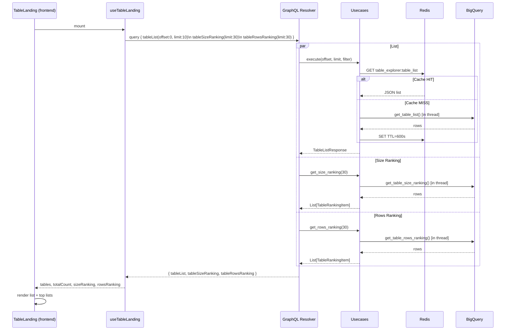

# Design: Table Landing — BigQuery Table List & Rankings

**Date:** 2026-04-11  
**Status:** Implementing  
**Scope:** Frontend (mfe-catalog) + Backend (analytics-manager, BigQuery)

---

## 1. Background

The Table Landing page displays a list of BigQuery tables with metadata and ranking statistics. The feature includes:
- **Main list**: All tables paginated (10 per page), sorted by `last_modified` DESC
- **Top lists**: Two ranking cards showing Top N tables by **Size** and **Rows Written** with 7-day sparklines
- Real BigQuery-backed data replacing static mock data

The design follows the same pattern as **Job Top Lists** (JobRankingItem, Sparkline SVG, TrendBadge, LimitSelector 5/10/30).

---

## 2. Data Sources

### 2.1 BigQuery Tables

| Table | Description |
|-------|-------------|
| `gizmopool.test_data.table_metadata_list` | Hourly snapshots of all table metadata collected from lineage-manager |

**`table_metadata_list` schema (source: lineage-manager):**

| Column | Type | Example |
|--------|------|---------|
| `project_name` | STRING | `gizmopool` |
| `dataset_name` | STRING | `analytics` |
| `table_name` | STRING | `user_events` |
| `issuer` | STRING | `Self Scheduling` / `Data Scheduling` |
| `period` | STRING | `hourly` / `daily` / `once` / `monthly` |
| `date` | STRING | `20260410` |
| `hour` | STRING | `00` - `23` |
| `publish_time` | TIMESTAMP | `2026-04-10 14:30:00 UTC` |
| `execute_dt` | TIMESTAMP | `2026-04-10 14:25:00 UTC` |
| `write_mode` | STRING | `append` / `fulldump` / `upsert` |
| `total_row_cnt` | NUMERIC | `1500000` (rows written in this period) |
| `total_logical_size` | NUMERIC | `5368709120` (current table size in bytes) |

**Partition info** is fetched separately from `lineage-manager` service and combined with table list in frontend (via second API call or dedicated endpoint).

---

## 3. Architecture Overview

```
┌────────────────────────────────────┐
│  Frontend (mfe-catalog)            │
│  TableLanding                      │
│    ├── TableLandingView            │
│    │   ├── Main table list (paged) │
│    │   └── TableTopLists           │
│    │       ├── sizeRanking props   │
│    │       └── rowsRanking props   │
│    └── useTableLanding hook        │
└────────────┬───────────────────────┘
             │ GraphQL
             ▼
┌────────────────────────────────────┐
│  analytics-manager (port 5004)     │
│  GraphQL Resolver                  │
│    tableList(offset, limit, ...)   │
│    tableSizeRanking(limit)         │
│    tableRowsRanking(limit)         │
│  GetTableListUseCase               │
│  GetTableRankingUseCase            │
│    ├── Redis Cache (TTL 10min)     │
│    └── BigQueryTableRepository     │
└────────────┬───────────────────────┘
             │ BigQuery SDK (sync → asyncio.to_thread)
             ▼
┌────────────────────────────────────┐
│  BigQuery                          │
│  table_metadata_list               │
└────────────────────────────────────┘
```

---

## 4. BigQuery Queries

### 4.1 Table List (with pagination)

Returns all tables sorted by latest `publish_time` DESC, filtered by optional table name / dataset name.  
Uses the **latest hourly snapshot per table** (max publish_time across all hours in the latest date).

```sql
WITH latest_snapshot AS (
  SELECT
    project_name, dataset_name, table_name, issuer, period,
    publish_time, execute_dt, write_mode, total_row_cnt, total_logical_size,
    ROW_NUMBER() OVER (PARTITION BY project_name, dataset_name, table_name ORDER BY date DESC, hour DESC) AS rn
  FROM `gizmopool.test_data.table_metadata_list`
)
SELECT
  project_name,
  dataset_name,
  table_name,
  publish_time,
  write_mode,
  total_row_cnt,
  total_logical_size
FROM latest_snapshot
WHERE rn = 1
  -- Optional: filter by table name (case-insensitive substring match)
  AND (@table_filter IS NULL OR LOWER(table_name) LIKE CONCAT('%', LOWER(@table_filter), '%'))
  -- Optional: filter by dataset name (exact match)
  AND (@dataset_filter IS NULL OR dataset_name = @dataset_filter)
ORDER BY publish_time DESC
LIMIT @limit OFFSET @offset
```

**Result shape:**
```
{
  items: [
    {
      projectName: "gizmopool",
      datasetName: "analytics",
      tableName: "user_events",
      lastModified: "2026-04-10T14:30:00Z",  # from publish_time
      sizeBytes: 5368709120,                   # from total_logical_size
      rowsWritten: 1500000,                    # from total_row_cnt
      writeMode: "append"
    },
    ...
  ],
  totalCount: 143
}
```

**Partition info** (not in this table): Fetched separately from `lineage-manager` service.

### 4.2 Table Size Ranking

Returns top N tables ranked by **7-day average size**, including yesterday's value and 7-day daily history for Sparkline.  
Aggregates hourly data to **daily max** (takes the latest snapshot per day), then computes 7-day average.

```sql
-- Table Size Ranking: Daily aggregation (latest per day) → 7-day average
WITH
date_range AS (
  SELECT
    FORMAT_DATE('%Y%m%d', DATE_SUB(CURRENT_DATE(), INTERVAL 1 DAY))  AS yesterday,
    FORMAT_DATE('%Y%m%d', DATE_SUB(CURRENT_DATE(), INTERVAL 7 DAY))  AS since_7d
),
daily_latest AS (
  -- Per table per date: take the latest snapshot (max publish_time)
  SELECT
    project_name, dataset_name, table_name, date,
    MAX(total_logical_size) AS daily_size
  FROM `gizmopool.test_data.table_metadata_list`, date_range
  WHERE date BETWEEN date_range.since_7d AND date_range.yesterday
  GROUP BY project_name, dataset_name, table_name, date
),
yesterday AS (
  SELECT project_name, dataset_name, table_name, daily_size
  FROM daily_latest
  WHERE date = (SELECT yesterday FROM date_range)
),
avg7 AS (
  SELECT project_name, dataset_name, table_name,
    ROUND(AVG(daily_size))  AS size_7d_avg,
    -- 7 daily values ordered oldest→newest for Sparkline
    ARRAY_AGG(daily_size ORDER BY date ASC) AS history_7d
  FROM daily_latest
  GROUP BY project_name, dataset_name, table_name
)
SELECT
  CONCAT(y.project_name, '.', y.dataset_name, '.', y.table_name)  AS table_id,
  y.project_name,
  y.dataset_name,
  y.table_name,
  y.daily_size                                                     AS value_yesterday,
  a.size_7d_avg                                                   AS value_7d_avg,
  ROUND((y.daily_size - a.size_7d_avg)
        / NULLIF(a.size_7d_avg, 0) * 100, 1)                      AS change_pct,
  a.history_7d
FROM yesterday y
JOIN avg7 a USING (project_name, dataset_name, table_name)
ORDER BY a.size_7d_avg DESC
LIMIT 30
```

### 4.3 Table Rows Ranking

Returns top N tables ranked by **7-day average rows written**, including yesterday's value and 7-day daily history.  
**Daily aggregate**: sums all hourly `total_row_cnt` values per table per date (since rows are deltas per hourly period).

```sql
-- Table Rows Ranking: Daily aggregation (sum of hourly rows) → 7-day average
WITH
date_range AS (
  SELECT
    FORMAT_DATE('%Y%m%d', DATE_SUB(CURRENT_DATE(), INTERVAL 1 DAY))  AS yesterday,
    FORMAT_DATE('%Y%m%d', DATE_SUB(CURRENT_DATE(), INTERVAL 7 DAY))  AS since_7d
),
daily_rows AS (
  -- Per table per date: sum all hourly row counts (rows are delta values)
  SELECT
    project_name, dataset_name, table_name, date,
    SUM(total_row_cnt) AS daily_rows_written
  FROM `gizmopool.test_data.table_metadata_list`, date_range
  WHERE date BETWEEN date_range.since_7d AND date_range.yesterday
  GROUP BY project_name, dataset_name, table_name, date
),
yesterday AS (
  SELECT project_name, dataset_name, table_name, daily_rows_written
  FROM daily_rows
  WHERE date = (SELECT yesterday FROM date_range)
),
avg7 AS (
  SELECT project_name, dataset_name, table_name,
    ROUND(AVG(daily_rows_written))  AS rows_7d_avg,
    -- 7 daily values ordered oldest→newest for Sparkline
    ARRAY_AGG(daily_rows_written ORDER BY date ASC) AS history_7d
  FROM daily_rows
  GROUP BY project_name, dataset_name, table_name
)
SELECT
  CONCAT(y.project_name, '.', y.dataset_name, '.', y.table_name)  AS table_id,
  y.project_name,
  y.dataset_name,
  y.table_name,
  y.daily_rows_written                                             AS value_yesterday,
  a.rows_7d_avg                                                   AS value_7d_avg,
  ROUND((y.daily_rows_written - a.rows_7d_avg)
        / NULLIF(a.rows_7d_avg, 0) * 100, 1)                      AS change_pct,
  a.history_7d
FROM yesterday y
JOIN avg7 a USING (project_name, dataset_name, table_name)
ORDER BY a.rows_7d_avg DESC
LIMIT 30
```

---

## 5. Backend Implementation

### 5.1 Domain Layer

**New abstract methods in `TableRepository`:**
```python
# app/domain/repository/table_repository.py
from abc import ABC, abstractmethod

class TableRepository(ABC):
    @abstractmethod
    def get_table_list(self) -> List[Dict[str, Any]]:
        """Returns list of all tables with metadata."""
        raise NotImplementedError

    @abstractmethod
    def get_table_size_ranking(self, limit: int = 30) -> List[Dict[str, Any]]:
        """Returns top N tables ranked by 7-day average size."""
        raise NotImplementedError

    @abstractmethod
    def get_table_rows_ranking(self, limit: int = 30) -> List[Dict[str, Any]]:
        """Returns top N tables ranked by 7-day average rows written."""
        raise NotImplementedError
```

**New domain entities:**
```python
# app/domain/entity/table_explorer.py
from pydantic import BaseModel
from typing import Optional, List

class TablePartitionInfo(BaseModel):
    type: Optional[str] = None      # "DAY" | "HOUR" | "RANGE" | None
    field: Optional[str] = None     # e.g., "event_date", "_PARTITIONTIME"

class TableListItem(BaseModel):
    project: str
    dataset: str
    table: str
    last_modified: str              # ISO datetime
    partition: Optional[TablePartitionInfo] = None
    size_bytes: Optional[int] = None
    rows_written: Optional[int] = None
    write_mode: Optional[str] = None  # "APPEND" | "OVERWRITE" | None

class TableRankingItem(BaseModel):
    table_id: str                   # "project.dataset.table_name"
    project: str
    dataset: str
    table: str
    value_yesterday: float
    value_7d_avg: float
    change_pct: float
    history_7d: List[float]         # 7 values, oldest → newest
```

### 5.2 Infrastructure Layer

**`BigQueryClient` — three new methods:**
```python
# app/infrastructure/gcp/bigquery.py

def get_table_list(self) -> List[Dict[str, Any]]:
    """Executes table list query against table_metadata_list."""
    query = """
    SELECT
      project, dataset, table_name, last_modified, 
      partition_type, partition_field, size_bytes, rows_written, write_mode
    FROM `{table}`
    WHERE (project, dataset, table_name, date) IN (
      SELECT project, dataset, table_name, MAX(date)
      FROM `{table}`
      GROUP BY project, dataset, table_name
    )
    ORDER BY last_modified DESC
    """.format(table=settings.BIGQUERY_TABLE_LIST_TABLE)
    return self.client.query(query).result()

def _table_ranking_query(self, metric_col: str, limit: int = 30) -> List[Dict[str, Any]]:
    """Shared template for size/rows ranking queries."""
    query = f"""
    WITH date_range AS (
      SELECT
        FORMAT_DATE('%Y%m%d', DATE_SUB(CURRENT_DATE(), INTERVAL 1 DAY)) AS yesterday,
        FORMAT_DATE('%Y%m%d', DATE_SUB(CURRENT_DATE(), INTERVAL 7 DAY)) AS since_7d
    ),
    yesterday AS (
      SELECT project, dataset, table_name, {metric_col}
      FROM `{{table}}`, date_range
      WHERE date = date_range.yesterday
    ),
    avg7 AS (
      SELECT project, dataset, table_name,
        ROUND(AVG({metric_col})) AS metric_7d_avg,
        ARRAY_AGG({metric_col} ORDER BY date ASC) AS history_7d
      FROM `{{table}}`, date_range
      WHERE date BETWEEN date_range.since_7d AND date_range.yesterday
      GROUP BY project, dataset, table_name
    )
    SELECT
      CONCAT(y.project, '.', y.dataset, '.', y.table_name) AS table_id,
      y.project, y.dataset, y.table_name,
      y.{metric_col} AS value_yesterday,
      a.metric_7d_avg AS value_7d_avg,
      ROUND((y.{metric_col} - a.metric_7d_avg) / NULLIF(a.metric_7d_avg, 0) * 100, 1) AS change_pct,
      a.history_7d
    FROM yesterday y
    JOIN avg7 a USING (project, dataset, table_name)
    ORDER BY a.metric_7d_avg DESC
    LIMIT {limit}
    """.format(table=settings.BIGQUERY_TABLE_LIST_TABLE)
    return self.client.query(query).result()

def get_table_size_ranking(self, limit: int = 30) -> List[Dict[str, Any]]:
    return self._table_ranking_query("size_bytes", limit)

def get_table_rows_ranking(self, limit: int = 30) -> List[Dict[str, Any]]:
    return self._table_ranking_query("rows_written", limit)
```

**`BigQueryTableRepository` (new):**
```python
# app/infrastructure/repository/bq_table_repository.py

class BigQueryTableRepository(TableRepository):
    def __init__(self, bq_client: BigQueryClient):
        self.bq = bq_client

    def get_table_list(self) -> List[Dict[str, Any]]:
        return self.bq.get_table_list()

    def get_table_size_ranking(self, limit: int = 30) -> List[Dict[str, Any]]:
        return self.bq.get_table_size_ranking(limit)

    def get_table_rows_ranking(self, limit: int = 30) -> List[Dict[str, Any]]:
        return self.bq.get_table_rows_ranking(limit)
```

### 5.3 Application Layer

**`GetTableListUseCase` (new):**
```python
# app/application/usecase/table_explorer/get_table_list.py

import asyncio
import json
from typing import List, Dict, Any, Optional
from redis.asyncio import Redis

class GetTableListUseCase:
    CACHE_KEY = "table_explorer:table_list"
    CACHE_TTL = 600  # 10 minutes
    CACHE_TTL_EMPTY = 60  # 1 minute when empty

    def __init__(self, repo: TableRepository, redis: Redis):
        self.repo = repo
        self.redis = redis

    async def execute(
        self,
        offset: int = 0,
        limit: int = 10,
        sort_order: str = "DESC",
        table_filter: Optional[str] = None,
        dataset_filter: Optional[str] = None
    ) -> Dict[str, Any]:
        """
        Fetches paginated table list with in-process filtering and sorting.
        Uses Redis cache for the full unfiltered list.
        """
        cached = await self._get_cache()
        if cached is not None:
            all_rows = cached
        else:
            rows = await asyncio.to_thread(self.repo.get_table_list)
            all_rows = [dict(r) for r in rows]
            ttl = self.CACHE_TTL if all_rows else self.CACHE_TTL_EMPTY
            await self._set_cache(all_rows, ttl)

        # In-process filtering
        filtered = all_rows
        if table_filter:
            filtered = [
                r for r in filtered
                if table_filter.lower() in r.get("table", "").lower()
            ]
        if dataset_filter:
            filtered = [
                r for r in filtered
                if r.get("dataset") == dataset_filter
            ]

        total_count = len(filtered)
        items = filtered[offset : offset + limit]
        
        return {
            "items": items,
            "totalCount": total_count
        }

    async def _get_cache(self) -> Optional[List[Dict]]:
        cached_json = await self.redis.get(self.CACHE_KEY)
        if cached_json:
            return json.loads(cached_json)
        return None

    async def _set_cache(self, data: List[Dict], ttl: int):
        await self.redis.setex(
            self.CACHE_KEY,
            ttl,
            json.dumps(data, default=str)
        )
```

**`GetTableRankingUseCase` (new):**
```python
# app/application/usecase/table_explorer/get_table_ranking.py

import asyncio
from typing import List, Dict, Any

class GetTableRankingUseCase:
    def __init__(self, repo: TableRepository):
        self.repo = repo

    async def get_size_ranking(self, limit: int = 30) -> List[Dict[str, Any]]:
        """Fetches top N tables by 7-day average size."""
        rows = await asyncio.to_thread(
            self.repo.get_table_size_ranking, limit
        )
        return [dict(r) for r in rows]

    async def get_rows_ranking(self, limit: int = 30) -> List[Dict[str, Any]]:
        """Fetches top N tables by 7-day average rows written."""
        rows = await asyncio.to_thread(
            self.repo.get_table_rows_ranking, limit
        )
        return [dict(r) for r in rows]
```

### 5.4 GraphQL Layer

**New GraphQL types (in `schema.py`):**
```python
# app/api/graphql/schema.py

@strawberry.type
class TableListItem:
    project: str
    dataset: str
    table: str
    last_modified: str                      # from publish_time
    size_bytes: Optional[int] = None        # from total_logical_size
    rows_written: Optional[int] = None      # from total_row_cnt (daily aggregate)
    write_mode: Optional[str] = None        # "append" | "fulldump" | "upsert" | null

@strawberry.input
class TableListFilter:
    table: Optional[str] = None
    dataset: Optional[str] = None

@strawberry.type
class TableListResponse:
    items: List[TableListItem]
    total_count: int

@strawberry.type
class TableRankingItem:
    table_id: str
    project: str
    dataset: str
    table: str
    value_yesterday: float
    value_7d_avg: float
    change_pct: float
    history_7d: List[float]

# Optional: Partition info (to be fetched separately from lineage-manager)
@strawberry.type
class TablePartitionInfo:
    type: Optional[str] = None
    field: Optional[str] = None

@strawberry.type
class Query:
    # ... existing fields ...

    @strawberry.field
    async def table_list(
        self,
        info: Info,
        offset: int = 0,
        limit: int = 10,
        sort_order: str = "DESC",
        filter: Optional[TableListFilter] = None
    ) -> TableListResponse:
        """Paginated table list sorted by last_modified."""
        uc = info.context["table_list_uc"]
        result = await uc.execute(
            offset=offset,
            limit=limit,
            sort_order=sort_order,
            table_filter=filter.table if filter else None,
            dataset_filter=filter.dataset if filter else None
        )
        return TableListResponse(
            items=[TableListItem(**item) for item in result["items"]],
            total_count=result["totalCount"]
        )

    @strawberry.field
    async def table_size_ranking(
        self,
        info: Info,
        limit: int = 30
    ) -> List[TableRankingItem]:
        """Top N tables ranked by 7-day average size."""
        uc = info.context["table_ranking_uc"]
        rows = await uc.get_size_ranking(limit)
        return [TableRankingItem(**r) for r in rows]

    @strawberry.field
    async def table_rows_ranking(
        self,
        info: Info,
        limit: int = 30
    ) -> List[TableRankingItem]:
        """Top N tables ranked by 7-day average rows written."""
        uc = info.context["table_ranking_uc"]
        rows = await uc.get_rows_ranking(limit)
        return [TableRankingItem(**r) for r in rows]
```

### 5.5 New Config Fields

```python
# app/core/config.py
BIGQUERY_TABLE_LIST_TABLE: str = "gizmopool.test_data.table_metadata_list"
```

### 5.6 Dependency Injection

**Update `factory/usecase.py`:**
```python
def get_table_list_usecase(
    bq_client: BigQueryClient,
    redis: Redis
) -> GetTableListUseCase:
    repo = BigQueryTableRepository(bq_client)
    return GetTableListUseCase(repo, redis)

def get_table_ranking_usecase(
    bq_client: BigQueryClient
) -> GetTableRankingUseCase:
    repo = BigQueryTableRepository(bq_client)
    return GetTableRankingUseCase(repo)
```

**Update `router.py` GraphQL context:**
```python
def get_graphql_context(...) -> dict:
    table_list_uc = get_table_list_usecase(bq_client, redis)
    table_ranking_uc = get_table_ranking_usecase(bq_client)
    
    return {
        # ... existing ...
        "table_list_uc": table_list_uc,
        "table_ranking_uc": table_ranking_uc,
    }
```

---

## 6. Frontend Implementation

### 6.1 GraphQL Query

**`useTableLanding.ts`:**
```typescript
const TABLE_LIST_QUERY = `
  query GetTableList(
    $offset: Int
    $limit: Int
    $sortOrder: SortOrder
    $filter: TableListFilter
  ) {
    tableList(offset: $offset, limit: $limit, sortOrder: $sortOrder, filter: $filter) {
      items {
        project
        dataset
        table
        lastModified
        sizeBytes
        rowsWritten
        writeMode
      }
      totalCount
    }
  }
`;

const TABLE_RANKING_QUERY = `
  query GetTableRanking($limit: Int) {
    tableSizeRanking(limit: $limit) {
      tableId project dataset table
      valueYesterday value7dAvg changePct history7d
    }
    tableRowsRanking(limit: $limit) {
      tableId project dataset table
      valueYesterday value7dAvg changePct history7d
    }
  }
`;

export function useTableLanding() {
  const api = useApiClient();

  const [tables, setTables] = useState<TableListItem[]>([]);
  const [totalCount, setTotalCount] = useState(0);
  const [sizeRanking, setSizeRanking] = useState<TableRankingItem[]>([]);
  const [rowsRanking, setRowsRanking] = useState<TableRankingItem[]>([]);
  const [loading, setLoading] = useState(false);
  const [rankingLoading, setRankingLoading] = useState(false);
  const [error, setError] = useState<string | null>(null);

  const fetchData = useCallback(async (options: {
    offset?: number;
    limit?: number;
    sortOrder?: "ASC" | "DESC";
    filter?: TableListFilter | null;
  } = {}) => {
    const { offset = 0, limit = 10, sortOrder = "DESC", filter = null } = options;
    setLoading(true);
    setError(null);
    try {
      const result = await api.graphqlRequest<{ tableList: TableListResponse }>(
        TABLE_LIST_QUERY,
        { offset, limit, sortOrder, filter }
      );
      setTables(result.tableList.items);
      setTotalCount(result.tableList.totalCount);
    } catch (err) {
      setError(err instanceof Error ? err.message : "Failed to fetch table list");
      setTables([]);
      setTotalCount(0);
    } finally {
      setLoading(false);
    }
  }, [api]);

  const fetchRanking = useCallback(async (limit: number = 30) => {
    setRankingLoading(true);
    try {
      const result = await api.graphqlRequest<{
        tableSizeRanking: TableRankingItem[];
        tableRowsRanking: TableRankingItem[];
      }>(TABLE_RANKING_QUERY, { limit });
      setSizeRanking(result.tableSizeRanking ?? []);
      setRowsRanking(result.tableRowsRanking ?? []);
    } catch (err) {
      setSizeRanking([]);
      setRowsRanking([]);
    } finally {
      setRankingLoading(false);
    }
  }, [api]);

  return {
    tables,
    totalCount,
    sizeRanking,
    rowsRanking,
    loading,
    rankingLoading,
    error,
    fetchData,
    fetchRanking,
    refresh: () => fetchData(),
  };
}
```

### 6.2 Component Interface

**`TableLandingView.tsx` props:**
```typescript
interface TableLandingViewProps {
  tables: TableListItem[];
  totalCount: number;
  sizeRanking: TableRankingItem[];
  rowsRanking: TableRankingItem[];
  loading: boolean;
  rankingLoading: boolean;
  error: string | null;
  search: string;
  onSearchChange: (value: string) => void;
  onRefresh: () => void;
  onFetchData: (options: {
    offset?: number;
    limit?: number;
    sortOrder?: "ASC" | "DESC";
    filter?: TableListFilter | null;
  }) => void;
}
```

### 6.3 Table List Display

**Seven columns** in the main table:
1. **Project** — Project ID (from `project_name`)
2. **Dataset** — Dataset name (from `dataset_name`)
3. **Table** — Table name (monospace font)
4. **Last Modified** — ISO timestamp formatted as `YYYY-MM-DD HH:MM` (from `publish_time`)
5. **Size** — Formatted bytes (TB / GB / MB / KB) (from `total_logical_size`)
6. **Rows Written** — Comma-separated number (from `total_row_cnt` daily aggregate)
7. **Write Mode** — Badge (`append` = blue, `fulldump` = purple, `upsert` = teal, null = dash)

**Partition info** (optional):  
If partition metadata becomes available from lineage-manager, can be added as an 8th column later.

### 6.4 Top Lists Display

**`TableTopLists` component** — identical pattern to `JobTopLists`:

| Card | Metric | Color | Icon |
|------|--------|-------|------|
| Left | Top N by Size | Indigo `#6366f1` | `HardDrive` |
| Right | Top N by Rows Written | Emerald `#10b981` | `BarChart2` |

**Limit selector**: 5 / 10 / 30 toggle buttons in card header.

**Ranking row layout:**
```
#N  table_name  [dataset]  ▁▁▂▃▄▅▆█▇  ↑+3.6%  720K
```

**Sparkline**: 7 bars, oldest→newest, last bar full opacity, prior 6 at 40%.

### 6.5 TypeScript Interfaces

**`shared/api/types/lineage.ts`:**
```typescript
export interface TableListItem {
  project: string;
  dataset: string;
  table: string;
  lastModified: string;           # from publish_time
  sizeBytes: number | null;       # from total_logical_size
  rowsWritten: number | null;     # from total_row_cnt
  writeMode: string | null;       # "append" | "fulldump" | "upsert" | null
}

export interface TableListResponse {
  items: TableListItem[];
  totalCount: number;
}

export interface TableRankingItem {
  tableId: string;
  project: string;
  dataset: string;
  table: string;
  valueYesterday: number;
  value7dAvg: number;
  changePct: number;
  history7d: number[];
}

# Partition info (optional, fetched separately from lineage-manager)
export interface TablePartitionInfo {
  type: string | null;  # "DAY" | "HOUR" | "RANGE" | null
  field: string | null; # e.g., "event_date", "_PARTITIONTIME"
}
```

---

## 7. Sequence Diagram



---

## 8. Components to Modify / Create

### 8.1 Backend — `analytics-manager`

| File | Change |
|------|--------|
| `app/domain/repository/table_repository.py` | **New** — Abstract `TableRepository` |
| `app/domain/entity/table_explorer.py` | **New** — Pydantic models (TablePartitionInfo, TableListItem, TableRankingItem) |
| `app/infrastructure/gcp/bigquery.py` | Add `get_table_list()`, `_table_ranking_query()`, `get_table_size_ranking()`, `get_table_rows_ranking()` |
| `app/infrastructure/repository/bq_table_repository.py` | **New** — `BigQueryTableRepository` |
| `app/application/usecase/table_explorer/get_table_list.py` | **New** — `GetTableListUseCase` with Redis cache |
| `app/application/usecase/table_explorer/get_table_ranking.py` | **New** — `GetTableRankingUseCase` |
| `app/api/graphql/schema.py` | Add `TablePartitionInfo`, `TableListItem`, `TableListFilter`, `TableListResponse`, `TableRankingItem` types; add `table_list`, `table_size_ranking`, `table_rows_ranking` queries |
| `app/core/config.py` | Add `BIGQUERY_TABLE_LIST_TABLE` |
| `app/controller/factory/usecase.py` | Add `get_table_list_usecase()`, `get_table_ranking_usecase()` |
| `app/api/graphql/router.py` | Wire usecases into GraphQL context |

### 8.2 Frontend — `mfe-catalog`

| File | Change |
|------|--------|
| `src/shared/api/types/lineage.ts` | Add `TablePartitionInfo`, `TableListItem`, `TableListResponse`, `TableRankingItem` |
| `src/widgets/table-landing/useTableLanding.ts` | **New** — Hook with `TABLE_LIST_QUERY` and `TABLE_RANKING_QUERY`; state management |
| `src/widgets/table-landing/TableLandingView.tsx` | **New** — Main list table (8 cols) + `TableTopLists` component |
| `src/pages/landing/TableLanding.tsx` | **New** — Page container; calls `fetchData` and `fetchRanking` on mount |
| `src/entities/table/TableTopLists.tsx` | **New** — Two ranking cards (Size, Rows Written) with Sparklines, identical pattern to `JobTopLists` |

---

## 9. Cache Policy

| Key | TTL (normal) | TTL (empty) | Invalidation |
|-----|-------------|-------------|--------------|
| `table_explorer:table_list` | 600s (10 min) | 60s | None (time-based only) |

**Ranking data**: No cache (small result set, fast BQ query).

Data freshness: Table metadata refreshes daily in BigQuery, so 10-minute frontend cache has negligible impact.

---

## 10. Trade-offs & Considerations

| Topic | Decision | Reason |
|-------|----------|--------|
| Data source | lineage-manager `table_metadata_list` | Single source of truth for table metadata; hourly snapshots available |
| Hourly → Daily aggregation | Max (size), Sum (rows) | Daily snapshots for cleaner 7-day trends; avoids 24×7=168 data points |
| Ranking baseline | 7-day average | More stable than single-day value; aligns with Job Top Lists pattern |
| History window | 7 days | Matches Sparkline bar count; sufficient for weekly pattern visualization |
| Cache strategy | Full list cached; filtering in-process | Avoids cache key explosion; `table_filter` and `dataset_filter` are ad-hoc |
| Partition info | Separate fetch from lineage-manager | Not in `table_metadata_list`; can be added as 8th column later if needed |
| Size unit | Raw bytes on backend, formatted frontend | Follows React style guide (presenter responsibility) |
| Pagination | 10 per page | Standard table pagination; backend supports any limit |
| Limit options (ranking) | 5 / 10 / 30 | Consistent with Job Top Lists; frontend slices without re-fetch |
| Write Mode values | `append` / `fulldump` / `upsert` / null | From lineage-manager enum; null shown as dash |
| Last Modified sort | DESC only | Recent tables first (most useful); ascending rarely needed |
| Rows Written metric | Daily sum of hourly deltas | `total_row_cnt` is per-period delta; summing gives daily row throughput |
| Size metric | Daily max (latest snapshot) | `total_logical_size` is cumulative; taking max per day gives latest table state |
